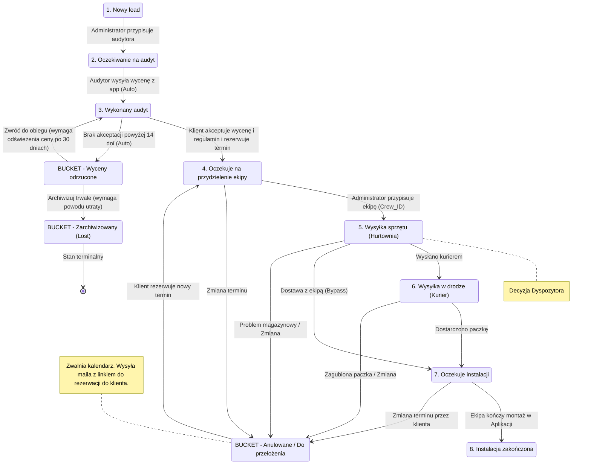
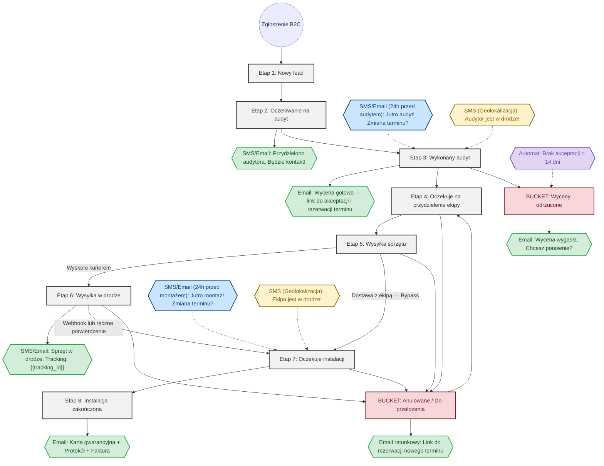
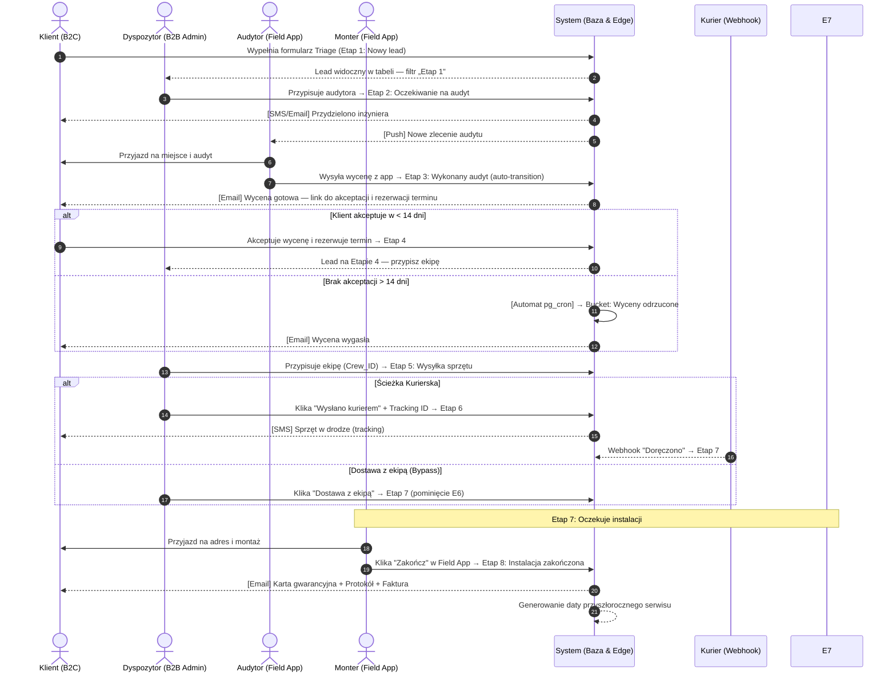

# Proces Lejka Sprzedażowego (B2B Admin Panel)

Poniższy schemat przedstawia sekwencyjny proces przepływu (Funnel Flow) zgłoszenia w systemie Klik Klima. Proces ten oparty jest na **8 etapach** i **3 bucketach** (stanach pobocznych) zdefiniowanych w wymaganiach biznesowych i obsługiwany za pomocą rozbudowanej tabeli z filtrem etapu (dropdown) w panelu B2B.

> **Uwaga:** Proces serwisów gwarancyjnych i obsługi usterek zostanie zdefiniowany w osobnym wątku i osobnym dokumencie procesowym.

## Maszyna Stanów Lejka (State Diagram)

Poniższy diagram przedstawia pełną maszynę stanów leada — w tym ścieżki alternatywne (State Bypass, Rollback Engine) i buckety.

## Szczegółowy opis etapów i wyzwalaczy

### Etap 1: Nowy lead
- **Opis:** Wpada nowy lead.
- **Wyzwalacz do Etapu 2:** Administrator dokonuje ręcznego przypisania audytora do leada w systemie.

### Etap 2: Oczekiwanie na audyt
- **Opis:** Audytor ma przypisany lead i realizuje wizję lokalną.
- **Wyzwalacz do Etapu 3:** Audytor wysyła wycenę z aplikacji do klienta. Po jej wysłaniu z automatu (auto-transition) lead przechodzi do kolejnego etapu.

### Etap 3: Wykonany audyt
- **Opis:** W systemie widnieje gotowa wycena. Klient otrzymał ofertę i decyduje o jej akceptacji.
- **Wyzwalacz do Etapu 4 (Sukces):** Klient akceptuje daną wycenę poprzez rezerwację konkretnego terminu montażu.
- **Wyzwalacz do Bucketu (Odrzucenie):** Jeśli klient nie zaakceptuje wyceny w czasie powyżej 14 dni, lead automatycznie spada do bucketu „Wyceny odrzucone".

### Etap 4: Oczekuje na przydzielenie ekipy
- **Opis:** Zlecenie posiada już zarezerwowany termin instalacji. System oczekuje na ostateczne dobranie brygady monterskiej.
- **Wyzwalacz do Etapu 5:** Administrator przypisuje konkretną ekipę monterską (`Crew_ID`) do zlecenia. Status przechodzi do działu logistyki.

### Etap 5: Wysyłka sprzętu (W hurtowni)
- **Opis:** Przygotowanie zlecenia wysyłki, kompletowanie urządzeń w magazynie.
- **Wyzwalacz do Etapu 6 (Ścieżka Kurierska):** Dyspozytor klika „Wysłano kurierem" (dodaje Tracking ID).
- **Wyzwalacz do Etapu 7 (State Bypass — Ścieżka Bezpośrednia):** Dyspozytor klika „Dostawa z ekipą w dniu montażu".

### Etap 6: Wysyłka w drodze
- **Opis:** Paczka nadana kurierem jest w drodze do klienta.
- **Wyzwalacz do Etapu 7:** Webhook od firmy kurierskiej zwraca status „Doręczono" LUB dyspozytor ręcznie klika „Paczka dostarczona".

### Etap 7: Oczekuje instalacji
- **Opis:** Warunki logistyczne spełnione. Ekipa monterska jest gotowa, sprzęt jest u klienta lub jedzie z monterami.
- **Wyzwalacz do Etapu 8:** Instalator za pomocą aplikacji mobilnej zmienia status zlecenia na „Zakończone" po udanym montażu.

### Etap 8: Instalacja zakończona
- **Opis:** Proces montażu pomyślnie zamknięty.

### Bucket: Wyceny odrzucone
- **Opis:** Miejsce na leady, które nie skonwertowały.
- **Wyzwalacz WEJŚCIA:** Brak akceptacji wyceny na Etapie 3 przez ponad 14 dni (automat).
- **Wyjście „Zwróć do obiegu" (T15):** Dyspozytor przesuwa leada z powrotem na Etap 3. Jeżeli od wejścia do bucketu minęło ponad 30 dni, guard `quoteRefreshedIfStale` blokuje przejście do czasu odświeżenia ceny — chodzi o to, żeby klient nie zaakceptował wyceny opartej na nieaktualnych cenach materiałów.
- **Wyjście „Archiwizuj trwale" (T16):** przejście do bucketu Lost, wymaga podania powodu utraty.

### Bucket: Zarchiwizowany (Lost)
- **Opis:** Stan terminalny. Lead zamknięty definitywnie, powód utraty zasila moduł analityczny.
- **Wyzwalacz WEJŚCIA:** wyłącznie ręczna akcja Dyspozytora z bucketu „Wyceny odrzucone" (T16), zawsze z powodem utraty (guard `lostReasonProvided`).
- **Wyjście:** brak w maszynie stanów. Przywrócenie leada wymaga ręcznej interwencji administratora w bazie — to celowe, bo archiwizacja ma być decyzją nieodwracalną w normalnym trybie pracy.

### Bucket: Anulowane / Do przełożenia (Rollback Engine)
- **Opis:** Worek na leady wyjęte z głównego przepływu. Zwalnia zasoby (kalendarz ekipy) i blokuje SLA logistyczne.
- **Wyzwalacze WEJŚCIA:** Klient klika „Zmień termin/Anuluj" w e-mailu LUB Dyspozytor wyzwala akcję „Problem z dostawą (Rollback)".
- **Wyzwalacz WYJŚCIA (Powrót do lejka):** Klient wybiera nowy termin z linku w e-mailu ratunkowym → lead wraca do Etapu 4.

---

## Schemat Przepływu z Systemem Powiadomień (Flowchart)

Poniższy diagram obrazuje przepływ leada oraz zintegrowany, zautomatyzowany system komunikacji z klientem (SMS/E-mail).
Węzły w kolorze **zielonym** reprezentują automatyczną komunikację wychodzącą, **niebieskim** wyzwalacze czasowe, **żółtym** wyzwalacze GPS.

## Rodzaje Powiadomień i Parametryzacja

Wysyłka wiadomości opiera się na tabeli `NOTIFICATION_QUEUE` i Edge Functions, co pozwala na pełną parametryzację (np. kolejkowanie wysyłki tylko w godzinach 8:00-18:00).

Wyróżniamy 4 typy wyzwalaczy (oznaczone kolorami na diagramie):

1. **Wyzwalacze na zmianę statusu (Zielone):**
   - Generowane natychmiast po zmianie etapu z poziomu tabeli lub karty klienta w panelu B2B (np. wejście w Etap 2, 3, 6, 8).
2. **Wyzwalacze Czasowe (Niebieskie):**
   - Wymagają harmonogramu (`pg_cron`). Obliczane na podstawie zaplanowanej daty w kalendarzu.
   - Przypomnienie dzień przed audytem, dzień przed montażem.
3. **Wyzwalacze Zewnętrzne / GPS (Żółte):**
   - Wyzwalane akcją z poziomu Field App. Audytor klika "Wyruszam" lub wkracza w promień np. 5 km od adresu leada, co wyzwala SMS "Audytor jest w drodze".
4. **Wyzwalacze Automatyczne (Fioletowe):**
   - Automat 14-dniowy: `pg_cron` sprawdza leady na Etapie 3 bez akceptacji > 14 dni → przenosi do bucketu.
   - Webhook kurierski: zewnętrzny callback od firmy kurierskiej ze statusem „Doręczono" → E6 → E7.
   - Rollback: zwolnienie kalendarza i wysyłka maila ratunkowego po wejściu do bucketu.

## Role i Odpowiedzialność (Sequence Diagram)

Poniższy diagram sekwencji ukazuje interakcje pomiędzy klientem, dyspozytorem (panel B2B), inżynierami terenowymi (Field App) oraz samym systemem automatyzującym.

