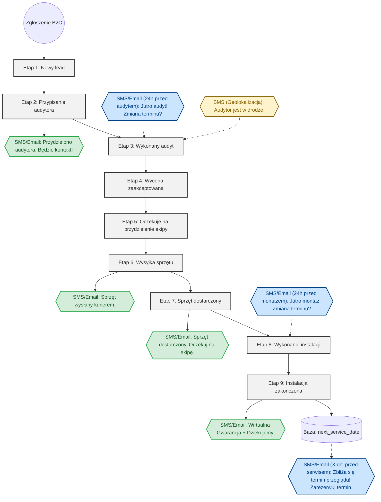
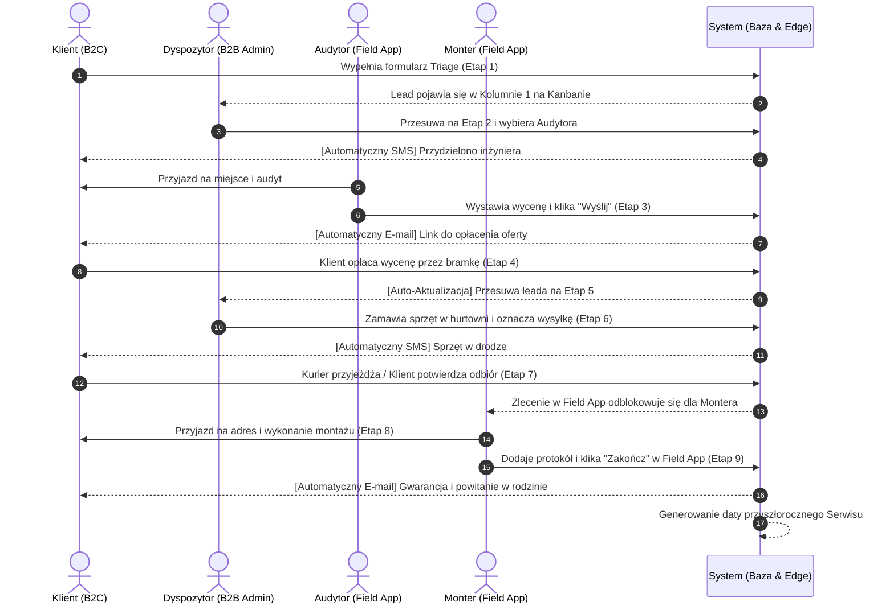

# Proces Lejka Sprzedażowego (B2B Admin Panel)

Poniższy schemat przedstawia sekwencyjny proces przepływu (Funnel Flow) zgłoszenia w systemie Klik Klima. Proces ten oparty jest na 9 etapach zdefiniowanych w wymaganiach biznesowych i obsługiwany za pomocą tablicy Kanban w panelu B2B.

## Schemat Przepływu z Systemem Powiadomień (Flowchart)

Poniższy diagram obrazuje przepływ leada oraz zintegrowany, zautomatyzowany system komunikacji z klientem (SMS/E-mail).
Węzły w kolorze **niebieskim** reprezentują automatyczną komunikację wychodzącą.

## Rodzaje Powiadomień i Parametryzacja

Wysyłka wiadomości opiera się na tabeli `NOTIFICATION_QUEUE` i Edge Functions, co pozwala na pełną parametryzację (np. kolejkowanie wysyłki tylko w godzinach 8:00-18:00).

Wyróżniamy 3 główne typy wyzwalaczy (oznaczone kolorami na diagramie):

1. **Wyzwalacze na zmianę statusu (Zielone):** 
   - Generowane natychmiast po zmianie kolumny na Kanbanie (np. wejście w Etap 2, 6, 7 i 9).
2. **Wyzwalacze Czasowe (Niebieskie):**
   - Wymagają harmonogramu (`pg_cron`). Obliczane na podstawie zaplanowanej daty w kalendarzu.
   - Przypomnienie dzień przed audytem, dzień przed montażem oraz przypomnienie o corocznym serwisie z linkiem do zmiany terminu.
3. **Wyzwalacze Zewnętrzne / GPS (Żółte):**
   - Wyzwalane akcją z poziomu Field App. Audytor klika "Wyruszam" lub wkracza w promień np. 5 km od adresu leada, co wyzwala SMS "Audytor jest w drodze".

## Role i Odpowiedzialność (Sequence Diagram)

Aby jeszcze lepiej zrozumieć, kto jest aktorem (wykonawcą) w poszczególnym kroku, poniższy diagram sekwencji ukazuje interakcje pomiędzy klientem, dyspozytorem (panel B2B), inżynierami terenowymi (Field App) oraz samym systemem automatyzującym.

