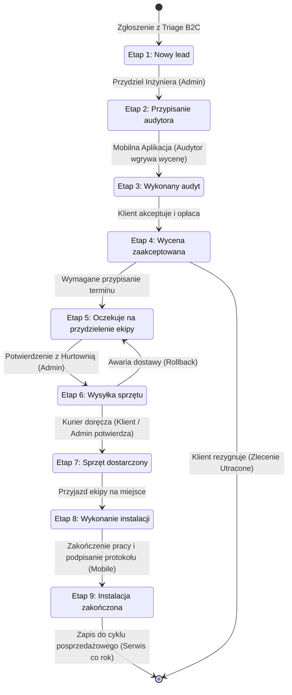

# Proces Lejka Sprzedażowego (B2B Admin Panel)

Poniższy schemat przedstawia sekwencyjny proces przepływu (Funnel Flow) zgłoszenia w systemie Klik Klima. Proces ten oparty jest na 9 etapach zdefiniowanych w wymaganiach biznesowych i obsługiwany za pomocą tablicy Kanban w panelu B2B.

## Schemat Przepływu (State Diagram)

## Opis Akcji Systemowych i Asynchronicznych
W trakcie przechodzenia pomiędzy powyższymi stanami (Drag&Drop na tablicy Kanban lub akcje w aplikacji mobilnej), baza danych (PostgreSQL Triggers) automatycznie nasłuchuje zmian. Na przykład:
1. Zmiana na **Etap 2** generuje w tabeli `notification_queue` powiadomienie SMS dla klienta z numerem telefonu przydzielonego inżyniera.
2. Wejście w **Etap 6** i brak dostawy do **Etapu 7** na 24h przed montażem wywołuje alert SLA u Dyspozytora.
3. Wejście w **Etap 9** generuje powiadomienie (Email) z wirtualną gwarancją i wpisuje klienta w cykliczny proces przypomnień o serwisie za 12 miesięcy.
