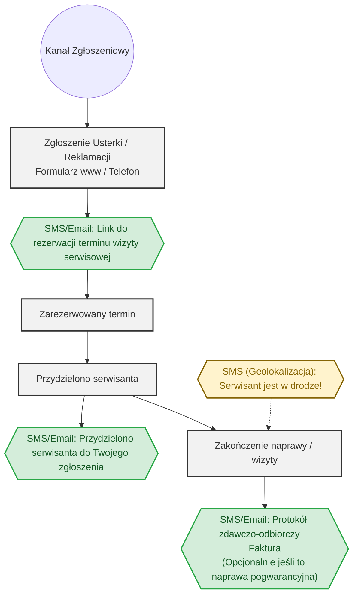

# Proces Reklamacji i Zgłaszania Usterek

> **ADR-003 (2026-08-18):** powiadomienia w tym procesie były numerowane `N1`–`N4`, czyli tymi samymi identyfikatorami, które w kanonicznym słowniku `notification_definitions.md` należą do lejka sprzedażowego. Przenumerowane na `N15`–`N18` zgodnie ze słownikiem. **Kanonem jest `notification_definitions.md`** — ten dokument opisuje proces, nie definiuje powiadomień.

Dokument ten definiuje przepływ (Flowchart) obsługi zgłoszeń serwisowych, usterek oraz reklamacji w systemie Klik Klima. Proces ten jest zintegrowany z systemem powiadomień B2C, podobnie jak główny lejek sprzedażowy i serwisowy.

## Schemat Przepływu (Flowchart)

Węzły w kolorze **niebieskim** reprezentują automatyczną komunikację wychodzącą.

## Opis Kroków

1. **Zgłoszenie Usterki / Reklamacji**: Zgłoszenie spływa do systemu B2B poprzez formularz na stronie (B2C) lub zostaje wprowadzone ręcznie przez dyspozytora w trakcie rozmowy telefonicznej.
2. **Rezerwacja Terminu**: Klient otrzymuje automatyczny SMS/Email ze spersonalizowanym linkiem do systemu Cal.com (lub wbudowanego kalendarza), gdzie może wybrać dogodny dla siebie termin z puli wolnych okienek.
3. **Przydzielenie Serwisanta**: Po wybraniu terminu przez klienta i akceptacji dyspozytora (lub automatycznym przypisaniu na bazie dostępności), ekipa serwisowa otrzymuje zgłoszenie w Field App.
4. **Powiadomienie o Zespole**: Klient dostaje potwierdzenie, że konkretny serwisant został przydzielony do zadania.
5. **Serwisant w Drodze**: Tuż przed przybyciem ekipy, klient otrzymuje SMS z geolokalizacją i szacowanym czasem dojazdu (mechanizm Field App).
6. **Zakończenie Naprawy**: Serwisant w aplikacji Field App wypełnia protokół naprawy, załącza zdjęcia i zamyka zlecenie.
7. **Protokół i Faktura**: Klient otrzymuje wiadomość końcową wraz z protokołem. Jeśli była to naprawa pogwarancyjna (płatna), dołączana jest faktura.
