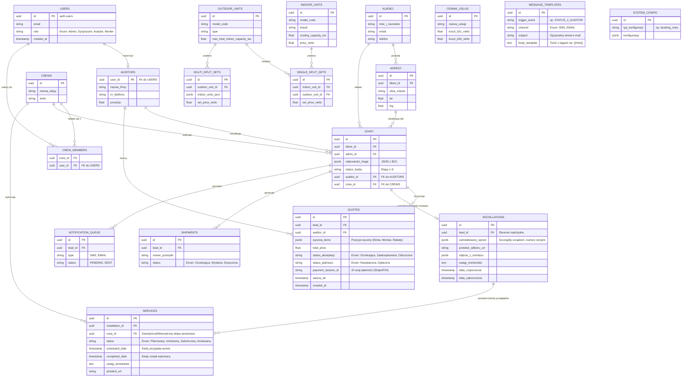

# Model Danych (Supabase / PostgreSQL) - Wersja B2B/B2C

Poniższy dokument obrazuje pełny, zaktualizowany relacyjny model danych dla systemu Klik Klima, uwzględniający zarówno obsługę Triage (B2C), jak i panel zarządzania dla dyspozytora i monterów (B2B/CRM).

## Diagram Relacji Encji (ERD)

## Opis Tabel (Katalog Produktów)
- **`indoor_units` & `outdoor_units`**: Baza sprzętowa, definiuje parametry klimatyzatorów.
- **`single_split_sets` & `multi_split_sets`**: Gotowe zestawy sprzedażowe wykorzystywane w kalkulatorze (Triage) oraz przez Audytorów.
- **`cennik_uslug`**: Standardowe koszty materiałów i robocizny (B2C i B2B).

## Opis Nowych Tabel B2B / Field App

1. **`users` (RBAC)**: Centralna tabela kont powiązana z Auth Supabase, zawierająca rolę pracownika (Audytor, Monter, Admin).
2. **`auditors`**: Dedykowana tabela rozszerzająca użytkownika (`1:1` z `users`). Ponieważ aplikacja Field App będzie używana przez zewnętrznych lub wewnętrznych inżynierów robiących wyceny zdalne, tu trzymamy specyficzne dane (nazwa firmy, prowizje).
3. **`quotes` (Wyceny)**: Rozwiązuje problem ewidencjonowania ofert. Audytor z poziomu aplikacji terenowej / B2B generuje tu konkretną wycenę dla `leada`. Tabela posiada statusy akceptacji oraz płatności (`Nieopłacona`, `Opłacona`), jak i klucz integrujący np. bramkę płatności (`payment_session_id`). Na jej podstawie system wie, czy odblokować klientowi wybór terminu w kalendarzu.
4. **`crews` & `crew_members`**: Ekipy monterskie. Jeden monter (`user_id`) może należeć do ekipy. Ekipa jako całość jest przypisywana do realizacji zadania na `leady`.
5. **`installations`**: Ewidencja wykonanych prac. To tutaj ekipa w Field App wrzuca podpisane protokoły po pierwszej instalacji, numery seryjne użytego sprzętu oraz zdjęcia ze ściany.
6. **`services`**: Historia cyklicznych przeglądów. Zamiast trzymać tylko jedną datę w instalacji, generujemy nowy rekord dla każdego serwisu (np. za rok, za dwa lata). Klient powiadamiany jest na podstawie rekordu ze statusem "Planowany". Po realizacji (Field App) status zmienia się na "Zakończony" i generowany jest kolejny rekord na następny rok.
7. **`shipments`**: Zarządzanie kurierami i materiałami, ścisłe powiązanie z leadem.
8. **`message_templates`**: Słownik dynamicznych szablonów wiadomości e-mail oraz SMS. Administrator (B2B) może edytować treści z poziomu interfejsu (bez grzebania w kodzie). Zmienne takie jak `{{imie}}` są dynamicznie podmieniane przez Edge Functions przed wysyłką.
