# Model Danych (Supabase / PostgreSQL) - Wersja B2B/B2C & CRM

Poniższy dokument obrazuje pełny, zaktualizowany relacyjny model danych dla systemu KlikKlima. Uwzględnia on proces pozyskiwania leadów przez kalkulator Triage (B2C), zarządzanie lejkiem sprzedażowym (8 etapów + 3 buckety) w panelu dyspozytora i administracji B2B, a także rygorystyczną obsługę 7 widoków modułu CRM (Karta 360, certyfikaty F-Gaz/SEP, serwisowanie roczne i niezależny proces awaryjnych usterek).

---

## 1. Diagram Relacji Encji (ERD)

Nazwa encji i pól odzwierciedla stan w schemacie Prisma (`schema.prisma`) oraz zawiera kolumny niezbędne do realizacji pełnych wytycznych architektonicznych i serwisowych.

> **ADR-002 (2026-08-18):** wszystkie identyfikatory techniczne — tabele, kolumny, klucze obce, wartości enumów — są po angielsku w `snake_case`. Modele Prisma noszą nazwy `PascalCase` z mapowaniem `@@map("snake_case")`. Polski zostaje w treściach dla użytkownika, komentarzach i tej dokumentacji. Pełny słownik przekładu: [`NAMING.md`](./NAMING.md).

```mermaid
erDiagram
    authorized_users {
        string id PK
        string email UK "Bramka logowania SSO Google"
        string role "Admin, Dyspozytor, Audytor, Monter"
        timestamp created_at
    }

    clients {
        uuid id PK
        string full_name
        string email
        string phone
        timestamp created_at
    }

    addresses {
        uuid id PK
        uuid client_id FK
        string street_city
        float lat
        float lng
        timestamp created_at
    }

    auditors {
        uuid id PK
        string full_name
        string phone
        string email
        string photo_url "Awaryjny avatar wizytówkowy"
        string fgaz_certificate_no
        date fgaz_valid_until "Wyzwalacz alertu 30d przed"
        boolean sep_qualified
        date sep_valid_until "Wyzwalacz alertu 30d przed"
        int hvac_experience_years
        uuid region_id FK "Obszar działania — auto-przypisywanie po kodzie pocztowym"
        int daily_audit_cap "Nadpisanie SLA.AUDITOR_DAILY_CAP dla tego audytora (NULL = wartość z kontraktu)"
        string availability_status "ACTIVE ON_LEAVE SICK_LEAVE"
        string iban
        timestamp created_at
    }

    crews {
        uuid id PK
        string name "np. Ekipa Alpha Wrocław"
        string contact_phone
        string photo_url "Zdjęcie reprezentatywne brygady"
        uuid representative_user_id FK "authorized_users — przedstawiciel zespołu, posiadacz certyfikatów (ADR-009)"
        string representative_full_name "Imię i nazwisko przedstawiciela, odpowiedzialnego za montaż"
        string fgaz_certificate_no "Certyfikat F-Gaz PRZEDSTAWICIELA, nie zespołu"
        date fgaz_valid_until "Wyzwalacz alertu I6 i blokady w E4"
        boolean sep_qualified "Uprawnienia SEP przedstawiciela"
        date sep_valid_until "Wyzwalacz alertu I6 i blokady w E4"
        int crew_count "Liczebność brygady — członkowie nie są ewidencjonowani osobno (ADR-009)"
        string iban
        boolean is_active
    }

    indoor_units {
        uuid id PK
        string model_code UK
        string brand
        decimal cooling_capacity_kw
        decimal net_price
        string image_url
    }

    outdoor_units {
        uuid id PK
        string model_code UK
        string brand
        string type "SINGLE MULTI"
        decimal net_price
    }

    single_split_sets {
        uuid id PK
        uuid indoor_unit_id FK
        uuid outdoor_unit_id FK
        decimal set_net_price
        boolean is_bestseller
    }

    multi_split_sets {
        uuid id PK
        uuid outdoor_unit_id FK
        jsonb indoor_units_json
        decimal set_net_price
        boolean is_bestseller
    }

    leads {
        uuid id PK
        uuid client_id FK
        uuid address_id FK
        jsonb triage_answers "Konfiguracja z Triage B2C"
        string declared_property_condition "FINISHED DEVELOPER_SHELL — deklaracja klienta w Triage, NIE decyduje o trybie montażu"
        string status "LeadStatus: Enum 8 etapów + 3 Buckety"
        uuid auditor_id FK
        decimal final_quote_pln
        timestamp bucket_entered_at "Kiedy wejście do Zimne Leady lub Rollback"
        string lost_reason "Powód trwałej archiwizacji Lost"
        timestamp last_followup_date "Ostatni automatyczny kontakt re-angażujący"
        timestamp created_at
    }

    quotes {
        uuid id PK
        uuid lead_id FK
        uuid auditor_id FK
        jsonb quote_items "Klimatyzacja, montaż, rabat"
        decimal total_price
        string installation_type "SINGLE_PHASE TWO_PHASE — ustalane przez audytora na miejscu, wartość wiążąca"
        string approval_status "DRAFT SENT ACCEPTED REJECTED"
        string payment_status "UNPAID PAID PENDING"
        string payment_session_id "Stripe / Przelew24"
        timestamp valid_until "Po 14d przenosi do Zimnych leadów"
        timestamp created_at
    }

    installations {
        uuid id PK
        uuid lead_id FK "Zlecenie sprzedażowo-montażowe"
        uuid crew_id FK "Przypisany zespół monterski"
        string installation_type "SINGLE_PHASE TWO_PHASE — kopiowane z zaakceptowanej wyceny"
        datetime scheduled_at "Termin instalacji w E7/E8"
        datetime completed_at
        string status "PLANNED IN_PROGRESS COMPLETED CANCELLED"
        date next_service_date "WYLICZONA data należności serwisu (ostatni etap + 1 rok). Pole pochodne — nie edytowane ręcznie, patrz ADR-010"
        string protocol_url
        jsonb installation_photos
        text installer_notes
    }

    installation_phases {
        uuid id PK "Etap montażu (ADR-005). SINGLE_PHASE ma jeden rekord, TWO_PHASE dwa"
        uuid installation_id FK
        int phase_no "1 = przygotowanie w stanie deweloperskim, 2 = montaż jednostek"
        uuid booking_id FK "Własna rezerwacja terminu dla tego etapu"
        uuid crew_id FK "Etapy może realizować inna ekipa"
        string status "PLANNED IN_PROGRESS COMPLETED CANCELLED"
        datetime started_at
        datetime completed_at
        uuid protocol_document_id FK "Protokół etapowy w documents"
        uuid invoice_id FK "Faktura za etap — dla TWO_PHASE etap I fakturowany osobno"
        text notes
    }

    services {
        uuid id PK "Cykliczne przeglądy roczne"
        uuid client_id FK
        uuid address_id FK
        uuid installation_id FK "Relacja do pierwotnego montażu"
        uuid crew_id FK
        uuid booking_id FK "Rezerwacja terminu — powstaje, gdy klient wybierze termin z linku w N10"
        datetime scheduled_date "Termin wizyty. Kopia bookings.scheduled_start, puste dopóki klient nie zarezerwuje"
        datetime completed_date
        string status "AWAITING_CONTACT SCHEDULED COMPLETED IGNORED"
        timestamp reminder_sent_at "Kiedy wysłano N10 — chroni przed powtórnym przypomnieniem w kolejnym przebiegu crona"
        text service_notes
    }

    incidents {
        uuid id PK "Identyfikator np. UST-2026-001"
        uuid client_id FK
        uuid installation_id FK
        uuid crew_id FK "Brygada ratunkowo-serwisowa"
        string priority "LOW MEDIUM CRITICAL (SLA 48h, PUSH)"
        string status "NEW EN_ROUTE AWAITING_PARTS REPAIRED WARRANTY_REJECTED"
        text customer_problem_description
        jsonb media_urls "Dowody usterki od B2C lub dyspozytora"
        timestamp created_at
    }

    shipments {
        uuid id PK "Obsługa hurtowni (E5) i kurierów (E6)"
        uuid lead_id FK
        string shipment_status "PENDING SHIPPED DELIVERED"
        string tracking_id "Nr listu przewozowego od webhooka kuriera"
        string courier_company
        datetime shipped_at
    }

    notification_queue {
        uuid id PK "Centrum Powiadomień: historia i ponawianie (ADR-007)"
        string notification_id "N1..N18, I1..I7 — ID z katalogu, nie wolny tekst"
        string template_key FK "Wskazuje na message_templates.template_key"
        string channel "SMS EMAIL PUSH"
        string recipient_kind "CLIENT DISPATCHER ADMIN AUDITOR CREW"
        uuid recipient_user_id FK "Dla odbiorców wewnętrznych — authorized_users"
        uuid client_id FK "Dla odbiorcy CLIENT; zasila też historię na Karcie 360"
        string recipient_address "Numer telefonu lub e-mail w chwili wysyłki — nie zmienia się po edycji klienta"
        uuid lead_id FK "Powiązanie polimorficzne — dokładnie jedno z czterech jest niepuste"
        uuid installation_id FK
        uuid service_id FK
        uuid incident_id FK
        jsonb payload "Zmienne szablonu w chwili kolejkowania"
        string status "PENDING SENT ERROR DEAD_LETTER CANCELLED"
        timestamp send_after "Najwcześniejszy moment wysyłki (okno SMS 8:00-18:00)"
        timestamp sent_at
        int attempts "Licznik prób, maxAttempts z QUEUE_POLICY"
        timestamp next_attempt_at "Wyliczane z backoffu wykładniczego"
        text last_error
        timestamp dead_lettered_at "Po przekroczeniu deadLetterAfterAttempts"
        string idempotency_key UK "Zapobiega drugiemu SMS-owi przy ponowieniu"
        timestamp created_at
    }

    audit_log {
        uuid id PK "Rejestr operacji wrażliwych, append-only (ADR-008)"
        string action "delete anonymize role_change contract_override manual_status_change notification_resend"
        string entity_table "Której tabeli dotyczy"
        uuid entity_id "Którego rekordu — bez klucza obcego, bo rekord mógł zostać usunięty"
        uuid actor_user_id FK "authorized_users — kto wykonał"
        string actor_role "Rola w chwili operacji, nie dzisiejsza"
        string legal_basis "Podstawa: RODO_ERASURE_REQUEST OPERATIONAL_ERROR DUPLICATE COURT_ORDER OTHER"
        text justification "Uzasadnienie wpisane przez operatora"
        jsonb before_snapshot "Stan przed zmianą, ze zanonimizowanymi danymi wrażliwymi"
        jsonb after_snapshot
        string request_id "Korelacja z żądaniem HTTP"
        timestamp occurred_at "Czas operacji, nie czas zapisu"
        date retention_until "occurred_at + AUDIT_REQUIREMENTS.retentionDays"
    }

    device_tokens {
        uuid id PK "Nośnik kanału PUSH (ADR-006)"
        uuid user_id FK "authorized_users — push idzie do pracownika, nie do klienta"
        string app "FIELD_APP B2B_PANEL"
        string platform "IOS ANDROID WEB"
        string token UK
        boolean is_active "Wygaszany po odrzuceniu przez dostawcę push"
        timestamp last_seen_at
        timestamp created_at
    }

    message_templates {
        uuid id PK
        string template_key UK "Klucz z katalogu, np. funnel.auditor_assigned"
        string notification_id "N1..N18, I1..I7"
        string channel "SMS EMAIL PUSH"
        string subject "Tylko dla EMAIL"
        text body_template "Treść po polsku, zmienne po angielsku: {{first_name}}"
        jsonb required_vars "Zmienne wymagane przez ten szablon"
        boolean is_active
        timestamp updated_at
    }


    bookings {
        uuid id PK "Rezerwacja terminu — jedyne źródło prawdy o terminach (ADR-012)"
        uuid lead_id FK "Rezerwacja audytu lub montażu"
        uuid service_id FK "Rezerwacja przeglądu rocznego"
        uuid incident_id FK "Rezerwacja wizyty usterkowej"
        string resource_kind "AUDITOR CREW"
        uuid auditor_id FK
        uuid crew_id FK
        datetime scheduled_start
        datetime scheduled_end
        string status "RESERVED CONFIRMED RELEASED COMPLETED"
        string booked_by "CLIENT DISPATCHER"
        uuid reschedule_of FK "Poprzednia rezerwacja przy zmianie terminu — historia zmian"
        timestamp created_at
    }

    absences {
        uuid id PK "Blokada kalendarza: urlop, zwolnienie, awaria auta"
        string resource_kind "AUDITOR CREW"
        uuid auditor_id FK
        uuid crew_id FK
        datetime starts_at
        datetime ends_at
        string reason "VACATION SICK_LEAVE VEHICLE_FAILURE OTHER"
        uuid created_by FK
        timestamp created_at
    }

    regions {
        uuid id PK "Obszar działania audytora"
        string name
        boolean is_active
    }

    region_postal_codes {
        uuid id PK
        uuid region_id FK
        string postal_code UK "Kod pocztowy do auto-przypisywania audytora"
    }

    documents {
        uuid id PK "Zakładka Dokumenty na Karcie 360"
        uuid client_id FK
        uuid lead_id FK
        uuid installation_id FK
        uuid service_id FK
        uuid incident_id FK
        string kind "QUOTE_PDF CONTRACT HANDOVER_PROTOCOL PHOTO OTHER"
        string storage_path "Supabase Storage"
        string mime_type
        int size_bytes
        uuid uploaded_by FK
        timestamp created_at
    }

    invoices {
        uuid id PK
        uuid client_id FK
        uuid installation_id FK
        uuid quote_id FK
        uuid document_id FK "PDF faktury w documents"
        string number UK
        date issued_at
        date due_at
        decimal net_amount
        decimal gross_amount
        string status "DRAFT ISSUED PAID OVERDUE CANCELLED"
    }

    contact_log {
        uuid id PK "Ostatni kontakt, logowanie próby kontaktu"
        uuid client_id FK
        uuid lead_id FK
        string channel "PHONE EMAIL SMS IN_PERSON"
        string direction "INBOUND OUTBOUND"
        string outcome "ANSWERED NO_ANSWER CALLBACK_REQUESTED REFUSED"
        text summary
        uuid contacted_by FK
        timestamp contacted_at
    }

    notes {
        uuid id PK "Notatki na karcie klienta"
        uuid client_id FK
        uuid lead_id FK
        uuid installation_id FK
        text body
        uuid author_id FK
        boolean is_pinned
        timestamp created_at
    }

    vehicles {
        uuid id PK "Auto służbowe przypisane do ekipy"
        string registration_number UK
        string brand_model
        uuid crew_id FK
        boolean is_active
    }

    soft_leads {
        uuid id PK "Porzucony Triage — Exit Intent"
        jsonb triage_answers
        string email
        string phone
        string source "EXIT_INTENT PARTIAL_FORM"
        uuid converted_lead_id FK "Wypełniane, gdy soft lead stał się leadem"
        timestamp captured_at
    }

    clients ||--o{ addresses : "posiada"
    clients ||--o{ leads : "składa"
    addresses ||--o{ leads : "lokalizacja dla"
    
    indoor_units ||--o{ single_split_sets : "tworzy"
    outdoor_units ||--o{ single_split_sets : "tworzy"
    outdoor_units ||--o{ multi_split_sets : "tworzy"

    auditors ||--o{ leads : "weryfikuje na E2-E3"
    auditors ||--o{ quotes : "generuje dla klienta"
    leads ||--o{ quotes : "obejmuje wycene"
    
    crews ||--o{ installations : "realizuje montaz"
    crews ||--o{ services : "wykonuje przeglady"
    crews ||--o{ incidents : "usuwa awarie"
    
    leads ||--o| installations : "konwertuje do montaz"
    leads ||--o{ shipments : "posiada dostawy E5-E6"
    leads ||--o{ notification_queue : "kolejkuje powiadomienia"
    installations ||--o{ notification_queue : "powiadomienia montazowe"
    services ||--o{ notification_queue : "przypomnienia serwisowe"
    incidents ||--o{ notification_queue : "powiadomienia usterkowe"
    clients ||--o{ notification_queue : "historia komunikacji na Karcie 360"
    message_templates ||--o{ notification_queue : "szablon wiadomosci"
    authorized_users ||--o{ device_tokens : "rejestruje urzadzenia"
    authorized_users ||--o{ audit_log : "wykonuje operacje"
    
    installations ||--o{ installation_phases : "dzieli sie na etapy"
    installation_phases ||--o| bookings : "ma termin"
    installation_phases ||--o| invoices : "fakturowany"
    installation_phases ||--o| documents : "protokol etapowy"
    crews ||--o{ installation_phases : "realizuje etap"
    installations ||--o{ services : "generuje roczny harmonogram"
    services ||--o| bookings : "termin wizyty"
    installations ||--o{ incidents : "podlega pod awarie"
    clients ||--o{ incidents : "zgłasza awarie"

    leads ||--o{ bookings : "rezerwuje terminy"
    services ||--o{ bookings : "ma termin"
    incidents ||--o{ bookings : "ma termin wizyty"
    auditors ||--o{ bookings : "obsadza"
    crews ||--o{ bookings : "obsadza"
    bookings ||--o| bookings : "przełożona z"

    auditors ||--o{ absences : "nieobecności"
    crews ||--o{ absences : "blokady kalendarza"
    authorized_users ||--o| crews : "reprezentuje zespol"
    crews ||--o{ vehicles : "dysponuje"

    regions ||--o{ region_postal_codes : "obejmuje"
    regions ||--o{ auditors : "obszar działania"

    clients ||--o{ documents : "posiada"
    clients ||--o{ invoices : "otrzymuje"
    clients ||--o{ contact_log : "historia kontaktu"
    clients ||--o{ notes : "notatki"
    installations ||--o{ documents : "protokoly i zdjecia"
    installations ||--o{ invoices : "rozliczenie"
    quotes ||--o| invoices : "podstawa faktury"
    documents ||--o| invoices : "plik PDF"
    soft_leads ||--o| leads : "konwertuje do"

```

---

## 2. Opis Tabel (Katalog Produktów)
- **`indoor_units` & `outdoor_units`**: Baza sprzętowa definująca techniczne parametry klimatyzatorów (moc chłodnicza/grzewcza, głośność, wymiary, cechy smart jak WiFi/czujnik obecności).
- **`single_split_sets` & `multi_split_sets`**: Kompletne zestawy sprzedażowe wykorzystywane we froncie B2C w kalkulatorze Triage oraz przez audytorów.
- **`service_pricing` & `product_3d_models`**: Kosztorysy usług dodatkowych (kucie w betonie, wysięgniki) oraz zasoby modeli 3D do wizualizacji na ścianie klienta.

---

## 3. Opis Głównych Encji B2B, CRM i Field App

1. **`authorized_users` (Bramka RBAC i SSO Google)**:
   - Tabela kontroli dostępu (Epic 5). Przechowuje dozwolone adresy e-mail i rolę (`admin`, `dyspozytor`, `audytor`, `monter`). Gdy użytkownik próbuje zalogować się przez Google (OAuth2), system sprawdza obecność maila w tej tabeli — brak wpisu natychmiast blokuje sesję z komunikatem o braku uprawnień.
2. **`auditors`**:
   - Rozszerzenie danych inżynierów techniczno-handlowych pracujących w terenie na Etapie 2 i 3. Posiada awatary (`photo_url`), numery kont IBAN oraz obowiązkowe daty wygaśnięcia **certyfikatów F-Gaz i uprawnień SEP** (`fgaz_valid_until`, `sep_valid_until`). Zbliżenie się do daty wygaśnięcia (< 30 dni) wyzwala powiadomienie do Administratora.
3. **`crews`**:
   - Reprezentuje brygady instalacyjne realizujące zlecenia montażowe na Etapach 7–8 i serwisach. Tabela zawiera zdjęcie reprezentatywne ekipy (przy aucie/w mundurach) oraz kontrolę ważności **certyfikatów F-Gaz i SEP**. Zespół z wygasłym certyfikatem jest **automatycznie blokowany i ukrywany z puli dostępnych brygad** na Etapie 4 przy przydzielaniu do zlecenia.
4. **`leads`**:
   - Centralne zgłoszenie w systemie z polem `status` typu `LeadStatus` przyjmującym 8 statusów lejka (`NEW_LEAD`, `AWAITING_AUDIT`, `AUDIT_COMPLETED`, `AWAITING_CREW_ASSIGNMENT`, `HARDWARE_IN_WAREHOUSE`, `HARDWARE_IN_TRANSIT`, `AWAITING_INSTALLATION`, `INSTALLATION_COMPLETED`) oraz 3 stany bucket:
     - **`QUOTE_REJECTED` (Zimne leady):** Wyceny bez akceptacji > 14 dni z polami `bucket_entered_at`, `last_followup_date` oraz obowiązkowym powodem odrzucenia `lost_reason` (np. „Konkurencja", „Za drogo") przy definitywnej archiwizacji (Lost).
     - **`ROLLBACK_RESCHEDULING` (Rollback Engine):** Stan awaryjny wywoływany m.in. brakiem dostawcy z kuriera z linkiem ponownym rezerwacji terminu montażu.
     - **`ARCHIVED_LOST` (Zarchiwizowany, ADR-004):** Stan terminalny osiągalny wyłącznie z `QUOTE_REJECTED` ręczną akcją Dyspozytora, zawsze z wypełnionym `lost_reason` ze słownika zamkniętego. Brak przejścia wychodzącego — przywrócenie leada wymaga interwencji administratora w bazie.
5. **`quotes` (Wyceny)**:
   - Ewidencja ofert generowanych w Field App na Etapie 3. Śledzi ważność wyceny (14 dni) oraz posiada `payment_session_id` integrujące bramki Stripe/P24 dla automatycznego księgowania w Etapie 4.
6. **`installations`**:
   - Karta zrealizowanej (lub w trakcie) pracy na Etapie 7 i 8. Zamiast mieszać serwisowanie roczne, generuje w bazie datę `next_service_date`, która służy za trigger dla crona automatycznie uruchamiającego procesy cyklicznych przeglądów.
7. **`services`**:
   - Cykliczne przeglądy roczne (gwarancyjne i pogwarancyjne). Na 30 dni przed upływem terminu serwisu rocznego system generuje dla klienta powiadomienie SMS/Email z linkiem do kalendarza serwisowego.
8. **`incidents` (Incident Management - Usterki Awaryjne)**:
   - Osobny moduł odizolowany od planowanych przeglądów rocznych! Zgłoszenia awaryjne z unikalnym ID (np. `UST-2026-001`), zdjęciami od klienta i poziomem priorytetu. Usterki z priorytetem **Krytycznym** wyzwalają natychmiastową notyfikację PUSH do Dyspozytora. Brak podjęcia akcji przez 48 godzin od zgłoszenia zmienia kolor wiersza w tabeli CRM na czerwony.
9. **`shipments`**:
   - Zarządzanie łańcuchem dostaw dla hurtowni (Etap 5) i kurierów (Etap 6) z obsługą numeru listu przewozowego (`tracking_id`) aktualizowanego zdalnie za pomocą webhooków kurierskich lub akcją manualną w panelu ("Paczka dostarczona", lub "Dostawa z ekipą - Bypass").

---

## 3a. Encje dodane w ADR-012 (2026-08-18)

Poniższe tabele wynikają z wymagań CRM, dla których w pierwotnym modelu nie było miejsca.

10. **`bookings` (rdzeń kalendarza)**:
   - **Jedyne źródło prawdy o terminach.** Wcześniej rezerwacja istniała jako pojedyncze pole `leads.data_rezerwacji`, które nie obsługiwało ani współbieżności, ani historii zmian terminu, ani dostępności ekipy. Pole zostało usunięte — termin czyta się z `bookings`.
   - Jeden rekord opisuje rezerwację zasobu (`resource_kind` = `AUDITOR` lub `CREW`) w oknie `scheduled_start`–`scheduled_end`, powiązaną z leadem, serwisem albo usterką. Zmiana terminu tworzy **nowy** rekord z `reschedule_of` wskazującym na poprzedni, dzięki czemu historia przekładań jest zachowana zamiast nadpisana.
   - Ochrona przed podwójną rezerwacją należy do bazy, nie do kodu: unikalny indeks częściowy na `(resource_kind, auditor_id, crew_id, scheduled_start)` dla statusów `RESERVED` i `CONFIRMED`. Wymaganie `FNL-E3-E4` mówi wprost o atomowości — sprawdzenie „czy wolne" w kodzie aplikacji jej nie daje, bo między odczytem a zapisem mieści się drugie żądanie.
   - Rollback (`T10`–`T13`) ustawia status `RELEASED`, co zwalnia slot bez kasowania śladu.

11. **`absences`**:
   - Realizuje „Zablokuj kalendarz" z CRM §6 i status dostępności audytora z §5. Blokada usuwa sloty z widoku klienta — to jest kryterium akceptacji `CRM-ZESP-AC3`.
   - `reason` obejmuje również `VEHICLE_FAILURE`, bo awaria auta blokuje ekipę tak samo skutecznie jak urlop.

12. **`regions` i `region_postal_codes`**:
   - Akcja „Zarządzaj regionem" (CRM §5) definiuje kody pocztowe do auto-przypisywania audytora. Kod pocztowy jest unikalny globalnie — jeden kod należy do dokładnie jednego regionu, inaczej auto-przypisanie jest niedeterministyczne.

13. **`documents`**:
   - Zakładka „Dokumenty" na Karcie 360. Zastępuje pola `protocol_url` i `installation_photos` jako **jedyny** rejestr plików. Same pola pozostają w `installations` do czasu migracji, ale nowy kod ma pisać do `documents` (patrz „Co pozostaje otwarte").
   - `kind` rozróżnia wycenę, umowę, protokół i zdjęcie, bo widok CRM grupuje je po typie.

14. **`invoices`**:
   - Rozliczenie montażu, z odwołaniem do wyceny (`quote_id`) i do pliku PDF (`document_id`). `number` jest unikalny — numeracja faktur nie znosi duplikatów.
   - Wymaganie `SEC-RODO-DELETE` mówi, że anonimizacja klienta nie może kasować faktur; dlatego `client_id` ma `onDelete: SetNull`, a nie `Cascade`.

15. **`contact_log`**:
   - „Ostatni kontakt", „logowanie próby kontaktu" i akcja „Zadzwoń do klienta". `outcome` odróżnia próbę nieudaną od rozmowy — bez tego „ostatni kontakt" pokazywałby datę nieodebranego telefonu jako kontakt.

16. **`notes`**:
   - Notatki na karcie klienta, opcjonalnie przypięte do konkretnego leada lub instalacji. `is_pinned` obsługuje wyróżnienie na Karcie 360.

17. **`vehicles`**:
   - „Pojazd / Wyposażenie: przypisane auto służbowe" (CRM §6). Osobna tabela, a nie pole w `crews`, bo auto bywa przepinane między ekipami i ma własny cykl życia.

18. **`soft_leads`**:
   - Porzucone Triage z Exit Intent. Świadomie **nie** trafiają do `leads`: nie mają kompletu danych, nie podlegają lejkowi i nie mogą zaśmiecać Etapu 1. `converted_lead_id` wypełnia się dopiero, gdy soft lead zamieni się w prawdziwe zgłoszenie.

### `audit_log` — rejestr operacji wrażliwych (ADR-008)

`database_model.md` §4 opisuje twarde usuwanie, anonimizację i uprawnienia administratora, ale nie miał gdzie zapisać, że którakolwiek z tych operacji się wydarzyła. Przy danych osobowych brak odpowiedzi na „kto, kiedy, co i na jakiej podstawie" jest problemem zgodnościowym, nie technicznym.

**Sześć rejestrowanych operacji** (lista z `AUDIT_REQUIREMENTS.mustLog`): `delete`, `anonymize`, `role_change`, `contract_override`, `manual_status_change`, `notification_resend`.

**Tabela jest append-only i to musi być wymuszone przez bazę, nie przez konwencję.** W praktyce oznacza to politykę RLS odrzucającą `UPDATE` i `DELETE` dla wszystkich ról łącznie z `admin`, oraz `REVOKE UPDATE, DELETE ON audit_log FROM authenticated`. Rejestr, który administrator może poprawić, nie jest dowodem niczego — a to administrator wykonuje właśnie te operacje, które rejestr ma dokumentować.

**Cztery decyzje projektowe:**

`entity_id` **nie ma klucza obcego.** Klucz obcy do usuniętego rekordu albo blokuje usunięcie, albo kasuje wpis audytowy razem z nim — oba warianty niweczą sens rejestru. Zamiast tego para `entity_table` + `entity_id` jako zwykłe pola.

`actor_role` przechowuje **rolę z chwili operacji**, nie dzisiejszą. Gdyby czytać ją przez relację, awans lub degradacja pracownika przepisałaby historię wstecz.

`legal_basis` i `justification` odpowiadają na „na jakiej podstawie". Bez tego rejestr mówi, że klient został usunięty, ale nie czy było to żądanie z RODO, czy pomyłka operatora — a to jest dokładnie różnica, którą trzeba wykazać przy kontroli.

`before_snapshot` **ma zanonimizowane dane wrażliwe.** Migawka przed anonimizacją zawierałaby komplet danych osobowych, których właśnie się pozbywamy — rejestr wykonania prawa do bycia zapomnianym nie może być miejscem, w którym te dane przetrwają.

**`retention_until`** wynika z `AUDIT_REQUIREMENTS.retentionDays` (1825 dni, pięć lat). Odpowiada też na pytanie zostawione otwarte w ADR-007 o czyszczenie wiadomości w statusie `DEAD_LETTER`: rejestr audytowy ma własny termin, kolejka powiadomień potrzebuje osobnego.

### Certyfikaty należą do przedstawiciela zespołu (ADR-009)

**Decyzja: nie ewidencjonujemy członków zespołu osobno.** Każdy zespół reprezentuje jedna osoba, która bierze na siebie odpowiedzialność za montaż i to ona posiada wymagane uprawnienia. Wystarczy przechowywać jej dane.

Konsekwencje dla modelu:

- `coordinator_full_name` (wolny tekst) zastąpione parą `representative_user_id` + `representative_full_name`. Klucz obcy do `authorized_users` daje przedstawicielowi konto — loguje się do Field App w roli `monter` i jest adresatem powiadomień dotyczących jego uprawnień.
- `fgaz_certificate_no`, `fgaz_valid_until`, `sep_qualified`, `sep_valid_until` **zostają przy zespole**, ale opisy mówią wprost, że są to certyfikaty przedstawiciela. Pola nie zmieniają nazw — zmienia się to, co o nich wiadomo.
- `crew_count` opisuje liczebność brygady, ale poszczególni monterzy nie mają rekordów.

**Czego świadomie nie budujemy:** tabel `employees` i `crew_members`, przypisań certyfikatów do osób ani osobnych przypomnień dla każdego montera. Alert `I6` dotyczy przedstawiciela; guard `crewCertsValid` sprawdza jego certyfikaty i to one decydują o ukryciu ekipy z puli na Etapie 4.

**Kiedy ta decyzja przestanie wystarczać:** gdy pojawi się wymóg wykazania, który konkretny monter wykonał daną instalację — na przykład przy reklamacji gwarancyjnej albo kontroli F-Gaz. Wtedy potrzebna będzie ewidencja osób i powiązanie z `installation_phases`. Dopóki odpowiedzialność za montaż spoczywa na przedstawicielu, model jest wystarczający i tańszy.

### Harmonogram serwisu: dwie role, jedno źródło prawdy (ADR-010)

`installations.next_service_date` i `services.scheduled_date` wyglądały jak dwie kopie tej samej informacji. Nie są — pełnią różne role i obowiązują w różnych momentach.

| | `installations.next_service_date` | `services` |
|---|---|---|
| Co to jest | **wyliczona data należności** przeglądu | **konkretna wizyta** |
| Skąd pochodzi | ostatni zamknięty etap montażu + 1 rok | rezerwacja klienta |
| Kto zapisuje | wyłącznie logika wyliczająca (efekt `do:computeNextServiceDate`) | dyspozytor lub klient przez link |
| Kiedy obowiązuje | dopóki nie powstanie rekord w `services` | od momentu powstania |

**Przebieg:**

1. Cron przegląda `installations.next_service_date` i na `SLA.SERVICE_REMINDER_LEAD` dni przed terminem wysyła klientowi `N10` — przypomnienie z linkiem do rezerwacji. Zapisuje `services.reminder_sent_at`, żeby kolejny przebieg nie wysłał tego samego przypomnienia drugi raz.
2. Klient wybiera termin → powstaje `bookings`, a rekord `services` dostaje `booking_id`, `scheduled_date` i status `SCHEDULED`.
3. **Od tego momentu prawdą jest `services`.** Przełożenie wizyty zmienia rezerwację i `services`, nie dotyka `next_service_date`.
4. Zamknięcie serwisu (`COMPLETED`) wyznacza nową datę należności na kolejny rok — i cykl zaczyna się od nowa.

**`next_service_date` jest polem pochodnym.** Nie edytuje się go ręcznie ani z panelu, ani z kodu aplikacji: jest wyliczane z dat montażu. Ręczna zmiana rozjeżdża je z tym, co system faktycznie policzy przy następnym zamknięciu instalacji — i wtedy wraca dokładnie ten problem, o którym mówi ADR-010. Hook `guard-forbidden` blokuje zapis do tego pola poza warstwą kontraktów.

**Statusy serwisu pochodzą z CRM §3:** `AWAITING_CONTACT` (data należności minęła lub się zbliża, klient jeszcze nie zarezerwował), `SCHEDULED`, `COMPLETED`, `IGNORED`. Poprzedni zestaw (`PLANNED SCHEDULED COMPLETED CANCELLED`) nie miał odpowiednika dla „Oczekuje na kontakt", czyli dla stanu, w którym rekord serwisu spędza najwięcej czasu.

### Powiadomienia I5–I7 i nośnik kanału PUSH (ADR-006)

Trzy brakujące powiadomienia weszły do katalogu jako `STABLE`:

| ID | Kiedy | Do kogo | Kanał |
|---|---|---|---|
| `I5` | przypisanie leada audytorowi (`T01`) | audytor | PUSH |
| `I6` | 30 dni przed wygaśnięciem F-Gaz lub SEP (cron) | administrator | EMAIL |
| `I7` | zgłoszenie usterki krytycznej | dyspozytor | PUSH |

**`device_tokens` jest konsekwencją, nie dodatkiem.** ADR-007 zostawił otwarte pytanie, gdzie żyją tokeny urządzeń — bez nich kanał `PUSH` figuruje w kolejce, ale nie ma jak dostarczyć wiadomości. Tabela wiąże token z kontem w `authorized_users`, bo push w tym systemie idzie wyłącznie do pracownika: klient korzysta z aplikacji webowej i dostaje SMS lub e-mail.

`is_active` gaśnie po odrzuceniu tokena przez dostawcę push. Bez tego kolejka próbowałaby wysyłać na martwe urządzenia aż do wyczerpania `maxAttempts`, zamieniając dead letter w śmietnik nieaktualnych instalacji aplikacji.

Tabela nie ma własnego wpisu w macierzy RBAC — podobnie jak `addresses` czy `region_postal_codes` nie jest widokiem CRM, tylko rejestrem technicznym zapisywanym przez aplikację w imieniu zalogowanego użytkownika.

### Montaż dwuetapowy (ADR-005)

Dotyczy wyłącznie mieszkań w stanie deweloperskim. Przebieg:

1. Klient w Triage zaznacza, że mieszkanie jest w stanie deweloperskim → `leads.declared_property_condition = DEVELOPER_SHELL`.
2. Audytor na miejscu potwierdza i oznacza wycenę jako dwuetapową → `quotes.installation_type = TWO_PHASE`.
3. Po akceptacji wyceny klient rezerwuje termin **etapu I**.
4. Ekipa przyjeżdża do mieszkania w stanie surowym, przygotowuje instalację (trasy, zasilanie, mocowania) i zamyka etap I (przejście `T17`).
5. Klient dostaje e-mail `N8a`: fakturę za etap I i link do rezerwacji **etapu II**.
6. Po wykończeniu mieszkania klient rezerwuje etap II, ekipa montuje jednostkę wewnętrzną i zewnętrzną, zamyka montaż (`T09`).

**Deklaracja klienta nie jest decyzją.** `leads.declared_property_condition` to informacja z formularza, `quotes.installation_type` to ustalenie audytora po obejrzeniu lokalu. Rozdzielenie tych dwóch pól jest celowe: klient może zaznaczyć stan deweloperski w mieszkaniu gotowym do montażu albo odwrotnie, a tryb realizacji ma wynikać z oględzin, nie z checkboxa. Kryterium akceptacji `FNL-2PHASE` mówi to wprost.

**Lead nie zmienia etapu między fazami.** Po zamknięciu etapu I lead nadal jest w `AWAITING_INSTALLATION` — bo nadal oczekuje instalacji, tylko drugiego etapu. W maszynie stanów `T17` jest pętlą własną na E7, zabezpieczoną guardem `phaseOneNotCompleted` przed dwukrotnym zamknięciem. Alternatywą było dodanie dziewiątego etapu lejka, co zmieniłoby filtry w całym panelu B2B i wszystkie dokumenty mówiące o ośmiu etapach — dla stanu, który dotyczy mniejszości zleceń.

**Każdy etap ma własną rezerwację, ekipę, protokół i fakturę.** Stąd osobna tabela `installation_phases`, a nie pole `phase` w `installations`: etapy dzieli często kilka miesięcy, mogą je realizować różne ekipy, a etap I jest fakturowany osobno.

**`next_service_date` liczy się od etapu II.** Sprzęt zaczyna pracować dopiero po drugim etapie — przegląd roczny liczony od etapu I wypadłby, zanim klimatyzacja zostanie uruchomiona. To było jedno z pytań otwartych w ADR-005 i jest teraz kryterium akceptacji `SRV-NEXT-DATE`.

### `notification_queue` i `message_templates` przebudowane (ADR-007)

Poprzedni kształt (`id`, `lead_id`, `type`, `status`, `send_after`) nie utrzymywał Centrum Powiadomień z `b2b_app_requirements.md`, które wymaga historii i ponawiania wysyłki.

**Powiązanie polimorficzne.** `lead_id` jako jedyny klucz obcy uniemożliwiał powiadomienia serwisowe (N10–N14) i usterkowe (N15–N18) — te dotyczą instalacji i zgłoszeń, które nie mają leada. Zamiast jednej kolumny `entity_id` bez typu użyto czterech nullable kluczy obcych z warunkiem `CHECK`, że dokładnie jeden jest niepusty. Kosztuje jedną kolumnę więcej, ale zachowuje integralność referencyjną, której wariant „typ + id" nie ma.

**`recipient_address` przechowuje numer lub e-mail z chwili wysyłki.** Bez tego historia komunikacji kłamie po każdej zmianie danych kontaktowych klienta: wiadomość wysłana na stary numer wyświetlałaby się przy nowym.

**`idempotency_key` jest unikalny** i to on, a nie kod aplikacji, zapobiega wysłaniu klientowi drugiego SMS-a przy ponowieniu. Ponowienie z Centrum Powiadomień nie tworzy nowego rekordu — inkrementuje `attempts` na istniejącym.

**`attempts`, `last_error`, `next_attempt_at`, `dead_lettered_at`** realizują politykę z kontraktu (`QUEUE_POLICY`): maksymalnie 5 prób, backoff wykładniczy od 60 sekund, potem dead letter. Status `DEAD_LETTER` jest osobny od `ERROR` — pierwszy oznacza „poddaliśmy się", drugi „spróbujemy jeszcze raz". Bez tego rozróżnienia lista błędów w Centrum Powiadomień rośnie w nieskończoność i przestaje być użyteczna.

**`message_templates` dostało `template_key` jako klucz unikalny** zamiast `trigger_event` w wolnym tekście. To ta sama warstwa ochrony, która w kontrakcie nazywa się `R10-template-unique` — kolizja opisana w ADR-003 zaczęła się właśnie od identyfikatorów bez ograniczenia unikalności.

**Kanał `PUSH`** dodany w obu tabelach: powiadomienia I3, I4 i proponowane I5/I7 są pushami do aplikacji, a poprzedni enum znał tylko SMS i e-mail.

### Zmiany w istniejących tabelach

| Tabela | Zmiana | Powód |
|---|---|---|
| `leads` | usunięte `booking_date` | termin czyta się z `bookings` — dwa źródła prawdy o terminie to gwarantowana rozbieżność |
| `auditors` | + `region_id` | auto-przypisywanie po kodzie pocztowym (CRM §5) |
| `auditors` | + `daily_audit_cap` | CRM §5 pkt 2: definiowalny cap dzienny. `NULL` oznacza wartość globalną z `SLA.AUDITOR_DAILY_CAP` |
| `auditors` | + `availability_status` | Aktywny / Urlop / Zwolnienie (CRM §5) |

---

## 4. Zasady Bezpieczeństwa Bazy, RODO i Usuwanie Danych

Zgodnie z wymogami prawnymi (RODO) oraz zapewnieniem spójności transakcyjnej w relacyjnych bazach PostgreSQL / Supabase, w systemie obowiązuą rygorystyczne wytyczne manipulacji danymi:

### 1. Globalne Uprawnienie Usuwania (🚨 „Usuń”)
- W żadnym widoku CRM (Klienci, Instalacje, Serwisy, Usterki, Audytorzy, Zespoły, Zimne leady) ranga Dyspozytora, Audytora ani Montera **nie posiada uprawnień do usuwania rekordów**.
- Akcja **🚨 „Usuń”** jest zablokowana na poziomie interfejsu (ukryty przycisku w Shadcn UI) oraz na poziomie RLS Supabase i Server Actions **wyłącznie dla roli Administrator (`admin`)**.

### 2. Polityka Relacji i Usunięć na Kluczach Obcych (Foreign Keys)
- **Klient 360 (`clients`):** W przypadku nakazu twardego usunięcia klienta (RODO) przez Administratora, relacje ze zleceniami montażowymi i rachunkowo-fakturowymi nie ulegają destrukcji historycznej — stosowany jest mechanizm `onDelete: SetNull` lub anonimizacja danych kontaktowych rekordu (z zachowaniem wartości zrealizowanego montażu).
- **Usunięcie Leada (`leads`):** Jeżeli rekord w tabeli `leads` zostanie skasowany z powodu duplikatu lub błędu systemowego przez Administratora, wszystkie jego zależne encje w trakcie tworzenia (`shipments`, `quotes`) podlegają czyszczeniu kaskadowemu (`onDelete: Cascade`).
- **Usunięcie Audytora lub Zespołu:** Próba usunięcia rekordu z tabel `auditors` lub `crews` blokowana jest na poziomie logiki do momentu ręcznego przepięcia przez Administratora wszystkich „wiszących", aktywnych na chwilę obecną leadów i instalacji na inną osobę/ekipę.
