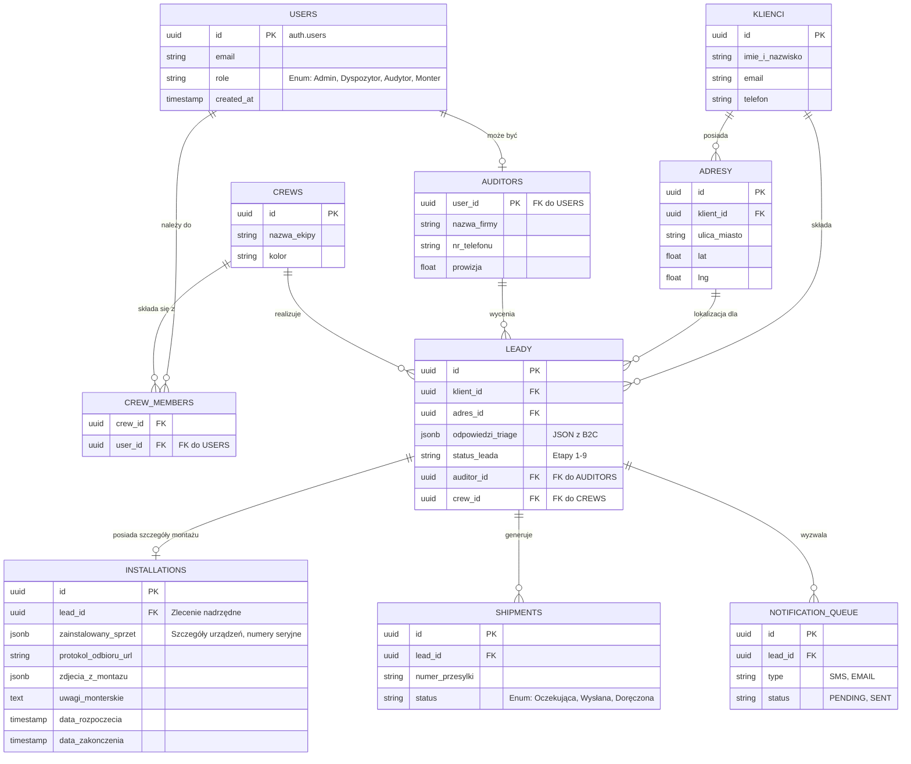

# Model Danych (Supabase / PostgreSQL) - Wersja B2B/B2C

Poniższy dokument obrazuje pełny, zaktualizowany relacyjny model danych dla systemu Klik Klima, uwzględniający zarówno obsługę Triage (B2C), jak i panel zarządzania dla dyspozytora i monterów (B2B/CRM).

## Diagram Relacji Encji (ERD)

## Opis Nowych Tabel B2B / Field App

1. **`users` (RBAC)**: Centralna tabela kont powiązana z Auth Supabase, zawierająca rolę pracownika (Audytor, Monter, Admin).
2. **`auditors`**: Dedykowana tabela rozszerzająca użytkownika (`1:1` z `users`). Ponieważ aplikacja Field App będzie używana przez zewnętrznych lub wewnętrznych inżynierów robiących wyceny zdalne, tu trzymamy specyficzne dane (nazwa firmy, prowizje).
3. **`crews` & `crew_members`**: Ekipy monterskie. Jeden monter (`user_id`) może należeć do ekipy. Ekipa jako całość jest przypisywana do realizacji zadania na `leady`.
4. **`installations`**: Ewidencja i repozytorium wykonanych prac. Oddzielone od "leada" (który jest nośnikiem statusu i zlecenia). To tutaj ekipa w Field App wrzuca podpisane protokoły, numery seryjne użytego sprzętu oraz zdjęcia ze ściany po robocie.
5. **`shipments`**: Zarządzanie kurierami i materiałami, ścisłe powiązanie z leadem.
