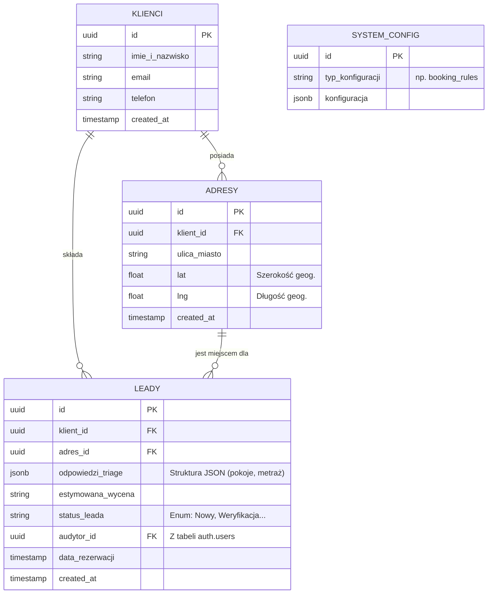
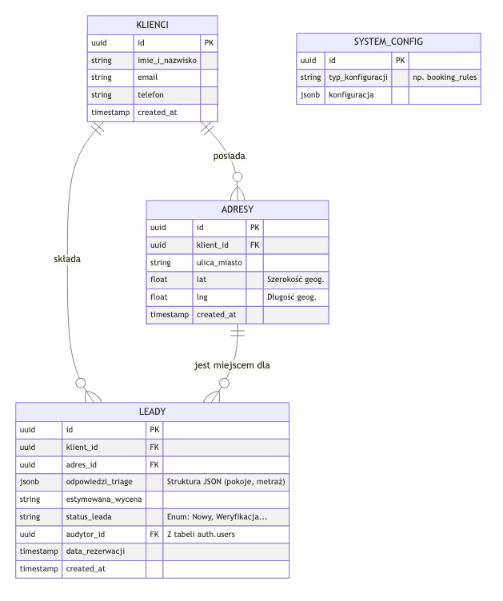

# Model Danych (Supabase / PostgreSQL)

Poniższy dokument obrazuje relacyjny model danych dla pierwszej fazy systemu Klik Klima.
Uwzględnia on kluczowe tabele niezbędne do obsłużenia całego procesu inteligentnego formularza (Triage), włączając w to geolokalizację (wielokrotne adresy dla jednego klienta) oraz rezerwację terminów.

## Diagram Relacji Encji (ERD)

## Opis Głównych Tabel

1. **`klienci`**: Centralny punkt prawdy o fizycznej osobie. Jeśli klient złoży drugi wniosek po roku (np. na pompę ciepła), będziemy bazować na tym samym rekordzie.
2. **`adresy`**: Zgodnie z architekturą, jeden klient może posiadać wiele adresów montażu (np. mieszkanie i dom pod miastem). Pola `lat` i `lng` są wypełniane automatycznie przez Google Places API.
3. **`leady`**: Reprezentacja pojedynczego zlecenia/wniosku (pochodzącego z Triage). Posiada ogromną elastyczność dzięki kolumnie `odpowiedzi_triage` typu `JSONB` – możemy tam wrzucić dowolną ilość pokoi bez zmiany schematu tabeli.
4. **`system_config`**: Bezstanowa tabela do przechowywania globalnych ustawień systemu, z których korzystają usługi zewnętrzne (np. długość okna czasowego Bookingu).

## Wizualizacja Diagramu

