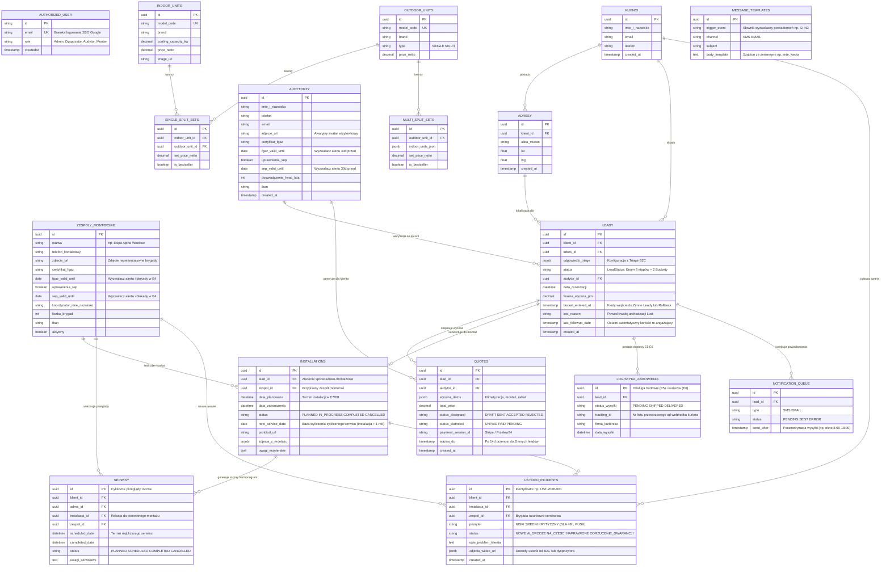

# Model Danych (Supabase / PostgreSQL) - Wersja B2B/B2C & CRM

Poniższy dokument obrazuje pełny, zaktualizowany relacyjny model danych dla systemu KlikKlima. Uwzględnia on proces pozyskiwania leadów przez kalkulator Triage (B2C), zarządzanie lejkiem sprzedażowym (8 etapów + 2 buckety) w panelu dyspozytora i administracji B2B, a także rygorystyczną obsługę 7 widoków modułu CRM (Karta 360, certyfikaty F-Gaz/SEP, serwisowanie roczne i niezależny proces awaryjnych usterek).

---

## 1. Diagram Relacji Encji (ERD)

Nazwa encji i pól odzwierciedla stan w schemacie Prisma (`schema.prisma`) oraz zawiera kolumny niezbędne do realizacji pełnych wytycznych architektonicznych i serwisowych.

---

## 2. Opis Tabel (Katalog Produktów)
- **`indoor_units` & `outdoor_units`**: Baza sprzętowa definująca techniczne parametry klimatyzatorów (moc chłodnicza/grzewcza, głośność, wymiary, cechy smart jak WiFi/czujnik obecności).
- **`single_split_sets` & `multi_split_sets`**: Kompletne zestawy sprzedażowe wykorzystywane we froncie B2C w kalkulatorze Triage oraz przez audytorów.
- **`cennik_uslug` & `modele_3d`**: Kosztorysy usług dodatkowych (kucie w betonie, wysięgniki) oraz zasoby modeli 3D do wizualizacji na ścianie klienta.

---

## 3. Opis Głównych Encji B2B, CRM i Field App

1. **`AuthorizedUser` (Bramka RBAC i SSO Google)**:
   - Tabela kontroli dostępu (Epic 5). Przechowuje dozwolone adresy e-mail i rolę (`admin`, `dyspozytor`, `audytor`, `monter`). Gdy użytkownik próbuje zalogować się przez Google (OAuth2), system sprawdza obecność maila w tej tabeli — brak wpisu natychmiast blokuje sesję z komunikatem o braku uprawnień.
2. **`audytorzy`**:
   - Rozszerzenie danych inżynierów techniczno-handlowych pracujących w terenie na Etapie 2 i 3. Posiada awatary (`zdjecie_url`), numery kont IBAN oraz obowiązkowe daty wygaśnięcia **certyfikatów F-Gaz i uprawnień SEP** (`fgaz_valid_until`, `sep_valid_until`). Zbliżenie się do daty wygaśnięcia (< 30 dni) wyzwala powiadomienie do Administratora.
3. **`zespoly_monterskie`**:
   - Reprezentuje brygady instalacyjne realizujące zlecenia montażowe na Etapach 7–8 i serwisach. Tabela zawiera zdjęcie reprezentatywne ekipy (przy aucie/w mundurach) oraz kontrolę ważności **certyfikatów F-Gaz i SEP**. Zespół z wygasłym certyfikatem jest **automatycznie blokowany i ukrywany z puli dostępnych brygad** na Etapie 4 przy przydzielaniu do zlecenia.
4. **`leady`**:
   - Centralne zgłoszenie w systemie z polem `status` typu `LeadStatus` przyjmującym 8 statusów lejka (`NEW_LEAD`, `AWAITING_AUDIT`, `AUDIT_COMPLETED`, `AWAITING_CREW_ASSIGNMENT`, `HARDWARE_IN_WAREHOUSE`, `HARDWARE_IN_TRANSIT`, `AWAITING_INSTALLATION`, `INSTALLATION_COMPLETED`) oraz 2 stany bucket:
     - **`QUOTE_REJECTED` (Zimne leady):** Wyceny bez akceptacji > 14 dni z polami `bucket_entered_at`, `last_followup_date` oraz obowiązkowym powodem odrzucenia `lost_reason` (np. „Konkurencja", „Za drogo") przy definitywnej archiwizacji (Lost).
     - **`ROLLBACK_RESCHEDULING` (Rollback Engine):** Stan awaryjny wywoływany m.in. brakiem dostawcy z kuriera z linkiem ponownym rezerwacji terminu montażu.
5. **`quotes` (Wyceny)**:
   - Ewidencja ofert generowanych w Field App na Etapie 3. Śledzi ważność wyceny (14 dni) oraz posiada `payment_session_id` integrujące bramki Stripe/P24 dla automatycznego księgowania w Etapie 4.
6. **`instalacje`**:
   - Karta zrealizowanej (lub w trakcie) pracy na Etapie 7 i 8. Zamiast mieszać serwisowanie roczne, generuje w bazie datę `next_service_date`, która służy za trigger dla crona automatycznie uruchamiającego procesy cyklicznych przeglądów.
7. **`serwisy`**:
   - Cykliczne przeglądy roczne (gwarancyjne i pogwarancyjne). Na 30 dni przed upływem terminu serwisu rocznego system generuje dla klienta powiadomienie SMS/Email z linkiem do kalendarza serwisowego.
8. **`usterki_incidents` (Incident Management - Usterki Awaryjne)**:
   - Osobny moduł odizolowany od planowanych przeglądów rocznych! Zgłoszenia awaryjne z unikalnym ID (np. `UST-2026-001`), zdjęciami od klienta i poziomem priorytetu. Usterki z priorytetem **Krytycznym** wyzwalają natychmiastową notyfikację PUSH do Dyspozytora. Brak podjęcia akcji przez 48 godzin od zgłoszenia zmienia kolor wiersza w tabeli CRM na czerwony.
9. **`logistyka_zamowienia`**:
   - Zarządzanie łańcuchem dostaw dla hurtowni (Etap 5) i kurierów (Etap 6) z obsługą numeru listu przewozowego (`tracking_id`) aktualizowanego zdalnie za pomocą webhooków kurierskich lub akcją manualną w panelu ("Paczka dostarczona", lub "Dostawa z ekipą - Bypass").

---

## 4. Zasady Bezpieczeństwa Bazy, RODO i Usuwanie Danych

Zgodnie z wymogami prawnymi (RODO) oraz zapewnieniem spójności transakcyjnej w relacyjnych bazach PostgreSQL / Supabase, w systemie obowiązuą rygorystyczne wytyczne manipulacji danymi:

### 1. Globalne Uprawnienie Usuwania (🚨 „Usuń”)
- W żadnym widoku CRM (Klienci, Instalacje, Serwisy, Usterki, Audytorzy, Zespoły, Zimne leady) ranga Dyspozytora, Audytora ani Montera **nie posiada uprawnień do usuwania rekordów**.
- Akcja **🚨 „Usuń”** jest zablokowana na poziomie interfejsu (ukryty przycisku w Shadcn UI) oraz na poziomie RLS Supabase i Server Actions **wyłącznie dla roli Administrator (`admin`)**.

### 2. Polityka Relacji i Usunięć na Kluczach Obcych (Foreign Keys)
- **Klient 360 (`klienci`):** W przypadku nakazu twardego usunięcia klienta (RODO) przez Administratora, relacje ze zleceniami montażowymi i rachunkowo-fakturowymi nie ulegają destrukcji historycznej — stosowany jest mechanizm `onDelete: SetNull` lub anonimizacja danych kontaktowych rekordu (z zachowaniem wartości zrealizowanego montażu).
- **Usunięcie Leada (`leady`):** Jeżeli rekord w tabeli `leady` zostanie skasowany z powodu duplikatu lub błędu systemowego przez Administratora, wszystkie jego zależne encje w trakcie tworzenia (`logistyka_zamowienia`, `quotes`) podlegają czyszczeniu kaskadowemu (`onDelete: Cascade`).
- **Usunięcie Audytora lub Zespołu:** Próba usunięcia rekordu z tabel `audytorzy` lub `zespoly_monterskie` blokowana jest na poziomie logiki do momentu ręcznego przepięcia przez Administratora wszystkich „wiszących", aktywnych na chwilę obecną leadów i instalacji na inną osobę/ekipę.
