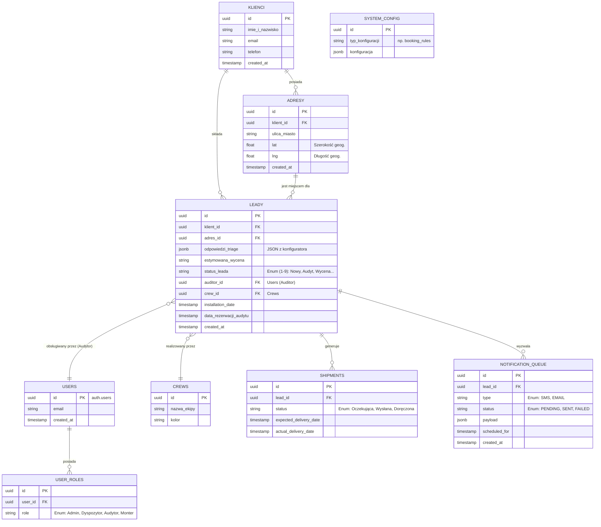

# Model Danych (Supabase / PostgreSQL) - Wersja B2B/B2C

Poniższy dokument obrazuje pełny, zaktualizowany relacyjny model danych dla systemu Klik Klima, uwzględniający zarówno obsługę Triage (B2C), jak i panel zarządzania dla dyspozytora i monterów (B2B/CRM).

## Diagram Relacji Encji (ERD)

## Opis Nowych Tabel B2B

1. **`users` i `user_roles`**: Rozszerzenie wbudowanej w Supabase tabeli `auth.users` o własną tabelę ról (RBAC). Dzięki temu możemy przypisać osobie uprawnienia (Dyspozytor, Monter) i włączać polityki bezpieczeństwa (RLS).
2. **`crews`**: Ekipy monterskie. Do jednej ekipy może należeć kilku użytkowników (monterów), a sama ekipa jest przypisywana do Leada na etapie instalacji.
3. **`shipments`**: Moduł logistyczny. Śledzi status wysyłki sprzętu dla danego Zlecenia (Leada). Powiązany ściśle z datą planowanej instalacji (by wyświetlać kolorowe SLA).
4. **`notification_queue`**: Tabela buforowa dla powiadomień. Triggery na tabeli `leady` wrzucają tu rekord, a Supabase Edge Functions / pg_cron go pobierają i wysyłają w świat (SMS/Email).
