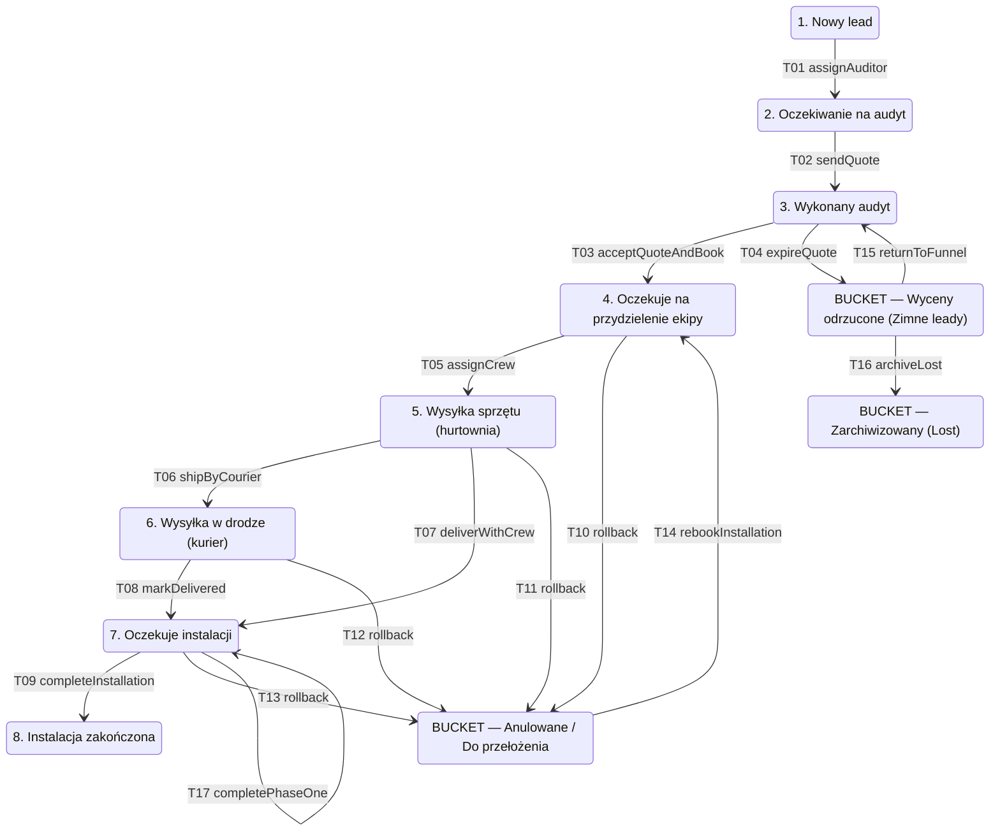

<!-- ⚠️ PLIK GENEROWANY — NIE EDYTUJ. Źródło: contracts/*.contract.mjs -->
# Kontrakty KlikKlima (widok wygenerowany)

Ten plik jest artefaktem, nie dokumentem roboczym. Jeżeli coś tu jest nie tak, popraw kontrakt i uruchom `node tools/kk-codegen.mjs`.

## Maszyna stanów leada

## Tabela przejść

| ID | Z | Do | Akcja | Aktor | Guardy | Efekty | Wymagania | Override | Równoważnik ręczny |
|---|---|---|---|---|---|---|---|---|---|
| `T01` | NEW_LEAD | AWAITING_AUDIT | `assignAuditor` | ADMIN | auditorIsActive, auditorCertsValid, auditorDailyCapNotExceeded | N1, I5 | FNL-E1-E2 | — | — |
| `T02` | AWAITING_AUDIT | AUDIT_COMPLETED | `sendQuote` | AUDITOR | — | N4, do:createQuote, do:startQuoteValidityClock | FNL-E2-E3 | — | — |
| `T03` | AUDIT_COMPLETED | AWAITING_CREW_ASSIGNMENT | `acceptQuoteAndBook` | CLIENT | quoteNotExpired, termsAccepted, slotAvailable | I2, do:reserveInstallationSlot | FNL-E3-E4 | — | — |
| `T04` | AUDIT_COMPLETED | QUOTE_REJECTED | `expireQuote` | SYSTEM | — | N_REJECT, do:stampBucketEnteredAt | FNL-E3-BUCKET, SLA-QUOTE-14D | — | — |
| `T05` | AWAITING_CREW_ASSIGNMENT | HARDWARE_IN_WAREHOUSE | `assignCrew` | ADMIN | crewCertsValid, crewCalendarFree | I3, do:createShipmentOrder | FNL-E4-E5, CRM-ZESP-AC2 | — | — |
| `T06` | HARDWARE_IN_WAREHOUSE | HARDWARE_IN_TRANSIT | `shipByCourier` | DISPATCHER | trackingIdPresent | N5 | FNL-E5-E6 | — | — |
| `T07` | HARDWARE_IN_WAREHOUSE | AWAITING_INSTALLATION | `deliverWithCrew` | DISPATCHER | — | — | FNL-E5-BYPASS | TAK | — |
| `T08` | HARDWARE_IN_TRANSIT | AWAITING_INSTALLATION | `markDelivered` | SYSTEM | — | — | FNL-E6-E7 | — | TAK (K1 anulowane) |
| `T09` | AWAITING_INSTALLATION | INSTALLATION_COMPLETED | `completeInstallation` | INSTALLER | allPhasesCompleted | N8, do:computeNextServiceDate, do:generateHandoverProtocol | FNL-E7-E8, SRV-NEXT-DATE | — | — |
| `T10` | AWAITING_CREW_ASSIGNMENT | ROLLBACK_RESCHEDULING | `rollback` | DISPATCHER | — | N_ROLLBACK, I4, do:releaseCrewSlot, do:suspendLogisticsSla | FNL-ROLLBACK | — | — |
| `T11` | HARDWARE_IN_WAREHOUSE | ROLLBACK_RESCHEDULING | `rollback` | DISPATCHER | — | N_ROLLBACK, I4, do:releaseCrewSlot, do:suspendLogisticsSla | FNL-ROLLBACK | — | — |
| `T12` | HARDWARE_IN_TRANSIT | ROLLBACK_RESCHEDULING | `rollback` | DISPATCHER | — | N_ROLLBACK, I4, do:releaseCrewSlot, do:suspendLogisticsSla | FNL-ROLLBACK | — | — |
| `T13` | AWAITING_INSTALLATION | ROLLBACK_RESCHEDULING | `rollback` | CLIENT | — | N_ROLLBACK, I4, do:releaseCrewSlot, do:suspendLogisticsSla | FNL-ROLLBACK | — | — |
| `T14` | ROLLBACK_RESCHEDULING | AWAITING_CREW_ASSIGNMENT | `rebookInstallation` | CLIENT | slotAvailable | do:reserveInstallationSlot | FNL-ROLLBACK-EXIT | — | — |
| `T17` | AWAITING_INSTALLATION | AWAITING_INSTALLATION | `completePhaseOne` | INSTALLER | installationIsTwoPhase, phaseOneNotCompleted | N8a, do:openPhaseTwoBooking | FNL-2PHASE, FNL-2PHASE-BOOKING | — | TAK (K1 anulowane) |
| `T15` | QUOTE_REJECTED | AUDIT_COMPLETED | `returnToFunnel` | DISPATCHER | quoteRefreshedIfStale | do:refreshQuoteValidity | CRM-ZIMNE-AC2 | — | — |
| `T16` | QUOTE_REJECTED | ARCHIVED_LOST | `archiveLost` | DISPATCHER | lostReasonProvided | do:recordLostReasonForAnalytics | CRM-ZIMNE-AC3 | — | — |

## Katalog powiadomień

| ID | Domena | Kanał | Adresat | Wyzwalacz | Szablon | Status |
|---|---|---|---|---|---|---|
| `N1` | FUNNEL | SMS+EMAIL | CLIENT | przejście T01 | `funnel.auditor_assigned` | STABLE |
| `N2` | FUNNEL | SMS+EMAIL | CLIENT | CRON: 24h_before_audit | `funnel.audit_reminder_24h` | STABLE |
| `N3` | FUNNEL | SMS | CLIENT | GEO: auditor_en_route | `funnel.auditor_en_route` | STABLE |
| `N4` | FUNNEL | EMAIL | CLIENT | przejście T02 | `funnel.quote_ready` | STABLE |
| `N5` | FUNNEL | SMS+EMAIL | CLIENT | przejście T06 | `funnel.shipped` | STABLE |
| `N6` | FUNNEL | SMS+EMAIL | CLIENT | CRON: 24h_before_installation | `funnel.install_reminder_24h` | STABLE |
| `N7` | FUNNEL | SMS | CLIENT | GEO: crew_en_route | `funnel.crew_en_route` | STABLE |
| `N8` | FUNNEL | EMAIL | CLIENT | przejście T09 | `funnel.install_completed` | STABLE |
| `N8a` | FUNNEL | EMAIL | CLIENT | przejście T17 | `funnel.install_phase1_completed` | STABLE |
| `N_REJECT` | FUNNEL | EMAIL | CLIENT | przejście T04 | `funnel.quote_expired` | STABLE |
| `N_ROLLBACK` | FUNNEL | EMAIL | CLIENT | przejście T10|T11|T12|T13 | `funnel.rollback_rebook` | STABLE |
| `N10` | SERVICE | SMS+EMAIL | CLIENT | CRON: x_days_before_service | `service.reminder` | STABLE |
| `N11` | SERVICE | SMS+EMAIL | CLIENT | DOMAIN: service_technician_assigned | `service.technician_assigned` | STABLE |
| `N12` | SERVICE | SMS+EMAIL | CLIENT | CRON: 24h_before_service | `service.reminder_24h` | STABLE |
| `N13` | SERVICE | SMS | CLIENT | GEO: technician_en_route | `service.technician_en_route` | STABLE |
| `N14` | SERVICE | EMAIL | CLIENT | DOMAIN: service_completed | `service.completed` | STABLE |
| `N15` | INCIDENT | SMS+EMAIL | CLIENT | DOMAIN: incident_received | `incident.received` | STABLE |
| `N16` | INCIDENT | SMS+EMAIL | CLIENT | DOMAIN: incident_technician_assigned | `incident.technician_assigned` | STABLE |
| `N17` | INCIDENT | SMS | CLIENT | GEO: incident_technician_en_route | `incident.technician_en_route` | STABLE |
| `N18` | INCIDENT | EMAIL | CLIENT | DOMAIN: incident_repaired | `incident.repaired` | STABLE |
| `I1` | INTERNAL | EMAIL | DISPATCHER | DOMAIN: lead_created | `internal.new_lead` | STABLE |
| `I2` | INTERNAL | SMS+EMAIL | DISPATCHER | przejście T03 | `internal.quote_accepted` | STABLE |
| `I3` | INTERNAL | SMS | CREW | przejście T05 | `internal.crew_task_assigned` | STABLE |
| `I4` | INTERNAL | EMAIL | DISPATCHER | przejście T10|T11|T12|T13 | `internal.rollback` | STABLE |
| `I5` | INTERNAL | PUSH | AUDITOR | przejście T01 | `internal.auditor_task_assigned` | STABLE |
| `I6` | INTERNAL | EMAIL | ADMIN | CRON: 30d_before_cert_expiry | `internal.cert_expiring` | STABLE |
| `I7` | INTERNAL | PUSH | DISPATCHER | DOMAIN: incident_critical_created | `internal.incident_critical` | STABLE |

## Słownictwo wejścia do lejka (Triage B2C)

Lejek zaczyna się od `NEW_LEAD`. To są odpowiedzi, z których ten stan powstaje.

| Słownik | Wartość | Etykieta PL | Uwagi |
|---|---|---|---|
| ROOM_SIZE_BANDS | `UP_TO_20` | Do 20 m² | — – 20 m² |
| ROOM_SIZE_BANDS | `FROM_21_TO_25` | 21-25 m² | 21 – 25 m² |
| ROOM_SIZE_BANDS | `FROM_26_TO_35` | 26-35 m² | 26 – 35 m² |
| ROOM_SIZE_BANDS | `OVER_35` | Powyżej 35 m² | 36 – ∞ m² |
| BUILDING_TYPES | `APARTMENT` | Mieszkanie | — |
| BUILDING_TYPES | `HOUSE` | Dom | — |
| BUILDING_TYPES | `COMMERCIAL` | Lokal komercyjny | — |
| PROPERTY_CONDITIONS | `FINISHED` | Wykończony / Zamieszkany | bez przesłanki dwuetapowości |
| PROPERTY_CONDITIONS | `RENOVATION` | W trakcie remontu | przesłanka montażu dwuetapowego (dla audytora, nie dla wyceny) |
| PROPERTY_CONDITIONS | `DEVELOPER_SHELL` | Stan deweloperski | przesłanka montażu dwuetapowego (dla audytora, nie dla wyceny) |

Próg kierujący na ekran Eksperta: **ROOM_COUNT_EXPERT_THRESHOLD = 4**.

| Reguła | Warunek | Skutek | Wymaganie |
|---|---|---|---|
| `COMMERCIAL_PROPERTY` | BUILDING_TYPE EQUALS COMMERCIAL | EXPERT_SCREEN | B2C-TRIAGE-DISQUALIFY |
| `ROOM_COUNT_AT_OR_ABOVE_THRESHOLD` | ROOM_COUNT GTE 4 | EXPERT_SCREEN | B2C-TRIAGE-DISQUALIFY |

## Progi SLA (czasowe, ilościowe i przestrzenne)

Każdy próg ma nazwę i dokładnie jeden kształt pomiaru (R21). Literał liczbowy w kodzie zamiast importu z kontraktu to przyszła rozbieżność między modułami.

| ID | Pomiar | Wartość | Zasięg | Wymagania |
|---|---|---|---|---|
| `LOGISTICS_INSTALL` | bands | 3 pasm (daysUntilInstallation) | Logistyka — wiersze tabeli wysyłek względem daty montażu | SLA-LOG-COLORS, UI-SLA-NO-GREEN |
| `INCIDENT_RESPONSE` | bands | 1 pasm (hoursSinceCreated) | Usterki — brak akcji od zgłoszenia | CRM-UST-AC3 |
| `QUOTE_VALIDITY` | days | 14 | Ważność wyceny przed zrzuceniem do bucketu Zimnych leadów | SLA-QUOTE-14D |
| `COLD_LEAD_REPRICE` | days | 30 | Po tylu dniach w bucketcie „Zwróć do obiegu" wymaga odświeżenia ceny | CRM-ZIMNE-AC2 |
| `SERVICE_REMINDER_LEAD` | days | 30 | Ile dni przed next_service_date wysyłamy N10 | CRM-SRV-TRIGGER |
| `CERT_EXPIRY_WARNING` | days | 30 | Ile dni przed wygaśnięciem F-Gaz/SEP alarmujemy administratora | CRM-AUDYT-AC3, CRM-ZESP-AC1 |
| `AUDITOR_DAILY_CAP` | count | 5 | Maksymalna liczba audytów przypisanych jednemu audytorowi na dzień | CRM-AUDYT-AC2 |
| `INSTALL_DAY_ALERT` | hourOfDay | 16 | Godzina, po której niezakończona dzisiejsza instalacja podświetla się na pomarańczowo | CRM-INST-AC2 |
| `GEOFENCE_UNLOCK_RADIUS` | meters | 20 | Promień w metrach od punktu docelowego, w którym Field App odblokowuje rozpoczęcie i zakończenie zlecenia | FLD-GEO-UNLOCK |
| `GEOFENCE_EN_ROUTE_RADIUS` | meters | 3000 | Promień w metrach (3 km), którego przecięcie w oknie dnia wizyty wyzwala klientowi SMS „w drodze" — N3/N7/N13/N17 | FLD-GEO-EN-ROUTE |

## Elementy oczekujące na decyzję człowieka

_Brak._
