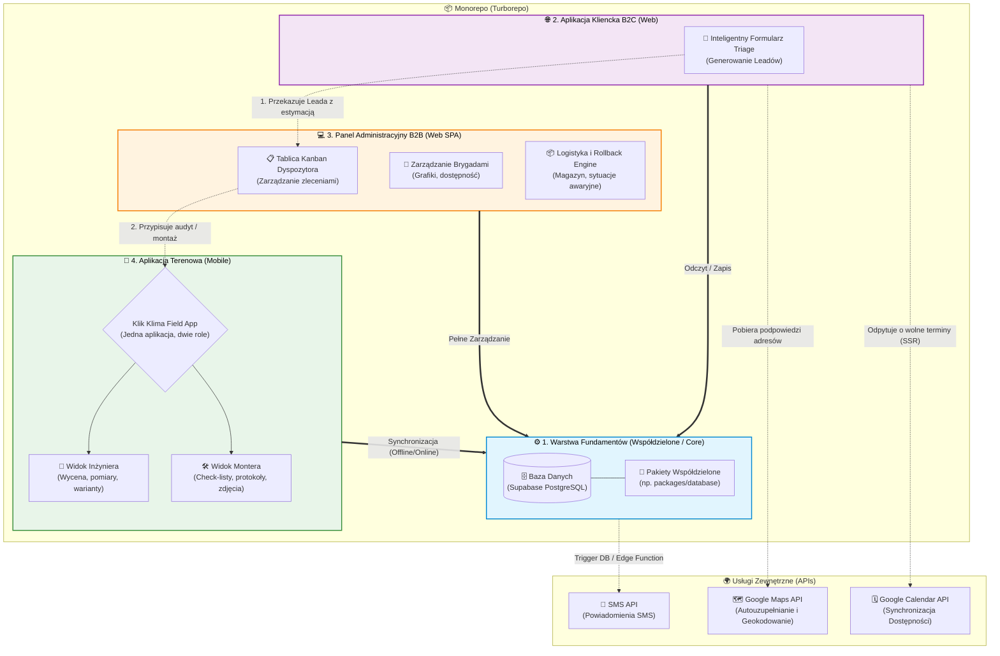
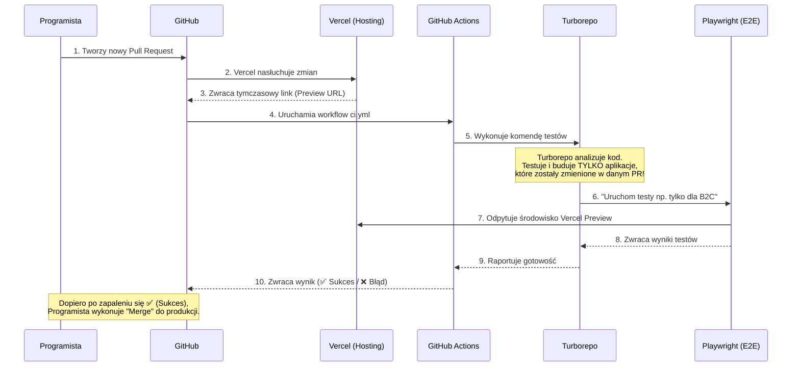

# Architektura Systemu Klik Klima (v2)

Ten dokument opisuje globalną architekturę systemu, podział na poszczególne aplikacje oraz wybrany stos technologiczny. Projekt prowadzony jest w architekturze **Monorepo** zarządzanej przez narzędzie **Turborepo**.

## 1. Diagram Architektury i Relacji

Poniższy diagram obrazuje przepływ danych i zależności pomiędzy czterema głównymi filarami naszego systemu: Warstwą Fundamentów (Core), aplikacją kliencką B2C, panelem administracyjnym B2B oraz aplikacją terenową.



---

## 2. Architektura Przepływu Danych i Powiadomień (Data Architecture)

Zrezygnowaliśmy z zewnętrznych narzędzi no-code na rzecz "Grubej Bazy Danych" (Thick DB Pattern). Poniższy schemat pokazuje architekturę kolejkowania i logiki danych.

```mermaid
flowchart TD
    ClientB2C([Klienci B2C / Triage])
    AdminB2B([Dyspozytorzy B2B])
    MobileApp([Aplikacja Mobilna])

    subgraph SupabaseCloud["☁️ Supabase Cloud (Data Layer)"]
        direction TB
        
        subgraph PostgreSQL["🗄️ Baza Danych PostgreSQL"]
            Tables[(Główne Tabele\nLeady, Users, itp.)]
            RLS[🔒 Row Level Security\n(Filtrowanie dostępu wg ról)]
            Queue[(Kolejka Powiadomień\n'notification_queue')]
            Triggers[⚡ DB Triggers\n(Reagują na zmianę statusu)]
            PgCron[🕰️ pg_cron\n(Harmonogram zadań)]
            
            Tables -->|UPDATE status=2| Triggers
            Triggers -->|INSERT INTO| Queue
        end
        
        subgraph EdgeLayer["🚀 Edge Computing"]
            EdgeFunc[[Edge Functions\nnp. send-notifications]]
            Auth[🔑 Supabase Auth\n(Logowanie Google)]
        end
        
        PgCron -.->|Co 1 minutę wyzwala HTTP| EdgeFunc
        EdgeFunc -->|Czyta rekordy 'PENDING'| Queue
        EdgeFunc -->|Aktualizuje status na 'SENT'| Queue
    end

    subgraph ExternalServices["🌍 Serwisy Zewnętrzne"]
        SMS[📩 SMS API]
        Email[📧 Email / SMTP]
    end

    %% Połączenia zewnętrzne
    ClientB2C -->|Odczyt/Zapis (Public)| Tables
    AdminB2B -->|Auth (OAuth)| Auth
    AdminB2B -->|Odczyt/Zapis (Role RLS)| RLS
    MobileApp -->|Odczyt/Zapis (Role RLS)| RLS
    RLS --> Tables

    EdgeFunc -->|Wysyłka (Payload JSON)| SMS
    EdgeFunc -->|Wysyłka (Payload JSON)| Email
```

---

## 3. Stos Technologiczny i Hosting

Wybór technologii podyktowany jest szybkością tworzenia (Time-to-Market), łatwością utrzymania z perspektywy jednego zespołu oraz niezawodnością gotowych usług chmurowych (BaaS - Backend as a Service).

| Aplikacja / Moduł | Stos Technologiczny (Frontend & Logika) | Baza Danych, Autoryzacja i Backend | Hosting / Deployment | Dlaczego to najlepszy wybór? |
| :--- | :--- | :--- | :--- | :--- |
| **1. Warstwa Fundamentów (Core)** | **Turborepo**, TypeScript, **Prisma ORM** | **Supabase** (PostgreSQL, Auth, Storage) | **Supabase Cloud** | Supabase to gotowy backend (BaaS). Przyjęto **Model Hybrydowy**: Prisma ORM służy jako Single Source of Truth dla schematu bazy i jest używana na serwerze (np. Panel B2B Admin) omijając RLS dla pełnej kontroli i typowania. Aplikacje klienckie (B2C) używają bezpośrednio klienta `supabase-js`, aby zachować wbudowane bezpieczeństwo RLS i logowanie z przeglądarki. |
| **2. Kliencka B2C (Formularz Triage)** | **Next.js (React)** + Tailwind CSS + React Hook Form | Łączy się bezpośrednio z Supabase / API (`supabase-js`) | **Vercel** | Next.js jest natywną technologią Vercel. Daje świetne SEO (Server-Side Rendering) i błyskawiczne ładowanie. Zastosowanie natywnego klienta Supabase gwarantuje, że dane chronione są przez reguły RLS bazy danych. |
| **3. Panel B2B (Dyspozytor)** | **Vite + React** (lub Next.js) + Tailwind CSS + shadcn/ui | Łączy się bezpośrednio z Supabase | **Vercel** | Dla zamkniętego panelu administracyjnego (Single Page Application bez SEO) Vite jest najszybszym i najlżejszym wyborem. Zestaw gotowych komponentów `shadcn/ui` pozwoli błyskawicznie budować tabele i formularze. |
| **4. Aplikacja Terenowa (Mobile)** | **React Native + Expo** | Łączy się z Supabase z poziomu telefonu | **EAS** (Expo Application Services) | Expo ułatwia tworzenie aplikacji cross-platform (iOS + Android) bez dotykania natywnego kodu (np. Android Studio). EAS drastycznie ułatwia publikację apki do App Store i Google Play. |
| **Integracje Zewnętrzne (APIs)** | **Google Maps** (Places Autocomplete) <br/> **Google Calendar API** (Custom SSR) <br/> **SMS API** | Zwracają JSON (Współrzędne geograficzne / Wolne sloty) | N/A | **Google Maps** gwarantuje absolutnie najwyższą jakość bazy adresowej w Polsce i natychmiastowe geokodowanie. **Google Calendar API** poprzez własne rozwiązanie serwerowe eliminuje ciężkie widgety na froncie. **SMS API** (np. SMSAPI) uwiarygadnia rezerwację dla klienta. |
| **Post-Booking / Automatyzacje** | **Supabase Database Triggers / Functions** | Logika wbudowana w strukturę bazy danych | **Supabase Cloud** | Zamiast polegać na zewnętrznym Make.com, automatyzacje (powiadomienia, SMS, e-mail) są rozwiązywane przez dedykowaną strukturę bazy danych, triggery PostgreSQL i Supabase Edge Functions, co gwarantuje pełną kontrolę i mniejsze koszty. |

---

## 3. Proces CI/CD (Continuous Integration)

Wszystkie aplikacje w monorepo poddawane są automatycznemu procesowi testowania i budowania przed wdrożeniem. Poniżej przedstawiono proces działania **GitHub Actions** w połączeniu z Vercel Preview i testami End-to-End w **Playwright**.


