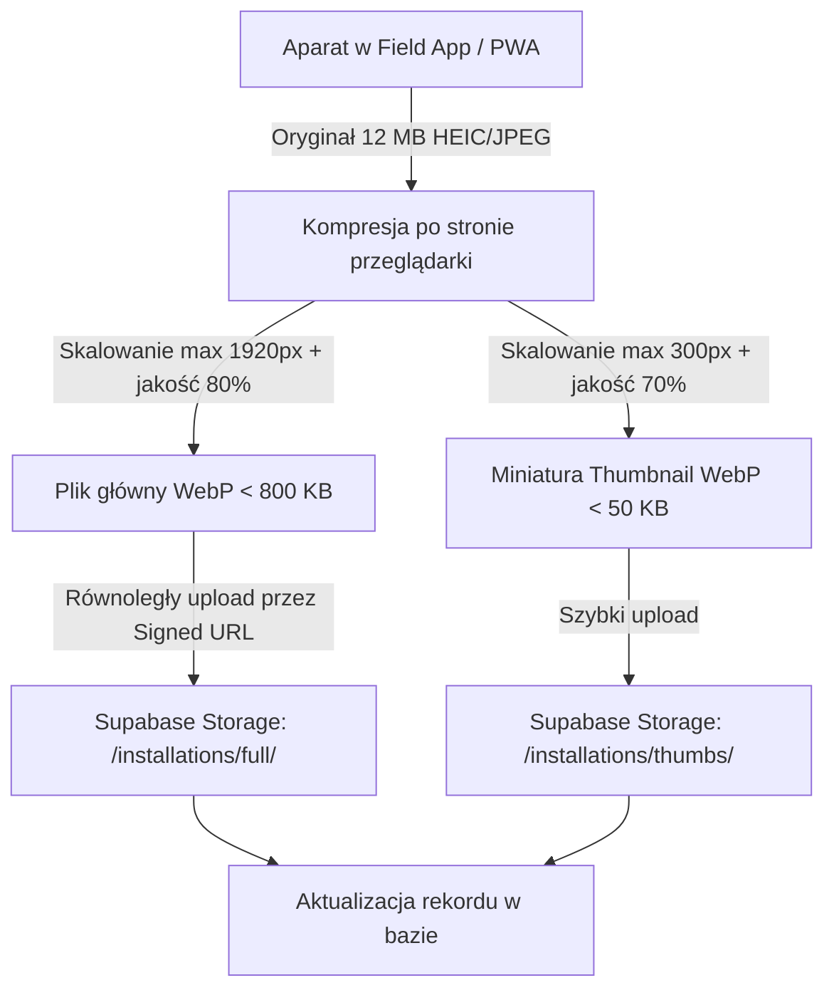

# Optymalizacja Dodawania Zdjęć — Kompresja w Locie (WebP) i Szybki Upload

> **Identyfikator zadania Trello:** `FLD-PHOTO-OPTIMIZE`  
> **Kategoria:** Field App (Aplikacja Terenowa) / Tech Debt  
> **Status:** DO WDROŻENIA  
> **Szacowany czas prac:** 12–16 roboczogodzin  

---

## 1. Problem i Diagnoza

Monterzy i audytorzy pracują w terenie często przy słabym zasięgu sieci komórkowej (LTE/3G w piwnicach, na obrzeżach miast lub w żelbetowych budynkach).
- Współczesne smartfony wykonują zdjęcia o wadze **8–15 MB** w formacie JPEG/HEIC i rozdzielczości 4000×3000px.
- Wrzucenie 4–8 takich zdjęć bez kompresji paraliżuje aplikację (upload trwa po kilkadziesiąt sekund per zdjęcie), powoduje timeouty HTTP 504 i zniechęca monterów do rzetelnego uzupełniania dokumentacji.
- Ładowanie pełnych plików w panelu B2B na Karcie 360 i w widoku instalacji generuje gigabajty niepotrzebnego transferu i spowalnia działanie CRM.

---

## 2. Architektura Rozwiązania

---

## 3. Szczegóły Techniczne

1. **Kompresja po stronie klienta (Client-Side Compression):**
   - Biblioteka `browser-image-compression` lub bezpośrednie wykorzystanie HTML5 OffscreenCanvas,
   - Przekształcenie do nowoczesnego formatu **WebP**,
   - Maksymalny wymiar dłuższego boku: **1920 px** (wystarczający do analizy technicznej, odczytania tabliczek znamionowych i weryfikacji estetyki),
   - Oczekiwana redukcja wagi pliku: **o 90–95%** (z 12 MB do ok. 400–700 KB).
2. **Generowanie Miniatur (Thumbnails):**
   - Tworzenie w locie miniatury o boku **300 px** (< 50 KB),
   - Szybkie renderowanie galerii w panelu B2B bez oczekiwania na pobranie plików pełnowymiarowych.
3. **Optymalizacja Uploadu:**
   - Pre-signed URL do Supabase Storage z bezpośrednim uploadem (brak obciążenia serwera Next.js przesyłaniem plików binarnych),
   - Wskaźnik postępu (progress bar) i odporność na zerwanie połączenia (retry).

---

## 4. Kryteria Akceptacji
- [ ] Próba wrzucenia zdjęcia 15 MB jest kompresowana w mniej niż 1 sekundę na telefonie do pliku < 800 KB w formacie WebP.
- [ ] Wygenerowana miniatura ładuje się natychmiastowo na Karcie 360 w panelu B2B.
- [ ] Nawet przy prędkości 1 Mb/s przesłanie kompletu zdjęć montażowych trwa poniżej 15 sekund.
