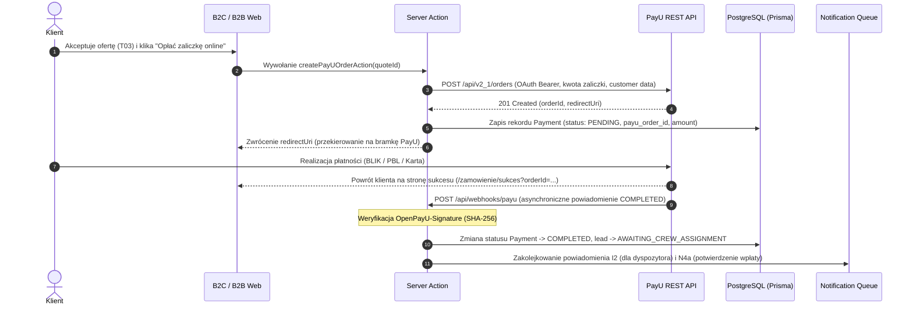

# Wdrożenie Bramki Płatności PayU — Zaliczki i Transakcje Online

> **Identyfikator zadania Trello:** `PAYU-GATEWAY`  
> **Kategoria:** Admin B2B (CRM & Logistyka) / Landing Page (B2C)  
> **Status:** DO WDROŻENIA (Pakiet 2 Roadmapy GTM)  
> **Szacowany czas prac:** 20–24 roboczogodziny  

---

## 1. Uzasadnienie Biznesowe i Cel

W modelu biznesowym KlikKlima bezpośrednie koszty zakupu klimatyzatorów w hurtowni (COGS) są w 100% finansowane z zaliczek wpłacanych przez klientów przed wysyłką towaru (**model Just-In-Time bez mrożenia kapitału obrotowego**).

Integracja z bramką **PayU** zapewnia:
1. **Pobranie zaliczki (40–50%) online** bezpośrednio po akceptacji wyceny przez klienta (przejście `AUDIT_COMPLETED` -> `AWAITING_CREW_ASSIGNMENT`),
2. **Szeroki wachlarz metod płatności:** BLIK (kluczowy dla szybkiej konwersji), szybkie przelewy Pay-By-Link (PBL), karty Visa/Mastercard oraz PayU Raty 0%,
3. **Automatyczne i bezobsługowe księgowanie wpłaty:** webhook PayU od razu oznacza zaliczkę jako opłaconą i odblokowuje administratorowi możliwość przypisania ekipy i zamówienia sprzętu z hurtowni (etap E4 -> E5).

---

## 2. Architektura Techniczna i Przepływ Danych

### 2.1 Przepływ Transakcji (Sequence Flow)


---

## 3. Zakres Implementacji

### 3.1 Baza Danych (Schema Prisma)
Dodanie modelu płatności powiązanego z leadem i wyceną:
```prisma
enum PaymentStatus {
  PENDING
  COMPLETED
  FAILED
  CANCELED
  REFUNDED
}

enum PaymentType {
  DEPOSIT_FIRST_PHASE  // Zaliczka na sprzęt (etap standardowy lub I faza)
  FINAL_PAYMENT        // Płatność końcowa po montażu
  SERVICE_FEE          // Opłata za przegląd/usterkę
}

model Payment {
  id              String        @id @default(dbgenerated("gen_random_uuid()")) @db.Uuid
  lead_id         String        @db.Uuid
  amount_cents    Int           // Kwota w groszach (np. 350000 = 3500.00 PLN)
  currency        String        @default("PLN") @db.VarChar(3)
  payment_type    PaymentType   @default(DEPOSIT_FIRST_PHASE)
  status          PaymentStatus @default(PENDING)
  provider        String        @default("PAYU") @db.VarChar(32)
  provider_order_id String?     @unique @db.VarChar(128)
  payment_url     String?       @db.Text
  paid_at         DateTime?     @db.Timestamptz(6)
  metadata        Json?         @default("{}")
  created_at      DateTime      @default(now()) @db.Timestamptz(6)
  updated_at      DateTime      @updatedAt @db.Timestamptz(6)

  lead            Lead          @relation(fields: [lead_id], references: [id], onDelete: Restrict)

  @@index([lead_id])
  @@index([status])
  @@map("payments")
}
```

### 3.2 Endpoint Webhooka (`app/api/webhooks/payu/route.ts`)
1. **Weryfikacja podpisu:** Nagłówek `OpenPayU-Signature` zawiera `signature`, `algorithm=SHA-256` oraz `sender`.
2. **Idempotencja:** Sprawdzenie bieżącego stanu płatności w bazie — jeśli `status == COMPLETED`, zwracany jest natychmiast kod HTTP 200 bez ponownego wywoływania mutacji.
3. **Bezpieczeństwo:** Rejestracja zdarzenia w `AuditLog`.

---

## 4. Kryteria Akceptacji (Do Testów)
- [ ] Utworzenie płatności w PayU Sandbox generuje poprawny URL i zapisuje rekord w `payments` ze statusem `PENDING`.
- [ ] Webhook z nieprawidłowym podpisem SHA-256 jest odrzucany z kodem 400 Bad Request.
- [ ] Webhook z poprawnym statusem `COMPLETED` przestawia status płatności na `COMPLETED`, zapisuje `paid_at` i przesuwa leada do `AWAITING_CREW_ASSIGNMENT`.
- [ ] Ponowne nadejście webhooka (retry) nie duplikuje powiadomień ani wpisów w audycie.
