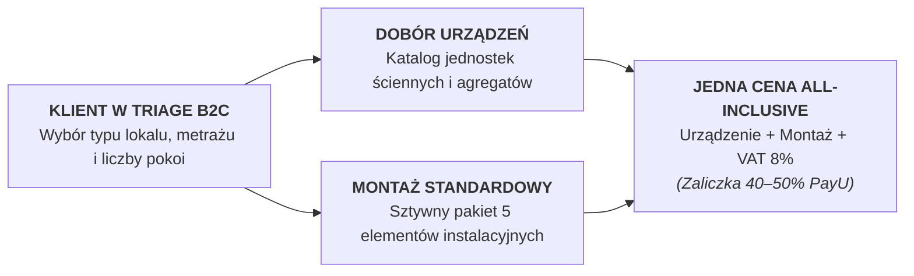
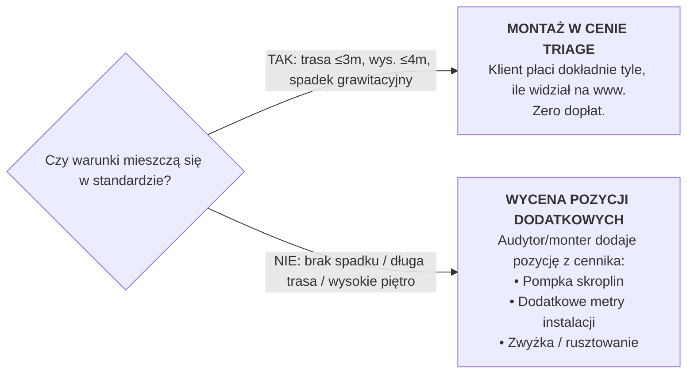
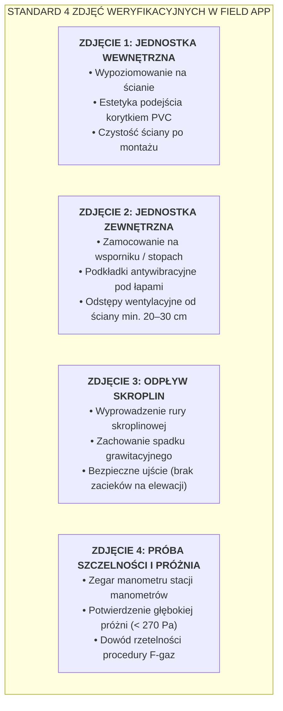

# Skład i Definicja Montażu Standardowego w Triage

## Wzorcowy Pakiet Instalacyjny, Zakres Materiałowy, Granice Technologiczne i Cennik B2C/B2B

> **Status:** Dokumentacja referencyjna architektury produktowej i operacyjnej  
> **Projekt:** System Cyfrowy KlikKlima  
> **Autorzy:** Michał Sznurowski (CEO / CTO) & Piotr (COO / Head of Operations)  
> **Data opracowania:** 17 września 2026 r.  
> **Dokumenty powiązane:**  
> - [Koszyki Usług i Modele Rozliczeniowe](KOSZYKI-USLUG-I-MODELE-ROZLICZENIOWE.md)  
> - [Modele Współpracy Wspólników](model_wspolpracy.md)  
> - [Polityka Dywidend i Dystrybucji Gotówki](POLITYKA-DYWIDEND-I-DYSTRYBUCJI-GOTOWKI.md)  
> - [Prognoza Finansowa i Koszty GTM](PROGNOZA-FINANSOWA-I-KOSZTY-GTM.md)  
> - [System KPI i Bramki Decyzyjne](SYSTEM-KPI-I-BRAMKI-DECYZYJNE.md)  
> - [Podział Ról Wspólników (CEO/CTO & COO)](OCZEKIWANY-WKLAD-OPERACYJNY-COO.md)  

---

## 1. Wprowadzenie i Geneza Biznesowa

W tradycyjnym modelu sprzedaży klimatyzacji klient niemal nigdy nie zna ostatecznej ceny montażu przed przyjazdem instalatora. Odpowiedzi firm montażowych: *„cena zależy od warunków na miejscu”* lub *„robocizna od 1500 zł, ale resztę policzymy po fakcie”* budzą nieufność, wydłużają proces decyzyjny i drastycznie obniżają konwersję (odrzucenie oferty na poziomie 60–70%).

W ekosystemie KlikKlima ten problem został rozwiązany poprzez **standaryzację usługi montażowej**. 

Konfigurator internetowy B2C (Triage) prezentuje klientowi **ostateczną, wiążącą cenę ryczałtową brutto (All-Inclusive)**, obejmującą:
1. Fabrycznie nowy zestaw klimatyzacji renomowanej marki (Single lub Multi-Split),
2. **Standardowy Pakiet Montażowy** (kompletny zestaw materiałów, robociznę certyfikowanej ekipy oraz uruchomienie technologiczne),
3. Ulgową stawkę podatku **VAT 8%** (dla osób fizycznych na cele mieszkaniowe zgodnie z art. 41 ust. 12 ustawy o VAT).



---

## 2. Rola Montażu Standardowego w Algorytmie Triage B2C

W logice serwerowej doboru (`apps/b2c-web/app/actions/getRecommendation.ts`) oraz prezentacji oferty (`Step7Success.tsx`), wycena instalacji opiera się na **Montażu Wzorcowym** pobieranym bezpośrednio z bazy danych (`cennik_uslug`):

$$\text{Cena Instalacji Netto} = \text{Stawka Montażu Standardowego Netto} \times \text{Liczba Jednostek Wewnętrznych}$$

$$\text{Cena Całkowita Brutto} = (\text{Cena Zestawu Urządzeń Netto} + \text{Cena Instalacji Netto}) \times 1.08$$

Domyślna stawka bazowa montażu wzorcowego wynosi **1 200 zł netto za każdą jednostkę wewnętrzną** (w układzie Single-Split 1 200 zł netto, w układzie Multi-Split 2x: 2 400 zł netto, 3x: 3 600 zł netto).

---

## 3. Szczegółowy Skład Montażu Standardowego (Co Zawiera Pakiet)

Zgodnie ze specyfikacją systemu KlikKlima, standardowy pakiet montażowy obejmuje **komplet materiałów i czynności niezbędnych do bezpiecznego, estetycznego i w 100% zgodnego z prawem F-gazowym uruchomienia instalacji**:

| Pozycja / Element | Standard dla 1 Pomieszczenia (Single-Split) | Standard dla 2 Pomieszczeń (Multi-Split 2x) | Standard dla 3 Pomieszczeń (Multi-Split 3x) | Szczegółowy Zakres Techniczny i Materiałowy |
| :--- | :---: | :---: | :---: | :--- |
| **Montaż jednostki wewnętrznej** | **1 szt.** | **2 szt.** | **3 szt.** | Precyzyjne wypoziomowanie i bezpieczny montaż płytki nośnej na ścianie murowanej lub gipsowo-kartonowej. |
| **Montaż agregatu zewnętrznego** | **1 szt.** | **1 szt.** | **1 szt.** | Montaż jednostki zewnętrznej do wysokości **4 metrów** (dostęp z drabiny montażowej, bez konieczności użycia rusztowania lub podnośnika koszowego). |
| **Wspornik zewnętrzny i wibroizolacja** | **1 komplet** | **1 komplet** | **1 komplet** | Atestowany wspornik ścienny z belką montażową (ze stali malowanej proszkowo) **lub** podstawa podłogowa (stopy PVC/gumowe) oraz gumowe wibroizolatory redukujące drgania i hałas. |
| **Instalacja chłodnicza (freonowa)** | **do 3 mb** | **do 6 mb** *(2 × 3 mb)* | **do 9 mb** *(3 × 3 mb)* | Bezszwowe rury miedziane w dedykowanej otulinie termoizolacyjnej odpornej na UV i kondensację pary wodnej (linie cieczowa i gazowa). |
| **Koryta maskujące PVC** | **do 3 mb** | **do 6 mb** *(2 × 3 mb)* | **do 9 mb** *(3 × 3 mb)* | Estetyczne, białe koryta elektroinstalacyjne PVC z narożnikami i kształtkami do estetycznego poprowadzenia instalacji natynkowej. |
| **Przewiert przez ścianę** | **1 szt.** | **2 szt.** | **3 szt.** | Pojedynczy przewiert przez ścianę zewnętrzną/nośną (do 40 cm grubości; cegła, pustak, gazobeton, silikat; bez żelbetu ciężkiego) ze spadkiem na zewnątrz. |
| **Odprowadzenie skroplin** | **grawitacyjne do 3 mb** | **grawitacyjne do 6 mb** | **grawitacyjne do 9 mb** | Odprowadzenie kondensatu grawitacyjnie atestowaną rurą elastyczną karbowaną lub sztywną rurą PVC (wyprowadzenie na balkon, do rynny lub poza obrys budynku). |
| **Instalacja elektryczna i sterująca** | **do 3–5 mb** | **do 6–10 mb** | **do 9–15 mb** | Połączenie kablowe jednostek wewnętrznych z agregatem (kabel OWY 4x1.5 / 5x1.5 mm²) oraz podłączenie zasilania do najbliższego istniejącego gniazda/puszki (do 3–5 mb). |
| **Próba szczelności (Azot)** | **TAK (obowiązkowa)** | **TAK (obowiązkowa)** | **TAK (obowiązkowa)** | Ciśnieniowa próba wytrzymałościowa suchym azotem (do 35–40 bar) potwierdzająca 100% szczelności połączeń kielichowych. |
| **Próżnia i osuszenie układu** | **TAK (obowiązkowa)** | **TAK (obowiązkowa)** | **TAK (obowiązkowa)** | Wytworzenie głębokiej próżni pompą próżniową (spadek poniżej 270 Pa / 2 mbar) i usunięcie wilgoci z rurociągu przed wpuszczeniem czynnika. |
| **Uruchomienie i testy chłodnicze** | **TAK** | **TAK** | **TAK** | Otwarcie zaworów fabrycznego czynnika R32, pomiar temperatur nawiewu/powrotu, test trybu chłodzenia i grzania, próba wodna odpływu skroplin. |
| **Instruktaż i szkolenie klienta** | **TAK** | **TAK** | **TAK** | Zaprezentowanie funkcji pilota, konfiguracja aplikacji Wi-Fi na smartfonie klienta, instruktaż czyszczenia filtrów siatkowych. |
| **Czystość i standard prac** | **TAK** | **TAK** | **TAK** | Wiercenie z odkurzaczem przemysłowym z filtrem HEPA, ochraniacze na obuwie w mieszkaniu, usunięcie gruzu i kartonów po urządzeniach. |

---

## 4. Powiązanie z Koszykami Harmonogramu (`VisitDurationBasket`)

W systemie dyspozytorskim CRM B2B montaż standardowy jest bezpośrednio powiązany z koszykiem harmonogramu i czasem rezerwacji w kalendarzu ekipy montażowej:

```mermaid
flowchart TD
    CONFIG{"Konfiguracja w Triage"}
    
    CONFIG -->|1 Jednostka (Single-Split)| B_SMALL["<b>KOSZYK: INSTALL_SMALL</b><br/>Czas trwania: <b>240 min (4h / pół dnia)</b><br/>Pula: CREW<br/>Ekipa może zrealizować 2 takie montaże dziennie"]
    
    CONFIG -->|2–3 Jednostki (Multi-Split)| B_STD["<b>KOSZYK: INSTALL_STANDARD</b><br/>Czas trwania: <b>480 min (8h / cały dzień)</b><br/>Pula: CREW<br/>Ekipa dedykowana na cały dzień roboczy"]
    
    CONFIG -->|Stan deweloperski / remont| B_PHASE["<b>MONTAŻ DWUETAPOWY</b><br/>Etap I: Bruzdy i rury (480 min)<br/>Etap II: Biały montaż po gładziach (240 min)"]
```

1. **`INSTALL_SMALL` (Montaż Mały – Single-Split):**
   - **Czas trwania:** 240 minut (4 godziny / pół dnia roboczego).
   - Pozwala zoptymalizować grafik ekipy: rano montaż u Klienta A (8:00–12:00), po południu u Klienta B (13:00–17:00).
2. **`INSTALL_STANDARD` (Montaż Standardowy – Multi-Split 2–3 jedn.):**
   - **Czas trwania:** 480 minut (8 godzin / cały dzień roboczy).
   - Ze względu na konieczność wykonania kilku przewiertów i tras chłodniczych ekipa otrzymuje pełny bufor jednodniowy.

---

## 5. Granice Montażu Standardowego: Czego NIE Zawiera Pakiet

Aby zapobiec nieporozumieniom, regulamin Triage oraz materiały ofertowe precyzyjnie definiują **sytuacje niestandardowe**. W przypadku ich wystąpienia montaż jest nadal możliwy, ale wymaga dopłaty według sztywnego cennika usług dodatkowych na etapie audytu lub w Field App:



### Pozycje Dodatkowe (Niewchodzące w Montaż Standardowy):

| Pozycja Niestandardowa | Kiedy Występuje? | Dlaczego Nie Mieści Się w Standardzie? | Wycena / Rozwiązanie w Systemie |
| :--- | :--- | :--- | :--- |
| **Instalacja chłodnicza powyżej 3 mb/jedn.** | Agregat znajduje się daleko na dachu lub po drugiej stronie mieszkania. | Zwiększone zużycie rur miedzianych, otuliny, korytek PVC oraz konieczność dopełnienia czynnika chłodniczego R32. | Dopłata za każdy kolejny metr bieżący instalacji (np. 120–150 zł netto/mb). |
| **Pompka skroplin** | Brak możliwości zachowania naturalnego spadku grawitacyjnego (trasa idzie w górę lub przez korytarz bez odpływu). | Wymaga zakupu dedykowanego urządzenia elektronicznego, podłączenia zasilania i zabezpieczenia przed przelaniem. | Pozycja w cenniku: cicha pompka skroplin (np. Sauermann / Aspen) z montażem (ok. 450–650 zł netto). |
| **Montaż jednostki zewnętrznej powyżej 4 m** | Mieszkanie powyżej parteru/1. piętra bez balkonu (montaż na elewacji zewnętrznej budynku). | Wymaga uprawnień do prac na wysokości, specjalistycznego podnośnika koszowego (zwyżki) lub rusztowania. | Koszt wynajmu podnośnika koszowego z operatorem (wycena indywidualna, zwykle 400–800 zł). |
| **Kucie bruzd podtynkowych w ścianie** | Klient życzy sobie całkowicie niewidocznej instalacji w wykończonym mieszkaniu. | Bardzo czasochłonne cięcie bruzdownicą z odsysaniem, kucie betonu i zaprawianie bruzd gipsem/klejem. | Dopłata za mb bruzdowania w zależności od materiału ściany (cegła vs żelbet). |
| **Dedykowany obwód zasilający z rozdzielnicy** | Stara instalacja elektryczna w lokalu lub brak gniazdka o odpowiedniej obciążalności w pobliżu. | Prowadzenie przewodu 3x2.5 mm² przez całe mieszkanie, montaż nowego bezpiecznika B16/RCBO w skrzynce bezpiecznikowej. | Pozycja w cenniku: linia zasilająca z podłączeniem w rozdzielnicy (np. 50–80 zł netto/mb + osprzęt). |
| **Przewiert w zbrojonym żelbecie (wielka płyta)** | Ściana nośna z gęstym zbrojeniem stalowym w budynkach z wielkiej płyty. | Wymaga wiertnicy diamentowej z kotwieniem lub pracochłonnego wiercenia koronkowego. | Dopłata technologiczna za przewiert w żelbecie. |
| **Montaż na dachu skośnym** | Agregat musi stanąć na dachu pokrytym dachówką lub blachodachówką. | Wymaga specjalnej konstrukcji dachowej z regulacją kąta nachylenia i zabezpieczeń dekarskich. | Pozycja w cenniku: wspornik dachowy z uszczelnieniem dekarskim. |

---

## 6. Gwarancja Jakości: Standard 4 Zdjęć w Field App

KlikKlima gwarantuje klientowi najwyższą jakość wykonania montażu standardowego. Zgodnie z procedurą operacyjną ([`FLD-PHOTO-SET`](file:///Users/michalsznurowski/Developemnt/klikklima-system/klikklima-system/turborepo/docs/architecture/field_app_requirements.md)), **żaden montaż nie może zostać odebrany w systemie, a ekipa nie otrzyma wynagrodzenia bez wgrania 4 obowiązkowych zdjęć**:



### Korzyści dla Spółki i Klienta:
1. **Dla Klienta:** Pewność, że urządzenie będzie działać bezawaryjnie przez 5–10 lat, a montaż nie spowodował uszkodzenia elewacji czy zacieków skroplin.
2. **Dla Spółki KlikKlima:** Niezbity materiał dowodowy chroniący przed nieuzasadnionymi roszczeniami oraz podstawa do natychmiastowego uznania gwarancji przez producenta klimatyzacji (Gree, Daikin, AUX, Rotenso).
3. **Dla Podwykonawcy B2B:** Błyskawiczna akceptacja protokołu przez dyspozytora w panelu CRM i wypłata wynagrodzenia w standardzie **SLA 24–48h**.

---

## 7. Podział Ról Wspólników wokół Montażu Standardowego

| Obszar | Michał Sznurowski (CEO / CTO) | Piotr (COO / Dyrektor Operacyjny) |
| :--- | :--- | :--- |
| **Architektura Cyfrowa** | Implementacja algorytmu kalkulatora wycen w Triage B2C, automatyczne mapowanie na koszyki rezerwacji slotów kalendarzowych (`VisitDurationBasket`), obsługa podziału zaliczek PayU. | Dostarczenie wytycznych technologicznych do kalkulatora (czasy montażu, limity metrów rurociągów, granice spadku skroplin). |
| **Katalog Materiałowy** | Model danych w bazie (`cennik_uslug`, pozycje kosztorysowe, powiązania z modułem wycen w Field App). | **Standaryzacja materiałowa:** dobór sprawdzonych wsporników, korytek, rur miedzianych oraz wynegocjowanie stałych cen pakietów instalacyjnych w hurtowniach HVAC. |
| **Egzekucja w Terenie** | Oprogramowanie aplikacji mobilnej Field App: sztywna checklista odbiorcza, geofencing GPS, blokada zamknięcia zlecenia bez kompletu 4 zdjęć i podpisu. | **Szkolenie i nadzór ekip:** przeszkolenie instalatorów z kultury montażu, czystości prac, estetyki korytowania i rygoru prób próżniowych; weryfikacja zdjęć w CRM i akceptacja wypłat. |
| **Obsługa Reklamacji** | Cyfrowy moduł zgłoszeń usterkowych w CRM i automatyczny zegar SLA 48h. | Osobisty telefoniczny triage techniczny zgłoszenia, wykluczenie błędów obsługi pilota, koordynacja ewentualnej bezpłatnej wizyty naprawczej ekipy. |

---

*Dokument stanowi integralną część specyfikacji procesowej i standardu technologicznego KlikKlima Sp. z o.o., stanowiąc załącznik do umów podwykonawczych z ekipami montażowymi oraz regulaminu świadczenia usług dla klientów B2C.*
