# Podział Ról Wspólników (CEO/CTO & COO)

**Spółka:** KlikKlima Sp. z o.o.  
**Organy i role założycielskie:**  
* **Michał Sznurowski:** Prezes Zarządu & Główny Architekt Technologii (CEO / CTO / Head of Product)  
  * **Nadrzędny Cel Strategiczny:** Rozwój technologii, zaawansowane modele danych i algorytmy predykcji, promocja systemu (marketing GTM, AEO) oraz skalowanie wartości spółki prowadzące do udanej akwizycji (Exit / M&A).
* **Piotr:** Dyrektor Operacyjny (COO / Managing Partner ds. Operacji i Rozwoju Rynku)  
  * **Nadrzędny Cel Strategiczny:** Skalowalna egzekucja w terenie, łańcuch dostaw Just-in-Time, budowa certyfikowanej sieci wykonawczej, certyfikacja UDT, dyspozytornia 360 oraz osobisty nadzór nad obsługą zgłoszeń reklamacyjnych, usuwaniem usterek i profesjonalnym kontaktem z klientem końcowym.
**Dokumenty powiązane:**  
* [System KPI i Bramki Decyzyjne](file:///Users/michalsznurowski/Developemnt/klikklima-system/klikklima-system/turborepo/docs/prezentacje/SYSTEM-KPI-I-BRAMKI-DECYZYJNE.md) (Główne źródło prawdy dla metryk)  
* [Prognoza Finansowa i Budżet GTM](file:///Users/michalsznurowski/Developemnt/klikklima-system/klikklima-system/turborepo/docs/prezentacje/PROGNOZA-FINANSOWA-I-KOSZTY-GTM.md) (Model finansowy do 100 montaży/mc)  
* [Raport Wartości IP i Technologii](file:///Users/michalsznurowski/Developemnt/klikklima-system/klikklima-system/turborepo/docs/prezentacje/RAPORT-WARTOSCI-IP-I-TECHNOLOGII.md)  
* [Koszyki Usług i Modele Rozliczeniowe](file:///Users/michalsznurowski/Developemnt/klikklima-system/klikklima-system/turborepo/docs/prezentacje/KOSZYKI-USLUG-I-MODELE-ROZLICZENIOWE.md)  
* [Roadmapa GTM i Prognoza Developmentu](file:///Users/michalsznurowski/Developemnt/klikklima-system/klikklima-system/turborepo/docs/prezentacje/ROADMAP-GTM-I-PROGNOZA-DEVELOPMENTU.md)  
**Cel dokumentu:** Precyzyjne zdefiniowanie strategicznych i operacyjnych ról założycieli, podziału odpowiedzialności, konkretnych zadań oraz mierzalnych wyników (KPI) wnoszonych do spółki KlikKlima w celu osiągnięcia progu 100 montaży miesięcznie i przygotowania spółki do akwizycji.

---

## 1. Filozofia Finansowania i Ramy Współpracy

Zgodnie z ustaleniami założycielskimi model biznesowy KlikKlima opiera się na czterech żelaznych filarach:

1. **Wspólne koszty akwizycji i marketingu:**
   * Koszty pozycjonowania (SEO/AEO), płatnych kampanii reklamowych (Google Ads, Meta Ads) oraz infrastruktury marketingowej są **finansowane wspólnie** (50/50 ze środków założycieli lub bezpośrednio z bieżących przychodów generowanych przez spółkę).
2. **Finansowanie spółki z bieżących wpływów (Samofinansujący się Cash Flow):**
   * Spółka nie może wymagać ciągłego dopłacania kapitału na zakup urządzeń czy utrzymanie magazynu.
   * **Zadaniem COO jest egzekucja modelu zaliczkowego i marżowego**, w którym wpłata zaliczki od klienta (40–50%) w 100% finansuje zakup klimatyzatora w hurtowni, a pozostała transza pokrywa montaż i marżę zysku spółki.
3. **Przekazanie dotychczasowej bazy klientów i budowa strumienia MRR:**
   * Piotr przekazuje do KlikKlima całą swoją dotychczasową bazę klientów instalacyjnych.
   * System pozyskuje od nich zgody RODO i marketingowe, a KlikKlima przejmuje ich cykliczny roczny serwis gwarancyjny i pogwarancyjny, tworząc stabilną bazę powtarzalnych przychodów (MRR).
4. **Gwarancja zaangażowania czasowego na minimum pierwsze 2 lata:**
   * Budowa stabilnej sieci monterskiej i procedur wymaga stałego nadzoru. Piotr zobowiązuje się wygospodarować priorytetową przestrzeń w swoim grafiku (min. 140–160 h/miesięcznie od 01.12.2026 r.) na realizację obowiązków COO w KlikKlima przez minimum pierwsze 2 lata istnienia spółki.
5. **Bezpiecznik decyzyjny („Złoty 1%” — podział 51/49) i ochrona przed paraliżem spółki:**
   * Michał posiada większościowy pakiet 51% udziałów, co stanowi bezpiecznik decyzyjny (tzw. tie-breaker) eliminujący ryzyko impasu i paraliżu decyzyjnego (*deadlock*).
   * Jest to jednocześnie rynkowy standard preferowany przez fundusze Venture Capital / Private Equity oraz inwestorów strategicznych (M&A), którzy odrzucają podmioty o symetrycznym podziale 50/50 ze względu na ryzyko paraliżu zarządczego w sytuacjach spornych.

---

## 2. Architektura Podziału Ról w Zarządzie

```mermaid
flowchart TD
    subgraph BOARD["ZARZĄD I PRZYWÓDZTWO STRATEGICZNE KLIKKLIMA"]
        direction TB

        subgraph CEO_COL["MICHAŁ — PREZES ZARZĄDU & CTO<br/>(Technologia, Predykcja, Promocja & Akwizycja)"]
            T1["<b>OBSZAR T1: PLATFORMA I ARCHITEKTURA IT</b><br/>• B2C Web, CRM B2B, Field App, silnik CDAL<br/>• Bankowe bezpieczeństwo DB, RLS i RODO<br/>• Integracje transakcyjne: PayU, SMS, fakturowanie"]
            T2["<b>OBSZAR T2: MODELE DANYCH I ALGORYTMY PREDYKCJI</b><br/>• Matematyczne modele doboru mocy chłodniczej<br/>• Silnik slotów i routing przejazdów ekip<br/>• Predykcja popytu, obciążenia sieci i cyklu MRR"]
            T3["<b>OBSZAR T3: PROMOCJA SYSTEMU I GTM</b><br/>• Performance Marketing: Google Ads i Meta Ads<br/>• Answer Engine Optimization (AEO / LLM Search)<br/>• Optymalizacja konwersji (CRO) i lejek sprzedaży"]
            T4["<b>OBSZAR T4: BUDOWA WARTOŚCI IP I AKWIZYCJA (EXIT)</b><br/>• Gotowość technologiczna do Tech Due Diligence<br/>• Metryki transakcyjne: MRR, ujemny cykl gotówki<br/>• Doprowadzenie do sprzedaży spółki (M&A)"]
        end

        subgraph COO_COL["PIOTR — DYREKTOR OPERACYJNY (COO)<br/>(Operacje, Łańcuch Dostaw, Monterzy & Dyspozytornia)"]
            O1["<b>OBSZAR O1: MODEL FINANSOWO-MARŻOWY</b><br/>• Cash-flow positive i model zaliczkowy 40–50%<br/>• Sztywny taryfikator prowizji ekip z koszyków<br/>• Gwarantowana marża brutto spółki 25–35%"]
            O2["<b>OBSZAR O2: ŁAŃCUCH DOSTAW HVAC</b><br/>• Negocjacje rabatów dystrybutorskich min. 35–45%<br/>• Logistyka Just-In-Time z hurtowni na budowę<br/>• Zerowy kapitał zamrożony w magazynie"]
            O3["<b>OBSZAR O3: SIEĆ WYKONAWCZA I MONTERZY</b><br/>• Rekrutacja i selekcja ekip monterskich<br/>• Weryfikacja uprawnień F-gaz, SEP i polis OC<br/>• Egzekucja standardu 4 zdjęć w Field App"]
            O4["<b>OBSZAR O4: CODZIENNA DYSPOZYTORNIA</b><br/>• Prowadzenie zleceń w CRM i kontrola statusów<br/>• Dotrzymywanie progów SLA i dyspozytornia 360<br/>• Zarządzanie eskalacjami i grafikami"]
            O5["<b>OBSZAR O5: FORMALNOŚCI, UDT I GWARANCJE</b><br/>• Uzyskanie i utrzymanie Certyfikatu UDT<br/>• Wpisy do bazy CRO i procedury F-gaz<br/>• Nadzór nad polisą OC działalności spółki"]
            O6["<b>OBSZAR O6: REKLAMACJE, USTERKI I CUSTOMER CARE</b><br/>• Bezpośredni kontakt z klientem i wsparcie techniczne<br/>• Obsługa reklamacji i egzekucja SLA napraw do 24–48h<br/>• Badanie NPS i brak kosztów usterek po stronie spółki"]
        end
    end

    CEO_COL <==> COO_COL
```

---

## 3. Zakres Obowiązków i Cele Strategiczne Michała (CEO / CTO)

Nadrzędnym celem Michała jest **zbudowanie wysokoskalowalnej platformy technologicznej, opartej na zaawansowanych modelach danych i algorytmach predykcji, dynamiczna promocja systemu oraz doprowadzenie spółki do transakcji akwizycji (Exit / M&A)** przez inwestora strategicznego lub fundusz Private Equity.

### OBSZAR T1: Rozwój Technologii i Niezawodnej Architektury Ekosystemu

Michał odpowiada za kompleksowe projektowanie, programowanie, bezpieczeństwo i utrzymanie całego ekosystemu informatycznego KlikKlima:

* **Konkretne zadania do wykonania:**
  1. **Rozwój trzech aplikacji ekosystemu:**
     * **Portal Klienta B2C (`apps/b2c-web`):** inteligentny konfigurator doboru klimatyzacji, moduł atomowej rezerwacji slotów kalendarzowych, bramka płatności online.
     * **System Dyspozytorski i CRM B2B (`apps/b2b-web`):** centralny pulpit operacyjny dla dyspozytorów, tablica Kanban, widok 360 leada, fakturowanie etapowe, monitoring SLA i marżowości.
     * **Aplikacja Terenowa Montera (`Field App`):** cyfrowy przewodnik zlecenia, sztywne checklisty, wymóg 4 zdjęć weryfikacyjnych i bezkartkowy podpis elektroniczny protokołu na smartfonie.
  2. **Rygor Architektury Kontraktowej (CDAL):**
     * Utrzymanie centralnego kontraktu biznesowego (`contracts/*.contract.mjs`) jako jedynego źródła prawdy (SSOT) dla maszyny stanów, powiadomień, SLA i ról użytkowników.
     * Eliminacja długu technologicznego poprzez zautomatyzowane testy mutacyjne i bramki walidacyjne (`scripts/verify.sh`).
  3. **Infrastruktura Transakcyjna i Bezpieczeństwo Enterprise:**
     * Integracja z bramką płatności PayU (obsługa transz zaliczkowych, mechanizmy escrow i webhooki).
     * Bezpieczeństwo bazy danych PostgreSQL (28 migracji SQL, ochrona danych klientów przez Row-Level Security, niezmienny rejestr audytowy `AuditLog`, pełna zgodność z RODO).
* **Mierzalne wyniki (zgodne z `SYSTEM-KPI-I-BRAMKI-DECYZYJNE.md`):**
  * **TECH-01 (Dostępność platformy Uptime):** **$\ge 99.9\%$** w skali miesiąca.
  * **TECH-02 (Błędy krytyczne P1/Blocker):** **0 nierozwiązanych błędów** w systemie produkcyjnym.
  * **TECH-03 (Czas ładowania stron LCP):** Średni czas renderingu kluczowych widoków **$< 1.2$ sekundy**.

---

### OBSZAR T2: Zaawansowane Modele Danych i Algorytmy Predykcji

KlikKlima nie jest zwykłym sklepem internetowym, lecz zaawansowaną platformą decyzyjną. Michał odpowiada za silniki matematyczne, analitykę danych i modele predykcyjne:

* **Konkretne zadania do wykonania:**
  1. **Matematyczne modele doboru mocy chłodniczej:**
     * Algorytm przeliczający kubaturę, poziom nasłonecznienia, ekspozycję okienną, rodzaj izolacji budynku i zyski ciepła na precyzyjne zapotrzebowanie chłodnicze (kW) z dopasowaniem jednostek Single i Multi-Split.
  2. **Algorytmiczny silnik slotów i rezerwacji (`packages/scheduling`):**
     * Dynamiczne zarządzanie pulą terminów w oparciu o dostępność kalendarzową monterów, czasy dojazdu (routing geolokalizacyjny) i koszyki technologiczne.
     * Wykluczenie ryzyka podwójnej rezerwacji (*double-booking*) oraz automatyczne buforowanie przerw między montażami.
  3. **Modele predykcji popytu i pojemności sieci (Capacity & Demand Forecasting):**
     * Algorytmy prognozujące obciążenie ekip i zapotrzebowanie na sloty w horyzoncie 14 i 30 dni naprzód na podstawie dynamiki napływu leadów, korelacji z prognozami pogody (fale upałów) oraz sezonowości.
     * Dynamiczne otwieranie i zamykanie slotów w poszczególnych miastach i powiatach w celu optymalizacji obłożenia wykonawców.
  4. **Predykcyjne utrzymanie i automatyzacja cyklu serwisowego (Predictive Maintenance):**
     * Modele predykcyjne automatycznie harmonogramujące roczne przeglądy gwarancyjne i pogwarancyjne.
     * Cykliczne wyzwalanie powiadomień SMS/E-mail w optymalnym oknie czasowym (przed sezonem letnim), maksymalizujące retencję bazy i generujące stały strumień powtarzalnych przychodów (MRR).
* **Mierzalne wyniki:**
  * **Trafność doboru mocy:** **$\ge 98\%$** zweryfikowanych instalacji bez konieczności korekty sprzętowej na audycie.
  * **Stopień automatyzacji rezerwacji:** **$\ge 95\%$** slotów rezerwowanych w czasie rzeczywistym bez udziału człowieka.
  * **Wskaźnik retencji serwisowej (MRR Retention):** Konwersja minimum **$70\%$** bazy zainstalowanych urządzeń na coroczne płatne przeglądy serwisowe.

---

### OBSZAR T3: Promocja Systemu, Marketing GTM i Skalowanie Sprzedaży

Spółka rośnie dzięki przewadze cyfrowej. Michał odpowiada za strategię rynkową, performance marketing, pozyskiwanie klientów i widoczność marki:

* **Konkretne zadania do wykonania:**
  1. **Strategia Go-To-Market (GTM) i Pozycjonowanie:**
     * Wdrożenie narracji rynkowej: „KlikKlima — Zamów klimatyzację z montażem w 60 sekund z gwarancją terminu”.
     * Projektowanie i optymalizacja stron lądowania (Landing Pages) o wysokiej konwersji pod kampanie regionalne.
  2. **Zarządzanie Kampaniami Paid Performance:**
     * Konfiguracja, testy i bieżące skalowanie kampanii Google Ads (Search na frazy z intencją zakupu, Performance Max, kampanie lokalne Google Maps).
     * Prowadzenie kampanii Meta Ads (Facebook & Instagram) targetowanych na właścicieli mieszkań, domów i deweloperów.
  3. **Answer Engine Optimization (AEO) & AI-Search SEO:**
     * Przygotowanie architektury treści i danych strukturalnych (Schema.org / JSON-LD) pod kątem silników rekomendacji AI (ChatGPT, Perplexity, Google Gemini, Copilot).
     * Zapewnienie pozycji KlikKlima jako domyślnej odpowiedzi generatywnej na zapytania o montaż klimatyzacji w regionie.
  4. **Optymalizacja Wskaźników Konwersji (CRO):**
     * Testy A/B ścieżki zakupowej, redukcja tarcia w formularzach, wdrożenie inteligentnych widgetów ratunkowych (*exit-intent*) i dynamicznych liczników dostępności.
* **Mierzalne wyniki (zgodne z `SYSTEM-KPI-I-BRAMKI-DECYZYJNE.md`):**
  * **MKT-01 (Koszt Pozyskania Klienta CAC):** Utrzymanie CAC na poziomie **$\le 350–450$ PLN** na zrealizowany montaż.
  * **MKT-02 (Współczynnik Konwersji Landing Page CVR):** **$\ge 4.5–6.0\%$** unikalnych wizyt zakończonych wysłaniem formularza / doborem.
  * **MKT-03 (Zwrot z Wydatków na Reklamę ROAS):** **$\ge 350–500\%$** zwrotu marży brutto z budżetu reklamowego.

---

### OBSZAR T4: Budowa Wartości Spółki i Doprowadzenie do Akwizycji (Exit M&A)

Nadrzędnym celem biznesowym Michała jest przekształcenie KlikKlima w najbardziej pożądany cel akwizycyjny na polskim rynku HVAC i doprowadzenie do udanego wyjścia inwestorskiego (Exit):

* **Konkretne zadania do wykonania:**
  1. **Repozycjonowanie Spółki z Firmy Usługowej na Marketplace Technologiczny:**
     * Tradycyjne firmy instalacyjne są wyceniane na poziomie 3–5x EBITDA ze względu na brak skalowalności i zależność od właścicieli.
     * Dzięki technologii KlikKlima jest wyceniana metodologią spółek platformowych (Platform / Software-Enabled Services) z mnożnikami **8–12x EBITDA** lub wielokrotnością obrotu i powtarzalnych przychodów MRR.
  2. **Przygotowanie Technologicznego Due Diligence (Tech & IP Compliance):**
     * Zapewnienie 100% czystości prawnej kodu, rejestracja autorskich praw majątkowych w majątku spółki, brak ryzyk licencyjnych open-source.
     * Kompletna dokumentacja architektoniczna, wskaźniki pokrycia testami i niezależne raporty bezpieczeństwa umożliwiające błyskawiczny audyt przez fundusz PE lub inwestora strategicznego.
  3. **Budowa Profilu Finansowego Pod Kątem Nabywcy:**
     * Budowa powtarzalnego strumienia przychodów (MRR) z umów serwisowych (wysoko premiowany przez rynki kapitałowe).
     * Wykazanie ujemnego cyklu konwersji gotówki i zautomatyzowanego procesu rozliczeń (spółka generuje gotówkę przed realizacją usługi).
  4. **Strukturyzacja i Prowadzenie Procesu Transakcyjnego (M&A):**
     * Identyfikacja i nawiązanie relacji z potencjalnymi nabywcami strategicznymi:
       * Grupy energetyczne wchodzące w rynek HVAC/OZE (np. PGE, Tauron, E.ON, Polenergia),
       * Międzynarodowi dystrybutorzy i producenci klimatyzacji szukający wertykalnej integracji w dół łańcucha (Direct-to-Consumer),
       * Fundusze Private Equity konsolidujące rozproszony rynek instalacyjny w Europie Środkowo-Wschodniej.
     * Przygotowanie Data Roomu (VDR), Teasera Inwestycyjnego i Memoranda Informacyjnego.
     * Negocjacje warunków transakcji (Share Purchase Agreement, earn-out, wycena) gwarantujących maksymalną stopę zwrotu dla założycieli.
* **Mierzalne wyniki:**
  * **Gotowość Transakcyjna (Due Diligence Readiness):** **100% zgodności** procedur, umów i architektury z wymogami audytu audytorów Big4 / funduszy PE.
  * **Horyzont Wyjścia:** Doprowadzenie do sfinalizowania transakcji akwizycji w horyzoncie **24–36 miesięcy** od momentu osiągnięcia stabilnego wolumenu 100 montaży miesięcznie.

---

## 4. Zakres Odpowiedzialności i Wkład Operacyjny Wspólnika (COO)

COO odpowiada za to, aby pozyskane przez system i marketing zlecenia zostały zrealizowane bezbłędnie fizycznie na budowach, z zachowaniem reżimu kosztowego, najwyższej jakości montażu i pełnej dyscypliny formalno-prawnej.

### OBSZAR O1: Model Finansowo-Marżowy i Polityka Płynnościowa

System posiada zintegrowany słownik koszyków wycen ([`FLD-QUOTE-BASKET-SELECT`](file:///Users/michalsznurowski/Developemnt/klikklima-system/klikklima-system/turborepo/docs/workorders/FLD-QUOTE-BASKET-SELECT.md), pełna specyfikacja: [Koszyki Usług i Modele Rozliczeniowe](file:///Users/michalsznurowski/Developemnt/klikklima-system/klikklima-system/turborepo/docs/prezentacje/KOSZYKI-USLUG-I-MODELE-ROZLICZENIOWE.md)). Zadaniem COO jest nałożenie na te koszyki twardej matematyki finansowej:

* **Konkretne zadania do wykonania:**
  1. **Zaprojektowanie modelu zaliczkowego:** Ustalenie struktury płatności klientów (40–50% zaliczki online przy rezerwacji terminu montażu / podpisaniu umowy, co w 100% pokrywa koszt zakupu sprzętu w hurtowni; 50–60% płatne po montażu przed podpisaniem protokołu odbioru).
  2. **Konstrukcja siatki marżowej per usługa:** Określenie narzutu na urządzeniach i robociźnie w podziale na instalacje Single-Split i Multi-Split oraz montaże dwufazowe w stanie deweloperskim.
  3. **Model rozliczeń z podwykonawcami:** Sztywny taryfikator stawek za montaż dla ekip partnerskich B2B, powiązany z koszykami technologicznymi w systemie (brak uznaniowości, rozliczenie wyłącznie za zatwierdzone protokoły).
* **Mierzalne wyniki (zgodne z `SYSTEM-KPI-I-BRAMKI-DECYZYJNE.md`):**
  * **OPS-01 (Ujemny cykl konwersji gotówki):** **100% zakupów urządzeń sfinansowane z zaliczek klientów** (zero przestojów i zero finansowania magazynu ze środków własnych).
  * **OPS-02 (Średnia marża brutto na zleceniu):** Utrzymanie marży brutto na poziomie **minimum 28–35%** (próg minimalny: 25%).

---

### OBSZAR O2: Łańcuch Dostaw i Relacje z Dystrybutorami HVAC

COO odpowiada za to, aby sprzęt był kupowany najtaniej jak to możliwe i docierał na budowę bez opóźnień:

* **Konkretne zadania do wykonania:**
  1. **Wynegocjowanie umów partnerskich z głównymi hurtowniami:** Nawiązanie bezpośrednich relacji z czołowymi dystrybutorami klimatyzacji (np. Gree, Daikin, Mitsubishi, Rotenso, AUX, Haier, Viessmann).
  2. **Wywalczenie rabatów instalatorskich i kredytów kupieckich:** Pozyskanie maksymalnych rabatów agencyjnych oraz wynegocjowanie odroczonego terminu płatności (14–30 dni) po zbudowaniu historii zakupowej.
  3. **Logistyka dostaw Just-in-Time:** Ułożenie procesu dostaw tak, aby hurtownia dostarczała sprzęt bezpośrednio na adres klienta w dniu montażu lub do rąk własnych ekipy monterskiej, eliminując koszty wynajmu i utrzymania centralnego magazynu.
* **Mierzalne wyniki (zgodne z `SYSTEM-KPI-I-BRAMKI-DECYZYJNE.md`):**
  * **OPS-08 (Poziom rabatu hurtowego B2B):** Wynegocjowany rabat **minimum 35–45% od cen katalogowych**.
  * **OPS-04 (Terminowość dostaw JIT OTIF):** **Minimum 98% dostaw urządzeń na czas** przed godziną rozpoczęcia slotu montażowego.

---

### OBSZAR O3: Budowa i Weryfikacja Sieci Ekip Monterskich i Audytorów

Cyfrowy silnik slotów ([`packages/scheduling`](file:///Users/michalsznurowski/Developemnt/klikklima-system/klikklima-system/turborepo/packages/scheduling/src)) wymaga realnych, sprawdzonych wykonawców, aby móc otwierać terminy w miastach:

* **Konkretne zadania do wykonania:**
  1. **Rekrutacja i weryfikacja podwykonawców (B2B):** Pozyskanie i zakontraktowanie na wyłączność lub w modelu partnerskim ekip montażowych oraz audytorów technicznych.
  2. **Rygorystyczny audyt uprawnień:** Weryfikacja certyfikatów F-gazowych (personalnych), uprawnień elektrycznych SEP (grupa G1), aktualnych polis OC instalatorów (min. 200 000 zł) oraz stanu technicznego narzędzi (pompy próżniowe, wagi, stacje odzysku).
  3. **Wdrożenie ekip w standardy KlikKlima:** Przeszkolenie wykonawców z obsługi aplikacji, procedury wgrywania fotodokumentacji, kultury osobistej u klienta oraz dbania o czystość (ochraniacze na buty, odkurzacz przemysłowy przy wierceniu).
* **Mierzalne wyniki (zgodne z `SYSTEM-KPI-I-BRAMKI-DECYZYJNE.md`):**
  * **OPS-07 (Pojemność sieci wykonawczej):** Zbudowanie bazy **minimum 4–6 stałych ekip monterskich** przed publicznym Go-Live (luty 2027 r.) oraz **6–10 ekip** w szczycie sezonu.
  * **OPS-05 (Wskaźnik jakości / reklamacji):** Wskaźnik poprawek montażowych na poziomie **poniżej 1.5%** (próg krytyczny: < 2.5%).

---

### OBSZAR O4: Bieżące Prowadzenie Dyspozytorni w Panelu B2B

Podczas gdy Michał odpowiada za rozwój architektury IT, bezpieczeństwo bazy i nowe moduły, **COO w 100% prowadzi codzienne życie operacyjne w panelu dyspozytorskim** ([`apps/b2b-web`](file:///Users/michalsznurowski/Developemnt/klikklima-system/klikklima-system/turborepo/apps/b2b-web)):

* **Konkretne zadania do wykonania:**
  1. **Prowadzenie tablicy Kanban i lejków:** Nadzór nad przechodzeniem leadów między etapami (audyt → wycena → zaliczka → montaż → odbiór).
  2. **Egzekucja progów SLA ([`contracts/sla.contract.mjs`](file:///Users/michalsznurowski/Developemnt/klikklima-system/klikklima-system/turborepo/contracts/sla.contract.mjs)):** Reakcja na nowe zapytania klientów, pilnowanie alertu montażowego o godzinie 16:00, zamykanie zgłoszeń reklamacyjnych w 48h.
  3. **Zarządzanie kryzysowe i eskalacje:** Rozwiązywanie problemów w terenie (trudne warunki na budowie, awaria auta ekipy, choroba instalatora — szybkie przearanżowanie slotu w kalendarzu bez utraty klienta).
  4. **Akceptacja protokołów odbioru:** Weryfikacja 4 zdjęć z montażu i próby szczelności przed zatwierdzeniem wypłaty wynagrodzenia dla podwykonawcy.
* **Mierzalne wyniki (zgodne z `SYSTEM-KPI-I-BRAMKI-DECYZYJNE.md`):**
  * **OPS-03 (SLA pierwszego kontaktu):** Kontakt telefoniczny z leadem w czasie **poniżej 30 minut** w godzinach pracy (bezwzględny maks: 60 minut).
  * **OPS-06 (Dyscyplina protokołów):** **100% zleceń odebranych formalnie z kompletem 4 zdjęć** (zero wypłat bez dowodu).

---

### OBSZAR O5: Kwestie Formalno-Prawne, UDT i Bezpieczeństwo Branżowe

Chłodnictwo i klimatyzacja podlegają ścisłym restrykcjom prawnym. Za błędy w obsłudze czynników chłodniczych grożą kary do 50 000 zł z Wojewódzkiego Inspektoratu Ochrony Środowiska (WIOŚ):

* **Konkretne zadania do wykonania:**
  1. **Certyfikat dla Przedsiębiorstwa w UDT:** Uzyskanie i utrzymanie certyfikatu Urzędu Dozoru Technicznego dla spółki KlikKlima (zgodnie z `PROCES-UZYSKANIA-CERTYFIKATU-UDT.md`).
  2. **Obsługa Centralnego Rejestru Operatorów (CRO):** Obowiązkowe wpisy i ewidencja urządzeń zawierających fluorowane gazy cieplarniane.
  3. **Polisa OC Spółki:** Wykupienie i nadzór nad ubezpieczeniem OC działalności spółki na kwotę minimum **500 000 – 1 000 000 zł**.
* **Mierzalne wyniki (zgodne z `SYSTEM-KPI-I-BRAMKI-DECYZYJNE.md`):**
  * **Zgodność prawna UDT (Gate-3.1):** Certyfikat UDT wpisany do oficjalnego rejestru online przed 28 lutego 2027 r., zero uwag przy kontrolach WIOŚ/UDT.
  * **Dyscyplina formalna F-gaz:** 100% poprawnych wpisów w CRO i kartach urządzeń, zero kar administracyjnych.

---

### OBSZAR O6: Obsługa Zgłoszeń Reklamacyjnych, Usuwanie Usterek i Bezpośredni Kontakt z Klientem (Customer Care & Warranty)

Reputacja marki KlikKlima, organiczne rekomendacje oraz prawo do corocznego pobierania opłat za serwisy gwarancyjne (strumień MRR) zależą bezpośrednio od profesjonalizmu i kultury obsługi klienta po montażu. **COO bierze 100% odpowiedzialności za bezpośredni kontakt z klientem w procesie reklamacji, triage usterek oraz koordynację natychmiastowych napraw w terenie**:

* **Konkretne zadania do wykonania:**
  1. **Bezpośredni kontakt z klientem i pierwsza linia wsparcia technicznego:**
     * Osobista obsługa infolinii posprzedażowej, czatu i zgłoszeń gwarancyjnych od klientów.
     * Telefoniczny i wideo-triage zgłoszenia usterki (szybka weryfikacja techniczna: wykluczenie błędów obsługi pilota, nieprawidłowych trybów chłodzenie/grzanie, braku zasilania czy zabrudzonych filtrów — eliminacja zbędnych i kosztownych wyjazdów ekip).
  2. **Koordynacja i natychmiastowe usuwanie usterek montażowych w terenie:**
     * W przypadku stwierdzenia wady montażowej (np. wyciek skroplin, nieszczelność na kielichach, głośna praca wibracyjna agregatu): natychmiastowe zadysponowanie ekipy instalatorskiej, która wykonywała montaż, do priorytetowej wizyty naprawczej.
     * Pełna egzekucja rękojmi montażowej podwykonawcy — **zero kosztów po stronie spółki KlikKlima** (100% kosztu robocizny i dojazdu pokrywa wykonawca instalacji).
  3. **Procedowanie reklamacji wad fabrycznych u dystrybutorów i producentów HVAC:**
     * W przypadku awarii podzespołów urządzenia (kody błędów jednostki, awaria elektroniki PCB, sprężarki, wentylatora): formalne zgłoszenie szkody do autoryzowanego serwisu importera/dystrybutora (Gree, Daikin, Rotenso, AUX itp.).
     * Nadzór nad sprowadzeniem części zamiennych, wyznaczeniem serwisu fabrycznego lub rozliczeniem robocizny wymiany podzespołu.
  4. **Proaktywna opieka posprzedażowa, zbieranie opinii i budowa NPS:**
     * Telefoniczny kontakt kontrolny z klientem w ciągu 48 godzin od montażu w celu upewnienia się, że system działa idealnie i spełnia oczekiwania.
     * Aktywne pozyskiwanie pozytywnych opinii w Google Moja Firma i mediach społecznościowych od zadowolonych klientów, budujące rynkowy autorytet spółki.
* **Mierzalne wyniki (zgodne z `SYSTEM-KPI-I-BRAMKI-DECYZYJNE.md`):**
  * **SLA pierwszego kontaktu w reklamacji:** Kontakt telefoniczny ze zgłaszającym usterkę w czasie **poniżej 2 godzin** w godzinach pracy dyspozytorni.
  * **OPS-09 (Czas fizycznej likwidacji usterki):** Wizyta ekipy i usunięcie usterki na obiekcie w czasie **poniżej 24–36 godzin** (bezwzględny próg maksymalny: 48 godzin).
  * **OPS-05 (Wskaźnik jakości / usterkowości montażowej):** Wskaźnik reklamacji z winy wykonawczej na poziomie **poniżej 1.5%** wszystkich zleceń.
  * **Wskaźnik Zadowolenia Klientów (NPS & Google Reviews):** Utrzymanie wskaźnika Net Promoter Score na poziomie **$\ge +70$** oraz średniej ocen klientów w Google **$\ge 4.8 / 5.0$**.
  * **Koszty napraw obciążające KlikKlima:** **0 PLN** (100% kosztów napraw wykonawczych alokowane do podwykonawców lub ubezpieczyciela).

---

## 5. Macierz Odpowiedzialności RACI (Podział Ról w Ekosystemie)

Struktura zarządzania procesami w KlikKlima opiera się na bezwzględnej jasności hierarchii decyzyjnej. Spółka KlikKlima ponosi całościową odpowiedzialność formalno-prawną i wizerunkową przed klientem końcowym (**A**), natomiast fizyczną realizację i ryzyko operacyjne (**R**) w całości deleguje na certyfikowane ekipy monterskie oraz Dyrektora Operacyjnego.

### Definicje Ról w Macierzy:
* **R (Responsible)** – Wykonawca (fizycznie i operacyjnie realizuje zadanie).
* **A (Accountable)** – Decydent (zatwierdza, rozlicza, podejmuje decyzję ostateczną i odpowiada prawnie; dokładnie 1 osoba/organ na proces).
* **C (Consulted)** – Konsultant (opiniuje merytorycznie przed podjęciem decyzji).
* **I (Informed)** – Informowany (otrzymuje automatyczne powiadomienie o statusie w systemie).

### Macierz Odpowiedzialności Procesowej:

| Proces / Zadanie operacyjne | KlikKlima (System / CEO Michał) | Dyrektor Operacyjny (COO Piotr) | Ekipa Monterska B2B | Klient Końcowy |
| :--- | :---: | :---: | :---: | :---: |
| **Utrzymanie praw i licencji do oprogramowania (IP)** | **A / R** | I | — | — |
| **Zarządzanie kampaniami Ads i pozyskanie leada** | **A / R** | I | — | — |
| **Fizyczna wizyta audytowa u klienta** | **A** | **R** | I | C |
| **Akceptacja wyceny i podpisanie umowy online** | **A** | I | I | **R** |
| **Weryfikacja certyfikatów F-gaz i polis OC ekip** | **A / R** | C | **R** | — |
| **Fizyczny montaż klimatyzacji na obiekcie** | **A** | I | **R** | I |
| **Protokół odbioru i rozliczenie transzy B2B** | **A / R** | I | I | — |
| **Obsługa zgłoszenia reklamacyjnego i kontakt z klientem** | I | **A / R** | — | C |
| **Fizyczne usunięcie usterki z tytułu rękojmi** | I | **A** | **R** | C |
| **Rekrutacja i kontraktowanie podwykonawców** | **A / R** | C | — | — |
| **Zarządzanie Certyfikatem UDT i audyt F-gaz** | **A** | **R** | C | — |
| **Prowadzenie procesu transakcyjnego (Exit M&A)** | **A / R** | C | — | — |

---

## 6. Oczekiwany Wymiar Czasu Pracy i Zaangażowania Wspólników

Równowaga partnerska opiera się na proporcjonalnym zaangażowaniu obu członków Zarządu:

* **Michał (Prezes Zarządu & CTO):**
  * **Dotychczasowy wkład założycielski:** Ponad 470 godzin udokumentowanej pracy inżynieryjnej, architektonicznej i prawnej (wycena rynkowa IP: 330 000 – 450 000 PLN).
  * **Bieżące zaangażowanie:** Ciągły nadzór nad platformą IT, rozwój algorytmów predykcji, optymalizacja kampanii marketingowych GTM, analityka CRO oraz przygotowanie i prowadzenie rozmów akwizycyjnych (M&A).
* **Piotr (Dyrektor Operacyjny - COO):**
  * **Wymiar czasu pracy COO:** **Pełen etat operacyjny (min. 140–160 godzin miesięcznie)** z gwarancją dostępności na minimum pierwsze 2 lata działalności spółki.
  * **Dyspozycyjność:** Stała dostępność w godzinach pracy montażystów i hurtowni (poniedziałek – piątek w godz. 8:00 – 17:00).
  * **Profil zaangażowania:** Praca „na ziemi” i bezpośredni kontakt z rynkiem — osobista obsługa zgłoszeń reklamacyjnych i kontakt z klientami, telefoniczny triage techniczny, spotkania z hurtowniami, rekrutacja ekip w terenie, wizyty na montażach pilotażowych oraz bieżące prowadzenie dyspozytorni w CRM.

---

## 7. Harmonogram Odbioru Wkładu Wspólników (Zgodny z Bramkami Decyzyjnymi)

| Horyzont | Etap Roadmapy | Wkład Technologiczny i Strategiczny (Michał - CEO/CTO) | Wkład Operacyjny i Rynkowy (Piotr - COO) | Kryterium Zaliczenia Bramki (SSOT) |
| :--- | :--- | :--- | :--- | :--- |
| **Listopad 2026 r.** | Faza 1: Przygotowanie | 1. Domknięcie integracji PayU sandbox. 2. Konfiguracja analityki GA4/Meta Pixel. 3. Zabezpieczenie rejestru RLS i bazy. | 1. Rejestracja spółki w KRS, wniosek UDT. 2. Podpisanie umów z min. 2 hurtowniami HVAC. 3. Zatwierdzenie taryfikatora koszyków i umów B2B (w tym klauzule rękojmi ekip). | **Zaliczenie Gate 1 (30.11.2026 r.):** komplet umów handlowych, rejestr KRS i opłacony wniosek UDT. |
| **Grudzień 2026 r. – Styczeń 2027 r.** | Faza 2: Dry Run (2 mies.) | 1. Testy transakcyjne ścieżki rezerwacji live. 2. Strojenie silnika slotów na realnych danych. 3. Nadzór nad stabilnością platformy (0 błędów P1). | 1. Realizacja 3–5 montaży u klientów Piotra pełną ścieżką cyfrową. 2. Asysta w kontroli inspektora UDT. 3. Prowadzenie dyspozytorni, logistyki JIT oraz obsługa pierwszych zgłoszeń i opinii klientów. | **Zaliczenie Gate 2 (31.01.2027 r.):** 100% z zaliczek, 0 błędów P1, marża $\ge 25\%$, pozytywny protokół UDT. |
| **Luty 2027 r.** | Faza 3: Onboarding Ekip | 1. Wdrożenie produkcyjnej bramki PayU. 2. Warsztaty techniczne z Field App dla monterów. 3. Uruchomienie kampanii teaserowych Ads. | 1. Zakontraktowanie i przeszkolenie min. 4–6 ekip (szkolenie ze standardów jakości i procedury reklamacji). 2. Weryfikacja certyfikatów F-gaz/SEP/OC ekip. 3. Zabezpieczenie slotów w hurtowniach na marzec. | **Zaliczenie Gate 3 (28.02.2027 r.):** wpis UDT w rejestrze, 4–6 ekip z F-gaz/SEP/OC po szkoleniu, gotowy budżet Ads. |
| **Marzec 2027 r. – Czerwiec 2027 r.** | Faza 4: Go-Live & Sezon | 1. Skalowanie budżetów Ads (Google/Meta). 2. Wdrożenie algorytmów predykcji popytu. 3. Optymalizacja CAC i CVR. | 1. Płynna obsługa dyspozytorni przy masowym ruchu. 2. Obsługa wolumenu 25–40 montaży/miesiąc. 3. **Bezpośrednia obsługa reklamacji i usuwanie usterek w terenie (SLA < 24–48h)** z zachowaniem wskaźnika jakości < 1.5% oraz NPS $\ge +70$. | **Zaliczenie Gate 4 (Go-Live) oraz Gate 5 (Dywidenda):** poduszka 3 mies. OPEX + $\ge 25$ montaży/mies. |
| **Horyzont 2027–2028 r.** | Faza 5: Skalowanie do 100 montaży & M&A | 1. Wdrożenie modeli Predictive Maintenance dla MRR. 2. Przygotowanie audytu Due Diligence (Tech/IP). 3. Prowadzenie rozmów akwizycyjnych (Exit M&A). | 1. Skalowanie sieci wykonawczej do 15–20 stałych ekip. 2. Osiągnięcie i utrzymanie wolumenu 100 montaży/mc. 3. Nadzór nad regionalnymi serwisantami, zarządzanie relacjami posprzedażowymi z klientami bazy abonamentowej. | **Docelowy Kamień Milowy:** Osiągnięcie 100 montaży/mc, 1000+ abonamentów MRR i udana transakcja akwizycji spółki. |

