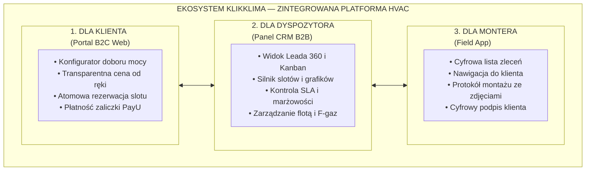

# KlikKlima — Cyfrowy Ekosystem Instalacji Klimatyzacji (One-Pager)

> **Misja:** Zastąpić tradycyjny, chaotyczny proces zakupu i montażu klimatyzacji w pełni zautomatyzowanym, transparentnym ekosystemem cyfrowym — działającym w modelu *Uber dla instalacji HVAC*.

---

## 1. Problem Rynkowy (Dlaczego rynek HVAC potrzebuje KlikKlima)

Tradycyjny rynek klimatyzacji w Polsce opiera się na przestarzałych, analogowych schematach:

* **Z perspektywy Klienta:** Konieczność dzwonienia po lokalnych monterach, wielotygodniowe oczekiwanie na „wycenę z kartki”, brak transparentnych cen w internecie, niepewność co do kwalifikacji ekip i chaos w umawianiu terminów.
* **Z perspektywy Firmy Instalacyjnej:** Ręczne układanie grafików w zeszycie lub Excelu, puste przebiegi audytorów, straty marży przez niedoszacowane wyceny, brak kontroli nad jakością pracy podwykonawców oraz ryzyko podkradania klientów przez ekipy monterskie.

---

## 2. Rozwiązanie: Czym jest KlikKlima?

**KlikKlima** to kompletny, wertykalnie zintegrowany ekosystem cyfrowy, który łączy klienta końcowego, dyspozytornię firmy, hurtownie chłodnicze oraz monterów w terenie w jeden spójny, zautomatyzowany proces.

---

## 3. Trzy Główne Filary Produktowe

### Filar A: Portal Klienta B2C (`apps/b2c-web`)
* **Inteligentny Konfigurator:** Klient podaje parametry mieszkania (powierzchnia, nasłonecznienie, piętro), a algorytm w kilka sekund wylicza zapotrzebowanie chłodnicze i rekomenduje kompatybilne jednostki Single lub Multi-Split.
* **Atomowa Rezerwacja Terminu:** Zintegrowany kalendarz prezentuje realnie wolne sloty audytorów w regionie. Klient rezerwuje wizytę bez konieczności rozmowy telefonicznej.
* **Maksymalizacja Konwersji:** Dynamiczny licznik dostępności w regionie (FOMO) oraz inteligentny formularz ratunkowy (*exit-intent*) wychwytujący porzucających użytkowników.

### Filar B: Mózg Operacyjny i CRM B2B (`apps/b2b-web`)
* **Zarządzanie Lejkiem (Funnel State Machine):** 8 zdefiniowanych etapów zlecenia z automatycznymi przejściami (od pierwszego kliknięcia, przez wycenę, zamówienie sprzętu, po montaż i rozliczenie).
* **Algorytmiczny Silnik Slotów (`packages/scheduling`):** Agreguje dostępność wielu wykonawców z Google Calendar, nakłada czasy dojazdu i koszyki technologiczne — eliminując ryzyko podwójnej rezerwacji (*double-booking*).
* **Obsługa Rynku Deweloperskiego (Montaż 2-Fazowy):** Zintegrowana obsługa instalacji w stanie surowym (Faza I: bruzdy i rury przed tynkami; Faza II: powieszenie i start urządzeń po wykończeniu).
* **Bezpieczeństwo i RODO:** Niezaprzeczalny, niezmienny rejestr audytowy zdarzeń (`AuditLog`) oraz pełna anonimizacja danych na żądanie.

### Filar C: Aplikacja Terenowa Wykonawcy (`Field App`)
* Standaryzacja pracy monterów: sztywne checklisty, obowiązek wykonania 4 zdjęć z montażu (jednostka zewn., wewn., odpływ, budynek), cyfrowy protokół odbioru podpisany na smartfonie.
* Ochrona bazy: dzięki regułom *Row Level Security* monter widzi wyłącznie dane bieżącego zlecenia, co uniemożliwia kradzież bazy klientów firmy.

---

## 4. Model Biznesowy i Przewaga Finansowa

KlikKlima opiera się na **wysokomarżowym modelu z ujemnym cyklem konwersji gotówki**:

1. **Struktura Przychodów:**
   * Marża na sprzedaży urządzeń (rabat B2B w hurtowni: 35–45% vs cena detaliczna).
   * Marża operacyjna na usłudze montażu (narzut na stawkach podwykonawców zdefiniowanych w koszykach).
   * Powtarzalny przychód z corocznych serwisów gwarancyjnych (baza danych automatycznie uruchamia cykliczne przypomnienia co 12 miesięcy).
2. **Samofinansujący się Cash Flow:**
   * Klient rezerwując montaż opłaca zaliczkę (40–50%), która w 100% finansuje zakup klimatyzatora w hurtowni przed przystąpieniem do prac. Firma nie mrozi własnego kapitału w magazynie.
3. **Skalowalność 10x bez wzrostu kosztów stałych:**
   * Tradycyjna firma do obsługi 100 montaży miesięcznie potrzebuje 4–6 osób w biurze do odbierania telefonów i koordynacji. KlikKlima realizuje ten wolumen przy **1 osobie w dyspozytorni**.

---

## 5. Przewaga Technologiczna i Moat Spółki

* **Bankowy rygor architektoniczny (CDAL):** Jedno źródło prawdy w kontraktach biznesowych (`contracts/*.contract.mjs`). Zmiana reguły biznesowej automatycznie aktualizuje kod TypeScript i diagramy procesowe.
* **Zero długu technologicznego:** Nowoczesny stos (Next.js App Router, Server Actions, PostgreSQL/Prisma, Tailwind v4). Brak podatności na halucynacje AI dzięki 14 testom mutacyjnym samej bramki weryfikacyjnej.
* **Brak vendor lock-in:** Baza danych z 28 migracjami SQL pozwala przenieść cały ekosystem do dowolnej chmury w kilka minut.

---

## 6. Status Projektu i Najbliższe Kamienie Milowe

* **Stan obecny:** Zbudowany i przetestowany rdzeń technologiczny (**470 godzin pracy architektoniczno-inżynieryjnej**, wycena IP: 260 000 – 360 000 PLN, gotowy silnik slotów, CRM B2B, modele urządzeń i baza RODO).
* **Najbliższe 30–60 dni (zgodnie z [SYSTEM-KPI-I-BRAMKI-DECYZYJNE.md](SYSTEM-KPI-I-BRAMKI-DECYZYJNE.md)):**
  1. Domknięcie bramek płatności online i testy w terenie (Gate 2: 3–5 montaży pilotażowych).
  2. Podpisanie umów z dystrybutorami HVAC i zakontraktowanie pierwszych certyfikowanych ekip monterskich (Gate 3).
  3. Start kampanii Google Ads i Meta Ads w marcu 2027 r. tuż przed szczytem sezonu (Gate 4).
