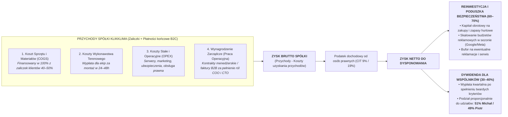
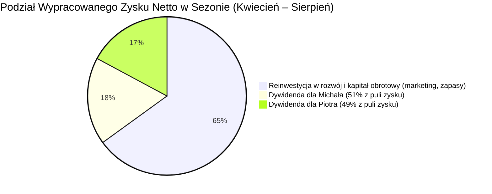

# Polityka Dywidend i Dystrybucji Gotówki KlikKlima Sp. z o.o.

## Strategia Zarządzania Płynnością, Reinwestycji i Podziału Zysków w Fazach Rozwoju

**Projekt:** KlikKlima Sp. z o.o.  
**Wspólnicy:** Michał Sznurowski (CEO / CTO – 51%) & Piotr (COO – 49%)  
**Data wejścia w życie:** Listopad 2026 r. (od rejestracji spółki)  
**Horyzont strategiczny:** Listopad 2026 r. – Sierpień 2027 r. (i kolejne lata obrotowe)  
**Dokumenty powiązane:**

- Modele Współpracy Wspólników (`model_wspolpracy.md`)
- Roadmapa GTM i Harmonogram Wdrożenia (`ROADMAP-GTM-I-PROGNOZA-DEVELOPMENTU.md`)
- Prognoza Finansowa i Koszty GTM (`PROGNOZA-FINANSOWA-I-KOSZTY-GTM.md`)
- Koszyki Usług i Modele Rozliczeniowe (`KOSZYKI-USLUG-I-MODELE-ROZLICZENIOWE.md`)
- System KPI i Bramki Decyzyjne (`SYSTEM-KPI-I-BRAMKI-DECYZYJNE.md`)

---

## 1. Filozofia Finansowa: Ścisłe Rozdzielenie Pracy od Kapitału

Jednym z najważniejszych fundamentów zdrowej, bezpiecznej spółki partnerskiej jest precyzyjne oddzielenie **wynagrodzenia za bieżącą pracę operacyjną** od **nagrody za wniesiony kapitał i ryzyko założycielskie (dywidendy)**.

### Dwa Niezależne Strumienie Dochodowe Wspólników:

1. **Wynagrodzenie za Pracę Operacyjną (OPEX Spółki):**
   - Płatne za bieżący wkład pracy (Michał: utrzymanie platformy, kod, architektura; Piotr: kierowanie operacjami, koordynacja montaży, rekrutacja i nadzór ekip).
   - Stanowi bezpośredni koszt uzyskania przychodu spółki, co optymalizuje podatek CIT.
   - Nie jest uzależnione od wypłaty dywidendy — przysługuje z tytułu bieżącego pełnienia ról operacyjnych.
2. **Dywidenda ze Skumulowanego Zysku Netto (Parytet 51/49):**
   - Wynagrodzenie kapitałowe wypłacane wyłącznie wtedy, gdy spółka generuje realną, potwierdzoną nadwyżkę finansową po opłaceniu wszystkich zobowiązań i podatków.
   - Dzielona ściśle według struktury udziałowej: **51% Michał Sznurowski / 49% Piotr**.

---

## 2. Model Cash Flow: Samofinansowanie Urządzeń i Kapitał Obrotowy

Model biznesowy KlikKlima został zaprojektowany tak, aby zminimalizować ryzyko zatorów płatniczych i wyeliminować konieczność kredytowania klientów.

### 1. Zasada 100% Pokrycia Sprzętu z Zaliczki (COGS)

- Każdy klient rezerwujący montaż uiszcza obligatoryjną **zaliczkę w wysokości 40–50% wartości zamówienia** (poprzez szybką bramkę PayU lub dedykowany przelew natychmiastowy).
- Wartość zaliczki jest kalkulowana w silniku wycen w taki sposób, by **w 100% pokrywała koszt zakupu klimatyzatora w hurtowni (Iglotech, Schiessl itp.) oraz materiałów montażowych**.
- Spółka **nigdy nie zamawia urządzeń za własne pieniądze** przed zaksięgowaniem zaliczki klienta. Ryzyko kapitałowe na sprzęcie wynosi 0 PLN.

### 2. Kapitał Obrotowy na Okres Przedstartowy (Runway: Listopad 2026 – Luty 2027)

Przed nadejściem wiosennego szczytu montażowego spółka ponosi koszty stałe, które nie są pokrywane z bieżących zaliczek klientów:

- Opłata rejestracyjna i urzędowa UDT (3 885,01 zł),
- Opłaty notarialne, rejestracja spółki w KRS, obsługa prawna i księgowa,
- Polisy ubezpieczeniowe OC działalności instalatorskiej (wymóg UDT i ochrona operacyjna),
- Infrastruktura serwerowa (Supabase, Vercel, bramki SMS/email, monitoring Sentry),
- Budżet reklamowy i zaliczka marketingowa na start kampanii w marcu 2027 r.

> **Reguła Płynnościowa:** W okresie przedstartowym (Faza 1 – Faza 3) **obowiązuje bezwzględny zakaz wypłaty jakichkolwiek dywidend (0%)**. Wszystkie wypracowane środki oraz wniesiony kapitał założycielski służą zabezpieczeniu płynności i uruchomieniu maszyny rynkowej.

---

## 3. Polityka Dystrybucji Gotówki w Fazach Rozwoju Projektu

Wypłata zysku jest ściśle powiązana z cyklem życia firmy i kalendarzem sezonowym branży HVAC:

| Faza Projektu                            | Okres Czasowy                           |    Poziom Dywidendy    | Przeznaczenie Nadwyżek Finansowych i Zasady Zysków                                                                                                                                     |
| :--------------------------------------- | :-------------------------------------- | :--------------------: | :------------------------------------------------------------------------------------------------------------------------------------------------------------------------------------- |
| **Faza 1: Przygotowanie i Fundamenty**   | Listopad 2026 r.                        |         **0%**         | Rejestracja spółki, opłata wniosku UDT, umowy B2B, cenniki hurtowe, domknięcie technologii do 30.11. Finansowanie z wkładów założycielskich.                                           |
| **Faza 2: Testy Bojowe (Dry Run)**       | Grudzień 2026 r. – Styczeń/Luty 2027 r. |         **0%**         | **100% zysków z montaży testowych zatrzymuje Piotrek (Kort Klima).** KlikKlima nie generuje marży komercyjnej — testuje stabilność platformy IT i procesów. Faza może ulec wydłużeniu. |
| **Faza 3: Onboarding i Szkolenie Ekip**  | Luty 2027 r.                            |         **0%**         | Praktyczne warsztaty ze standardu 4 zdjęć i Field App. Finansowanie startowego budżetu reklamowego. **Piotr deklaruje wybór modelu współpracy (Wariant A vs Wariant B).**              |
| **Faza 4: Publiczny Start (Go-Live)**    | Marzec 2027 r.                          |         **0%**         | **Rozpoczęcie komercyjnej realizacji zysków przez KlikKlima Sp. z o.o.** 100% reinwestycji zysku w budowę nienaruszalnej poduszki rezerwowej (2–3 miesiące kosztów stałych).           |
| **PRÓG AKTYWACJI DYWIDENDY**             | **Kwiecień 2027 r.**                    |    **Start Wypłat**    | **Moment weryfikacji twardych warunków płynnościowych** (poduszka gotówkowa + skala sprzedaży min. 20–25 montaży/mc).                                                                  |
| **Faza 5: Skalowanie Sezonowe**          | Kwiecień – Sierpień 2027 r.             | **30–40% zysku netto** | **60–70% reinwestycji** w kapitał obrotowy, zwiększanie budżetów reklamowych Google/Meta; **30–40% dywidendy** w transzach kwartalnych (51% Michał / 49% Piotr).                       |
| **Okres Jesienno-Zimowy (Stabilizacja)** | Wrzesień – Luty 2028 r.                 |   **Według uchwały**   | Spółka przechodzi na powtarzalny strumień MRR z corocznych serwisów i przeglądów gwarancyjnych. Buforowanie gotówki na kolejny sezon.                                                  |

---

## 4. Twarde Kryteria Aktywacji Wypłaty Dywidendy (Próg: Kwiecień 2027)

Aby Zgromadzenie Wspólników mogło podjąć wiążącą uchwałę o pierwszej wypłacie dywidendy (lub zaliczki na poczet dywidendy), **spółka musi spełnić łącznie następujące 4 kryteria**:

1. **Nienaruszalna Poduszka Bezpieczeństwa na Rachunku:**
   - Na koncie bankowym spółki musi stale znajdować się żelazna rezerwa płynnościowa pokrywająca:
     - Minimum **2–3 miesiące bieżących kosztów stałych OPEX** (infrastruktura, księgowość, stałe opłaty, wynagrodzenia podstawowe),
     - Bufor reklamacyjny i gwarancyjny na nieprzewidziane serwisy.
2. **Stabilny Wolumen Sprzedaży:**
   - Osiągnięcie powtarzalnej skali minimum **20–25 zrealizowanych i opłaconych montaży w miesiącu** ze zbilansowaną marżą brutto na montażu.
3. **Brak Jakichkolwiek Zatorów i Zadłużeń:**
   - 100% terminowości w płatnościach za urządzenia wobec hurtowni HVAC (faktury opłacane w terminie, brak blokad kredytu kupieckiego),
   - 100% terminowości rozliczeń z podwykonawcami montażowymi (wypłaty zgodnie z SLA 24–48h od zatwierdzenia protokołu odbioru).
4. **Brak Nierozwiązanych Roszczeń i Sporów Prawnych:**
   - Brak toczących się postępowań reklamacyjnych, które mogłyby skutkować koniecznością zwrotu środków lub wymiany sprzętu na koszt spółki.

---

## 5. Algorytm i Harmonogram Wypłaty w Sezonie (Faza 5)

Po aktywacji dywidendy w kwietniu 2027 r., zyski wypracowane w okresie wysokiego sezonu są dzielone według przejrzystego algorytmu:

### Zasady Wypłat Kwartalnych:

1. **Transza Q1/Q2 (rozliczana w lipcu 2027 r.):**
   - Podsumowanie wyników za kwiecień, maj i czerwiec.
   - Ustalenie zysku netto po potrąceniu zaliczki na CIT.
   - Wypłata 30–40% zysku netto wspólnikom w relacji 51/49.
   - Pozostałe 60–70% zasila kapitał obrotowy na szczyt fali upałów w lipcu i sierpniu.
2. **Transza Q3 (rozliczana w październiku 2027 r.):**
   - Podsumowanie wyników za lipiec, sierpień i wrzesień.
   - Wypłata dywidendy z zachowaniem rezerwy na koszty stałe okresu jesienno-zimowego.
3. **Forma Prawna Wypłat:**
   - Zgodnie z art. 194 i 195 Kodeksu spółek handlowych, umowa spółki KlikKlima Sp. z o.o. przewiduje upoważnienie zarządu do wypłaty wspólnikom zaliczki na poczet przewidywanej dywidendy za dany rok obrotowy, pod warunkiem posiadania zatwierdzonego sprawozdania finansowego wykazującego zysk.

---

## 6. Zabezpieczenie Interesów Wspólników i Ciągłości Spółki

1. **Zasada Priorytetu Wypłacalności:**
   - Interes bezpieczeństwa i płynności spółki KlikKlima ma pierwszeństwo przed doraźną wypłatą zysków. Żaden ze wspólników nie może wymusić wypłaty dywidendy, jeżeli naruszyłoby to nienaruszalną poduszkę finansową lub groziło utratą płynności.
2. **Pełna Transparentność Finansowa:**
   - Obaj wspólnicy mają wgląd w czas rzeczywisty do rachunku bankowego spółki, raportów fakturowania w systemie KlikKlima CRM oraz bieżących deklaracji VAT i CIT prowadzonych przez biuro rachunkowe.
3. **Podział Zysków z Ewentualnej Akwizycji (Exit M&A):**
   - W przypadku pojawienia się inwestora strategicznego lub funduszu chcącego kupić spółkę KlikKlima Sp. z o.o., zasady podziału środków ze sprzedaży firmy zostały zdefiniowane w dokumencie `model_wspolpracy.md` — Michał, jako właściciel praw majątkowych do IP, gwarantuje Piotrowi proporcjonalny i sprawiedliwy udział w zyskach z akwizycji, doceniając zbudowaną przez niego wartość operacyjną.
4. **Punkt Decyzyjny Wspólników po Dry Run i De-risking Płynnościowy:**
   - Po zakończeniu testów bojowych (koniec stycznia / luty 2027 r.) Piotr formalnie wybiera model współpracy:
     - **Wariant A (Partnerstwo B2B):** Piotr nie wchodzi do zarządu KlikKlima Sp. z o.o., a podział zysków wynika wyłącznie z umowy podwykonawczej pomiędzy spółką a firmą Kort Klima (Cord Klima) według stawek taryfikatora montażowego.
     - **Wariant B (Wspólnicy 51/49 – Rekomendowany):** Piotr obejmuje funkcję COO w zarządzie oraz 49% udziałów, a zysk z klientów pozyskanych przez firmę Kort Klima (Cord Klima) zostaje włączony do KlikKlima i podzielony zgodnie z modelem wspólników (51% Michał / 49% Piotr).
   - **Mechanizm De-riskingu:** Klienci wnoszeni z Kort Klima stanowią gwarantowaną bazę przychodową, która niweluje ryzyko luki w cash flow, gdyby startowa kampania marketingowa KlikKlima (Google/Meta Ads w marcu 2027) wymagała dłuższego czasu na optymalizację algorytmów reklamowych.

---

_Niniejsza Polityka stanowi integralną część porozumienia założycielskiego pomiędzy wspólnikami spółki KlikKlima Sp. z o.o._
