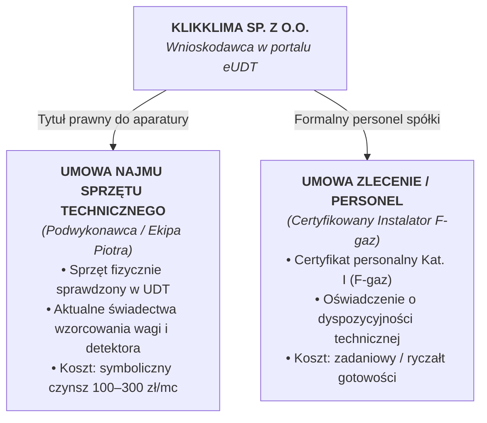
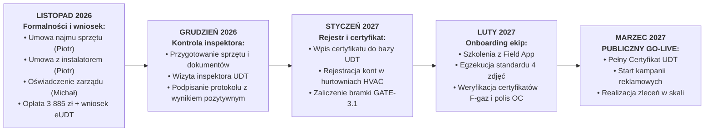

# Certyfikat UDT dla Przedsiębiorstwa
## Model Ekonomiczny: Wynajem Wyposażenia i Współpraca z Personelem Certyfikowanym

**Spółka:** KlikKlima Sp. z o.o. (w organizacji / zarejestrowana)  
**Odpowiedzialność wykonawcza:** Piotr (COO / Dyrektor Operacyjny) — w ramach *Obszaru 5: Formalności, UDT i Gwarancje* ([`OCZEKIWANY-WKLAD-OPERACYJNY-COO.md`](file:///Users/michalsznurowski/Developemnt/klikklima-system/klikklima-system/turborepo/docs/prezentacje/OCZEKIWANY-WKLAD-OPERACYJNY-COO.md))  
**Wsparcie:** Michał (CTO) — formalności zarządu, dostęp do kont spółki i ePUAP/KRS  
**Krytyczny punkt w harmonogramie:** Zgłoszenie wniosku w **Listopadzie 2026 r.** (Gate 1), finalizacja i wpis przed publicznym Go-Live (kryterium **GATE-3.1** w [`SYSTEM-KPI-I-BRAMKI-DECYZYJNE.md`](file:///Users/michalsznurowski/Developemnt/klikklima-system/klikklima-system/turborepo/docs/prezentacje/SYSTEM-KPI-I-BRAMKI-DECYZYJNE.md))  
**Podstawa prawna:** Ustawa z dnia 15 maja 2015 r. o substancjach zubożających warstwę ozonową oraz o niektórych fluorowanych gazach cieplarnianych (Dz.U. 2015 poz. 881 z późn. zm.)

---

## 1. Dlaczego Certyfikat UDT jest Krytyczny dla KlikKlima?

Posiadanie certyfikatu dla przedsiębiorców wydanego przez Urząd Dozoru Technicznego (UDT) jest **warunkiem bezwzględnym i prawnym fundamentem działania KlikKlima**:
1. **Legalny zakup urządzeń i czynnika:** Hurtownie HVAC mają ustawowy zakaz sprzedaży klimatyzatorów oraz butli z czynnikiem chłodniczym podmiotom nieposiadającym wpisu do rejestru UDT.
2. **Legalny montaż pod marką KlikKlima:** Spółka firmuje umowy z klientami B2C i wystawia faktury za montaż — bez certyfikatu przedsiębiorstwa każda instalacja stanowi przestępstwo skarbowo-środowiskowe (kary WIOŚ do 50 000 zł za każdy montaż bez uprawnień).
3. **Brama Go-Live (Kryterium GATE-3.1):** Wdrożenie publiczne platformy (marzec 2027 r.) i start kampanii reklamowych może nastąpić **wyłącznie po uzyskaniu certyfikatu i wpisie do rejestru UDT** (zgodnie z `SYSTEM-KPI-I-BRAMKI-DECYZYJNE.md`).

---

## 2. Strategia: Wariant Ekonomiczny (*Smart Asset-Light*)

Zamiast zamrażać na starcie 10 000 – 15 000 zł w zakup własnych narzędzi oraz zatrudniać instalatora na pełny etat (generując koszty stałe przed jakimkolwiek przychodem ze sprzedaży), KlikKlima wdraża **sprawdzony wariant ekonomiczny dopuszczony przez UDT**:


---

## 3. Krok po Kroku: Procedura Uzyskania Certyfikatu

---

### KROK 1: Przygotowanie Formalności i Umów (Przed Złożeniem Wniosku)
*Termin realizacji: 1 – 15 listopada 2026 r. (Odpowiedzialny: Piotr)*

Zanim złożysz wniosek w portalu eUDT, spółka musi posiadać skompletowany pakiet 4 dokumentów:

#### 1.1. Umowa najmu aparatury i wyposażenia technicznego
* Ustawa wymaga, aby przedsiębiorca dysponował określonym wyposażeniem technicznym na terytorium RP. **Nie ma wymogu bycia jego właścicielem** — umowa najmu z podwykonawcą lub partnerską firmą instalatorską jest w 100% honorowana przez inspektorów UDT.
* **Wymagany minimalny zestaw aparatury (Załącznik nr 1 do umowy):**
  1. **Stacja do odzysku czynnika chłodniczego** (np. Value, Mastercool, CPS) — model i nr seryjny.
  2. **Pompa próżniowa dwustopniowa** (osiągająca próżnię < 270 Pa / 2 Torr) z wakuometrem.
  3. **Elektroniczna waga chłodnicza** o dokładności min. 5 g — **OBOWIĄZKOWO: aktualne świadectwo wzorcowania (kalibracji)** z akredytowanego laboratorium (ważne 1 rok).
  4. **Elektroniczny wykrywacz nieszczelności** o czułości min. 5 g/rok — **OBOWIĄZKOWO: aktualne świadectwo wzorcowania (kalibracji)** (ważne 1 rok).
  5. **Zestaw manometrów cyfrowych lub analogowych** z wężami ciśnieniowymi z zaworami odcinającymi.
  6. **Butla dwuzaworowa do odzysku czynnika** (z aktualną legalizacją UDT — data wybita na kołnierzu butli).
  7. **Zestaw do lutowania twardego (palnik tlen-propan / tlen-acetylen) lub zaciskarka połączeń bezlutowych**.
  8. **Kielicharka do rur miedzianych oraz obcinarka i gradownik**.
  9. **Butla z suchym azotem z reduktorem ciśnienia** (do prób ciśnieniowych do min. 35–40 bar).
* *Zadanie dla Piotra:* Podpisanie umowy najmu z podwykonawcą z wpisaniem dokładnych numerów seryjnych oraz pobranie skanów świadectw wzorcowania dla wagi i wykrywacza.

#### 1.2. Umowa z personelem certyfikowanym (F-gaz Kategoria I)
* Przedsiębiorstwo musi zatrudniać personel posiadający certyfikaty personalne w liczbie odpowiadającej skali działalności.
* W świetle prawa UDT „zatrudnieniem” jest zarówno **umowa o pracę**, jak i **umowa cywilnoprawna (umowa zlecenie)** zawarta z osobą fizyczną.
* Jeśli współpracujący instalator prowadzi jednoosobową działalność gospodarczą (JDG), umowę zlecenie podpisuje się z nim **jako z osobą fizyczną**, a nie B2B między spółkami.
* *Wymagania wobec instalatora:*
  * Posiadanie ważnego bezterminowego Certyfikatu Personalnego F-gaz (Kategoria I — uprawniająca do montażu i serwisu urządzeń o dowolnej masie czynnika).
  * Zgoda na zgłoszenie do ewidencji personelu KlikKlima Sp. z o.o.
* *Zadanie dla Piotra:* Podpisanie umowy zlecenia (na symboliczną stawkę gotowości lub powiązaną ze zleceniami montażowymi) oraz zebranie kopii certyfikatu F-gaz.

#### 1.3. Oświadczenie o niekaralności Zarządu Spółki
* Zgodnie z art. 30 ust. 2 ustawy, osoby wchodzące w skład organu zarządzającego (Zarząd KlikKlima Sp. z o.o.) nie mogą być skazane prawomocnym wyrokiem za przestępstwo przeciwko środowisku (art. 181–188 Kodeksu karnego).
* Oświadczenie składa się w formie pisemnej pod rygorem odpowiedzialności karnej.
* *Zadanie dla Michała i Piotra:* Podpisanie oświadczenia przez członków zarządu zgodnie z reprezentacją w KRS.

#### 1.4. Procedury prowadzenia działalności (Księga Jakości F-gaz KlikKlima)
Wymóg prawny wdrożenia i stosowania procedur operacyjnych w firmie. Pakiet procedur musi obejmować:
1. **Procedurę ewidencji F-gazów:** Opis prowadzenia dokumentacji na platformie cyfrowej KlikKlima (rejestracja numeru seryjnego klimatyzatora, ilości napełnienia fabrycznego, ewentualnego dopełnienia i odzysku w karcie zlecenia).
2. **Procedurę postępowania przy instalacji i uruchomieniu:** Próba ciśnieniowa azotem, próżniowanie poniżej 270 Pa, test szczelności wykrywaczem, wpis do protokołu.
3. **Procedurę postępowania w razie wykrycia nieszczelności i awarii:** Natychmiastowe odessanie czynnika do butli odzysku, usunięcie nieszczelności, powtórna próba ciśnieniowa.
4. **Procedurę nadzoru nad sprzętem:** Harmonogram corocznego wzorcowania wagi i detektora, ewidencja stanu technicznego aparatury.
* *Zadanie dla Michała i Piotra:* Zaadaptowanie procedur operacyjnych do specyfiki systemu KlikKlima (wykorzystanie gotowego wzorca z Załącznika A).

---

### KROK 2: Rejestracja w Portalu eUDT i Złożenie Wniosku
*Termin realizacji: 16 – 20 listopada 2026 r. (Odpowiedzialny: Piotr przy wsparciu Michała)*

Cała procedura administracyjna odbywa się drogą elektroniczną na portalu:  
👉 **[https://eudt.gov.pl](https://eudt.gov.pl)**

1. **Logowanie i autoryzacja:**
   * Logowanie profilem zaufanym lub podpisem kwalifikowanym członka zarządu.
   * Powiązanie konta z profilem firmy KlikKlima Sp. z o.o. (weryfikacja po NIP / KRS).
2. **Wypełnienie wniosku online:**
   * Wybór procedury: *Wniosek o wydanie certyfikatu dla przedsiębiorców w zakresie instalacji, konserwacji lub serwisowania stacjonarnych urządzeń chłodniczych, klimatyzacyjnych i pomp ciepła*.
   * Wpisanie danych spółki, miejsca prowadzenia działalności / przechowywania sprzętu (adres biura / magazynu KlikKlima).
   * Wpisanie danych personelu: Imię, nazwisko, PESEL, numer Certyfikatu Personalnego F-gaz instalatora.
   * Wpisanie wykazu wyposażenia technicznego (marki, modele, numery seryjne).
3. **Załączenie dokumentacji (pliki PDF):**
   * Skan podpisanej umowy najmu aparatury technicznej wraz z Załącznikiem nr 1.
   * Skany aktualnych świadectw wzorcowania wagi chłodniczej i detektora nieszczelności.
   * Skan umowy zlecenia z instalatorem oraz skan jego certyfikatu personalnego F-gaz.
   * Podpisane oświadczenie członków zarządu o niekaralności.
   * Dokument procedur technicznych KlikKlima.
   * Potwierdzenie uiszczenia opłaty skarbowej/urzędowej.
4. **Wniesienie opłaty urzędowej:**
   * Kwota: **3 885,01 zł** (stawka urzędowa UDT).
   * Przelew na numer konta właściwego terenowo oddziału UDT z tytułem:  
     *„Opłata za wydanie certyfikatu dla przedsiębiorców — KlikKlima Sp. z o.o., NIP [NUMER]”*.

---

### KROK 3: Kontrola Inspektoratu UDT (Finał w Grudniu 2026 r.)
*Termin realizacji: ok. 2–3 tygodnie od złożenia wniosku (Grudzień 2026 r., faza Dry Run)*

Po weryfikacji formalnej dokumentów inspektor z właściwego oddziału UDT kontaktuje się telefonicznie z Piotrem, aby wyznaczyć termin kontroli stacjonarnej.

#### 1. Gdzie odbywa się kontrola?
W miejscu wskazanym we wniosku i umowie najmu jako baza techniczna / magazyn sprzętu (siedziba KlikKlima lub wskazany punkt magazynowy w Warszawie).

#### 2. Kto musi być obecny?
* **Piotr (COO)** — reprezentacja spółki i omówienie procedur.
* **Zatrudniony certyfikowany instalator** — musi być fizycznie obecny z dowodem osobistym oraz oryginałem swojego Certyfikatu Personalnego F-gaz.

#### 3. Co musi znajdować się na miejscu kontroli?
* **Fizyczny sprzęt z umowy najmu:** Podwykonawca przywozi dokładnie te urządzenia, których numery seryjne wpisano do umowy i wniosku. Inspektor osobiście odczytuje tabliczki znamionowe stacji odzysku, pompy, wagi, detektora i butli.
* **Dokumenty wzorcowania:** Oryginały lub czytelne kopie świadectw kalibracji wagi i wykrywacza nieszczelności.
* **Segregator dokumentacji KlikKlima:**
  * Egzemplarz procedur technicznych podpisany przez zarząd,
  * Wzory protokołów montażowych i kart urządzeń z systemu cyfrowego KlikKlima.

#### 4. Przebieg kontroli i wynik:
* Kontrola trwa zazwyczaj **45 – 90 minut**.
* Inspektor zadaje instalatorowi 2–3 rutynowe pytania sprawdzające (np. jak wykonuje próbę ciśnieniową, do jakiego podciśnienia próżniuje układ, w jaki sposób rozlicza odzyskany gaz).
* Inspektor sporządza **Protokół z kontroli UDT**.
* Podpisanie protokołu z wynikiem pozytywnym kończy postępowanie.

#### 5. Otrzymanie certyfikatu:
* W ciągu **3–7 dni roboczych** od podpisania pozytywnego protokołu numer certyfikatu zostaje wpisany do publicznego Rejestru Certyfikowanych Przedsiębiorców na stronie UDT.
* Od tej chwili KlikKlima Sp. z o.o. jest w pełni legalnym podmiotem uprawnionym do zakupu klimatyzatorów, F-gazów i świadczenia usług instalacyjnych.

---

## 4. Całkowity Kosztorys Uzyskania Certyfikatu (Wariant Wynajmu)

Dzięki zastosowaniu modelu najmu aparatury spółka **oszczędza na starcie ok. 8 000 – 12 000 zł netto**, które musiałaby wydać na zakup nowego sprzętu chłodniczego:

| Pozycja kosztowa | Koszt netto | Płatność | Komentarz i odpowiedzialność |
| :--- | :---: | :---: | :--- |
| **Opłata urzędowa UDT** | **3 885,01 zł** | Jednorazowo | Ustawowa opłata urzędowa (pokrywana z kapitału obrotowego spółki). |
| **Czynsz najmu sprzętu** | **100 – 300 zł / mc** | Miesięcznie | Wynagrodzenie dla podwykonawcy za udostępnienie aparatury do umowy i kontroli. |
| **Umowa zlecenie z instalatorem** | **0 – 500 zł / mc** | Według ustaleń | Podstawa prawna zatrudnienia personelu (rozliczana ryczałtowo lub w ramach zleceń montażu). |
| **Wzorcowanie wagi i detektora** | *0 zł (w cenie najmu)* lub ok. 350 zł | Raz w roku | Zazwyczaj sprzęt podwykonawcy ma aktualne wzorcowanie; ewentualny koszt odnowienia kalibracji. |
| **Pakiet procedur technicznych** | **0 zł** | Wkład własny | Przygotowany i zaadaptowany w ramach dokumentacji KlikKlima (Załącznik A). |
| **ŁĄCZNY BUDŻET NA START** | **ok. 4 200 – 4 500 zł netto** | — | **Środki niezbędne na koncie spółki w I połowie listopada 2026 r.** |

---

## 5. Harmonogram Odpowiedzialności (Timeline Listopad 2026 – Luty 2027)



---

## 6. Wzory Dokumentów do Pobrania i Wykorzystania

### Załącznik 1: Wzór Oświadczenia Zarządu o Niekaralności

```text
Miejscowość: Warszawa, data: .................... r.

                             OŚWIADCZENIE ZARZĄDU
         O NIEKARALNOŚCI ZA PRZESTĘPSTWA PRZECIWKO ŚRODOWISKU

Działając w imieniu wnioskodawcy:
KlikKlima Sp. z o.o.
Adres siedziby: ....................................................
NIP: ..........................., KRS: ............................

Świadomy/a odpowiedzialności karnej za składanie fałszywych oświadczeń wynikającej 
z art. 233 § 1 i § 6 Kodeksu karnego, niniejszym oświadczam, że:

Osoby wchodzące w skład organu zarządzającego KlikKlima Sp. z o.o. nie zostały skazane 
prawomocnym wyrokiem sądu za przestępstwo przeciwko środowisku, o którym mowa 
w rozdziale XXII Kodeksu karnego (art. 181-188 ustawy z dnia 6 czerwca 1997 r. 
- Kodeks karny) lub w odpowiednich przepisach prawa innych państw.

Oświadczenie składane jest w związku z ubieganiem się o wydanie certyfikatu dla przedsiębiorców 
zgodnie z art. 30 ust. 2 ustawy z dnia 15 maja 2015 r. o substancjach zubożających warstwę ozonową 
oraz o niektórych fluorowanych gazach cieplarnianych.


.....................................................
(Podpisy członków Zarządu zgodnie z reprezentacją)
```

---

### Załącznik 2: Wzór Załącznika nr 1 do Umowy Najmu (Wykaz Wyposażenia)

```text
ZAŁĄCZNIK NR 1 DO UMOWY NAJMU WYPOSAŻENIA TECHNICZNEGO
Z DNIA .................... R.

WYKAZ WYPOSAŻENIA TECHNICZNEGO PRZEKAZANEGO NAJEMCY (KLIKKLIMA SP. Z O.O.):

1. Stacja do odzysku czynników chłodniczych:
   - Producent / Model: ................................................
   - Numer seryjny: ....................................................
   - Przeznaczenie do czynników: R32, R410A

2. Pompa próżniowa dwustopniowa z wakuometrem:
   - Producent / Model: ................................................
   - Numer seryjny: ....................................................
   - Wydajność / Próżnia końcowa: ............ l/min / < 15 mikronów

3. Elektroniczna waga do napełniania i odzysku czynnika:
   - Producent / Model: ................................................
   - Numer seryjny: ....................................................
   - Zakres i nośność: 0 - 50 kg (dokładność 5 g)
   - Świadectwo wzorcowania nr: ........................................
   - Data wydania świadectwa kalibracji: ................................ (ważne do: .............)

4. Elektroniczny wykrywacz nieszczelności chłodniczych:
   - Producent / Model: ................................................
   - Numer seryjny: ....................................................
   - Czułość pomiaru: 3 g/rok (wymóg UDT: min. 5 g/rok)
   - Świadectwo wzorcowania nr: ........................................
   - Data wydania świadectwa kalibracji: ................................ (ważne do: .............)

5. Zestaw manometrów elektronicznych / analogowych z wężami:
   - Producent / Model: ................................................
   - Węże z zaworami kulowymi odcinającymi (ciśnienie pracy do 55 bar)

6. Butla dwuzaworowa do odzysku czynnika chłodniczego:
   - Pojemność / Ciśnienie robocze: 12,5 L / 48 bar
   - Numer seryjny butli: ..............................................
   - Ważność legalizacji UDT: do .................... r.

7. Butla z suchym azotem technicznym wraz z reduktorem ciśnienia (0 - 50 bar):
   - Reduktor ciśnienia model: .........................................

8. Narzędzia do obróbki i łączenia rur:
   - Kielicharka mimośrodowa ze sprzęgłem: model ........................
   - Obcinak krążkowy i gradownik do rur miedzianych
   - Zestaw do lutowania twardego (palnik tlen-propan / MAPP)


Wynajmujący:                                  Najemca:
....................................          ....................................
```

---

### Załącznik 3: Skrócona Karta Procedur Technicznych F-Gaz KlikKlima

```text
PROCEDURY TECHNICZNE OBROTU CZYNNOKAMI F-GAZ W KLIKKLIMA SP. Z O.O.

1. Procedura weryfikacji i instalacji:
   a) Każdy montaż klimatyzatora realizowany pod marką KlikKlima wykonuje wyłącznie 
      certyfikowany instalator posiadający ważny certyfikat personalny F-gaz.
   b) Przed uruchomieniem instalator wykonuje próbę ciśnieniową suchym azotem (ciśnienie min. 35 bar 
      przez minimum 30 minut) w celu wykluczenia nieszczelności.
   c) Przed napełnieniem czynnikiem instalator wykonuje próżniowanie instalacji pompy próżniowej 
      do poziomu poniżej 270 Pa, potwierdzone wakuometrem.
   d) Napełnienie lub ewentualne dopełnienie czynnika odbywa się wyłącznie wagowo przy użyciu 
      wywzorcowanej wagi chłodniczej.

2. Procedura ewidencji w systemie cyfrowym KlikKlima:
   a) Po zakończeniu montażu instalator wprowadza do aplikacji terenowej: model jednostki, 
      numer fabryczny, rodzaj czynnika (R32) oraz masę czynnika wprowadzoną do układu.
   b) Dane te są trwale zapisywane w Karcie Urządzenia w bazie CRM KlikKlima, 
      umożliwiając natychmiastowe wygenerowanie raportu dla organów WIOŚ i UDT.

3. Procedura odzysku i nieszczelności:
   a) W razie stwierdzenia nieszczelności zabrania się dopełniania układu. Czynnik chłodniczy 
      musi zostać odessany do butli dwuzaworowej za pomocą stacji odzysku.
   b) Po usunięciu nieszczelności układ poddawany jest ponownej procedurze ciśnieniowej i próżniowej.
   c) Odzyskany zużyty czynnik przekazywany jest do regeneracji lub utylizacji u uprawnionego dystrybutora.

4. Procedura nadzoru nad wyposażeniem pomiarowym:
   a) Dyrektor Operacyjny (COO) prowadzi rejestr aparatury pomiarowej.
   b) Waga chłodnicza oraz elektroniczny wykrywacz nieszczelności podlegają corocznemu 
      obowiązkowemu wzorcowaniu w akredytowanym laboratorium metrologicznym.
```

---

## 7. Podsumowanie dla Zarządu

1. **Wdrożenie UDT jest w 100% wykonalne w modelu asset-light** bez zbędnego obciążania budżetu KlikKlima zakupami drogiego sprzętu.
2. **Kluczowy koszt to 3 885,01 zł opłaty skarbowej**, która musi zostać zabezpieczona w kapitale obrotowym na listopad 2026 r.
3. **Piotr bierze pełną odpowiedzialność operacyjną** za kontakt z instalatorem, zebranie numerów seryjnych maszyn, podpisanie umowy najmu i asystę podczas grudniowej kontroli inspektora.
4. **Wpis do rejestru UDT w styczniu 2027 r.** otwiera zielone światło dla lutowego Go-Live i masowej sprzedaży.
