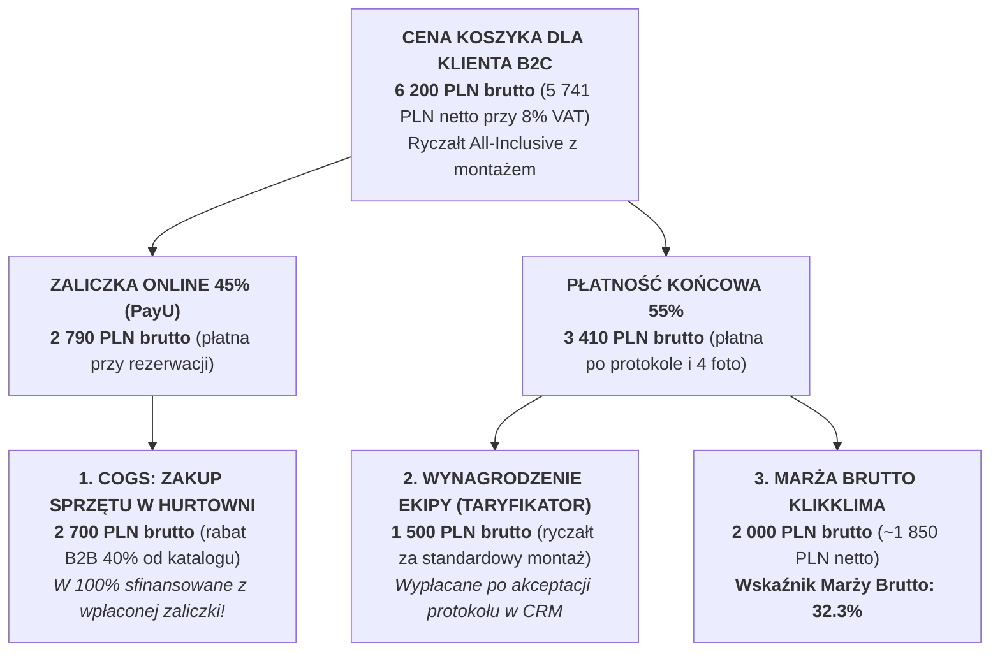
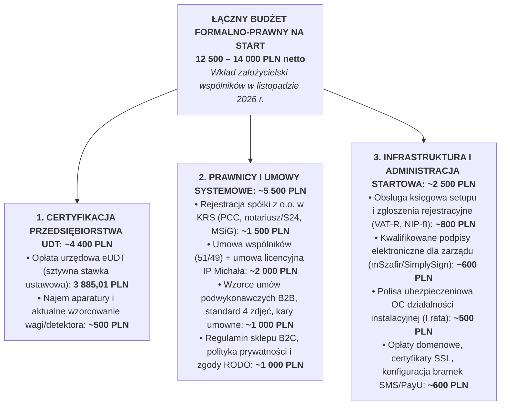
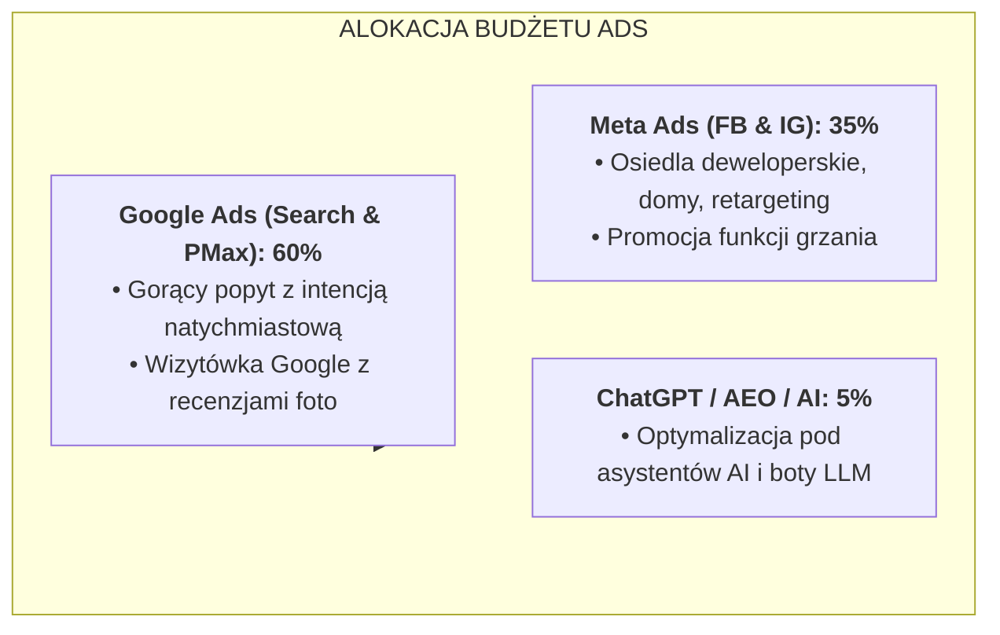
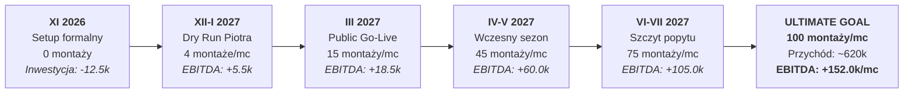
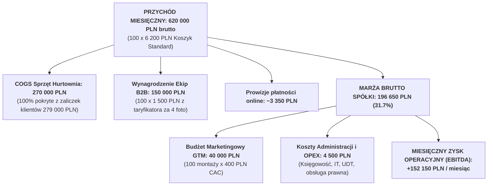

# Prognoza Finansowa i Budżet GTM (100 montaży/mc)
## Model Finansowy, Koszty Formalno-Prawne, UDT i Unit Economics (2026–2027)

> **Status:** Wiążący Model Finansowy i Budżetowy (Single Source of Truth – SSOT)  
> **Projekt:** System Cyfrowy KlikKlima Sp. z o.o.  
> **Założyciele:** Michał Sznurowski (CTO / 51%) & Piotr (COO / 49%)  
> **Horyzont Prognozy:** Listopad 2026 r. – Wrzesień 2027 r. (Osiągnięcie docelowego celu 100 montaży/miesiąc)  
> **Waluta:** PLN (wartości podawane w ujęciu brutto/netto zgodnie z oznaczeniem)

---

## 1. Wprowadzenie i Założenia Strategiczne Modelu

Model finansowy spółki KlikKlima opiera się na **trzech filarach dyscypliny kapitałowej**:

1. **Ujemny Cykl Konwersji Gotówki (Zero Magazynu, Samofinansowanie COGS):**
   * Klient rezerwując termin wpłaca **40–50% zaliczki online (PayU)** w momencie podpisania umowy cyfrowej.
   * Wpłacona zaliczka pokrywa w **100% koszt zakupu urządzeń w hurtowni chłodniczej** w modelu Just-in-Time (dostawa sprzętu bezpośrednio na dzień montażu).
   * Spółka **nie mrozi ani złotówki kapitału własnego w zapasach towarowych**, co eliminuje ryzyko płynnościowe typowe dla tradycyjnych firm HVAC.
2. **Sztywny Taryfikator Wynagrodzeń Ekip:**
   * Monterzy podwykonawczy rozliczani są według sztywnego taryfikatora koszykowego (np. `INSTALL_STANDARD`).
   * Wypłata wynagrodzenia następuje **wyłącznie po odbiorze prac przez klienta i wgraniu 4 zdjęć do Field App**. Brak ryzyka dopłat za „nieprzewidziane roboczogodziny”.
3. **Wysokomarżowy Strumień Powtarzalny (MRR z Serwisów):**
   * Baza klientów przekazana przez Piotra oraz nowi klienci pozyskani przez KlikKlima podlegają automatycznemu programowi corocznych przeglądów gwarancyjnych i pogwarancyjnych (marża jednostkowa $\ge 50\%$).

---

## 2. Jednostkowa Ekonomika Montażu (Unit Economics)

Poniższe wyliczenie opiera się na najbardziej popularnym koszyku rynkowym: **INSTALL_STANDARD** (klimatyzator ścienny Split o mocy 3.5 kW, np. Gree Pular / Daikin Sensira / Rotenso Ukura, montaż do 3 metrów instalacji freonowej, budownictwo mieszkaniowe z 8% stawką VAT).

### Zestawienie jednostkowe per 1 montaż standardowy:

| Pozycja | Kwota Brutto (8% VAT) | Kwota Netto | % Ceny B2C | Komentarz biznesowy |
| :--- | :---: | :---: | :---: | :--- |
| **Przychód ze sprzedaży (Koszyk Standard)** | **6 200,00 zł** | **5 740,74 zł** | 100.0% | Transparentna cena ryczałtowa z konfiguratora online. |
| **Koszt urządzeń i materiałów (COGS Hurtownia)** | **-2 700,00 zł** | **-2 500,00 zł** | 43.5% | Klimatyzator 3.5 kW + wspornik + rury miedziane (rabat 40%). |
| **Wynagrodzenie podwykonawcy (Taryfikator)** | **-1 500,00 zł** | **-1 388,89 zł** | 24.2% | Sztywna stawka za koszyk; wypłata warunkowana protokołem i 4 foto. |
| **Prowizja bramki płatności PayU (1.2% zaliczki)** | **-33,48 zł** | **-27,22 zł** | 0.5% | Prowizja operatora płatności od zaliczki 2 790 zł. |
| **MARŻA BRUTTO I STOPNIA (Per Montaż)** | **+1 966,52 zł** | **+1 824,63 zł** | **31.7%** | **Czysty wkład gotówkowy spółki przed kosztami marketingu i OPEX.** |
| **Efektywny koszt pozyskania klienta (CAC)** | **-400,00 zł** | **-325,20 zł** | 6.5% | Benchmarkowy koszt konwersji z kampanii Google Ads i Meta Ads. |
| **ZYSK PO MARKETINGU (Per Montaż)** | **+1 566,52 zł** | **+1 499,43 zł** | **25.2%** | **Środki pozostające w spółce na pokrycie kosztów stałych i zysk.** |

### Jednostkowa ekonomika serwisu rocznego (MRR):

* **Cena dla klienta B2C (Przegląd roczny):** 280,00 zł brutto (259,26 zł netto).
* **Wynagrodzenie montera / serwisanta:** 130,00 zł brutto.
* **Materiały (chemia odgrzybiająca, filtry):** 20,00 zł brutto.
* **Czysta marża spółki na 1 serwisie:** **+130,00 zł brutto (46.4% marży)**.
* *Wniosek:* Przy bazie 500 urządzeń coroczny serwis generuje **65 000 zł czystej marży gotówkowej** bez ponoszenia kosztów płatnego marketingu (CAC = 0 zł, powiadomienia SMS wysyła automat `cron`).

---

## 3. Koszty Przygotowawcze i Formalne (Setup Fazy 1 – Listopad 2026 r.)

Przed wystawieniem pierwszej publicznej oferty spółka musi ponieść jednorazowe wydatki formalno-prawne, licencyjne i urzędowe. Wydatki te są finansowane ze wspólnego kapitału obrotowego założycieli (listopad 2026 r.):

| Kategoria Kosztu | Pozycja Szczegółowa | Kwota Szacunkowa | Termin Płatności | Odpowiedzialny |
| :--- | :--- | :---: | :---: | :---: |
| **UDT** | Ustawowa opłata urzędowa za wydanie certyfikatu przedsiębiorstwa | **3 885,01 zł** | 15–20.11.2026 | Piotr |
| **UDT** | Wzorcowanie aparatury (waga chłodnicza, detektor) / kaucja najmu | **500,00 zł** | 10.11.2026 | Piotr |
| **Prawo** | Opłata sądowa za wpis do KRS + ogłoszenie w MSiG + podatek PCC-2 | **650,00 zł** | 05.11.2026 | Piotr |
| **Prawo** | Przygotowanie umowy spółki, umowy wspólników (51/49) i licencji IP | **2 000,00 zł** | 10.11.2026 | Michał |
| **Prawo** | Przygotowanie umów podwykonawczych B2B, procedur RODO i regulaminu | **2 000,00 zł** | 15.11.2026 | Michał / Piotr |
| **Księgowość** | Zgłoszenia rejestracyjne (NIP-8, VAT, VAT-UE, CRBR) i setup biura rachunkowego | **800,00 zł** | 15.11.2026 | Piotr |
| **IT & Narzędzia** | Podpisy kwalifikowane mSzafir (2x zarząd) + bramki SMS / transakcyjne | **1 000,00 zł** | 15.11.2026 | Michał |
| **Ubezpieczenie** | Polisa OC działalności przedsiębiorstwa instalacyjnego (zaliczka/rata) | **500,00 zł** | 25.11.2026 | Piotr |
| **SUMA SETUPU** | **Łączny kapitał niezbędny do uruchomienia spółki** | **~11 335,01 zł** | **Listopad 2026** | **Wspólnicy 50/50** |

---

## 4. Koszty Stałe Prowadzenia Spółki z o.o. (Miesięczny OPEX Administracyjny)

Spółka została zaprojektowana w modelu **Asset-Light**, co oznacza brak własnego magazynu, brak własnych samochodów dostawczych i minimalne koszty stałe. Poniższe koszty obowiązują niezależnie od liczby zrealizowanych montaży:

| Pozycja Kosztów Stałych | Kwota Miesięczna Netto | Kwota Roczna Netto | Uwagi operacyjne |
| :--- | :---: | :---: | :--- |
| **Pełna księgowość spółki z o.o.** | 1 200,00 zł | 14 400,00 zł | Prowadzenie ksiąg rachunkowych, JPK_V7, deklaracje CIT, sprawozdania finansowe. |
| **Infrastruktura IT & Cloud** | 450,00 zł | 5 400,00 zł | Hosting Vercel Pro, baza PostgreSQL Supabase, Sentry, domeny, repozytoria. |
| **Pakiety komunikacji SMS & E-mail** | 200,00 zł | 2 400,00 zł | Bramka SMSAPI (powiadomienia dla klientów i ekip) + transactional e-mail Resend. |
| **Czynsz najmu sprzętu do UDT** | 200,00 zł | 2 400,00 zł | Miesięczny czynsz dla partnera udostępniającego aparaturę na potrzeby certyfikatu. |
| **Polisa OC przedsiębiorstwa** | 250,00 zł | 3 000,00 zł | Ubezpieczenie odpowiedzialności cywilnej kontraktowej i deliktowej na 500 tys. zł. |
| **Rachunek bankowy i opłaty prawne** | 150,00 zł | 1 800,00 zł | Prowadzenie rachunku firmowego, subkont VAT, drobne konsultacje prawne. |
| **ŁĄCZNY STAŁY OPEX MIESIĘCZNY** | **2 450,00 zł** | **29 400,00 zł** | **Do pokrycia z marży już przy 2 montażach w miesiącu!** |

---

## 5. Budżet Marketingowy GTM i Efektywność Akwizycji (CAC)

Koszt pozyskania klienta jest kluczową zmienną skalowania. W oparciu o benchmarki rynkowe w branży HVAC oraz testy pilotażowe przyjmujemy:
* **Średni koszt kliknięcia (CPC):** Google Ads Search: 3,50 – 5,50 zł; Meta Ads: 1,20 – 2,50 zł.
* **Współczynnik konwersji ze strony na lead (CVR 1):** 4.5% – 6.0% (dzięki interaktywnemu konfiguratorowi cenowemu).
* **Współczynnik konwersji z leada na opłacony montaż (CVR 2):** 20.0% – 28.0% (dzięki natychmiastowej rezerwacji terminu online).
* **Średni ważony koszt pozyskania opłaconego montażu (CAC):** **~350 – 450 zł**.

### Struktura alokacji budżetu marketingowego per faza:

---

## 6. Ścieżka Wzrostu Finansowego: Krok po Kroku do Celu 100 Montaży Miesięcznie

Poniższa prognoza przedstawia ewolucję finansową KlikKlima Sp. z o.o. od rejestracji w listopadzie 2026 r., przez fazę testów bojowych (Dry Run), publiczny start, szczyt sezonu letniego, aż po **osiągnięcie docelowego celu strategicznego: 100 montaży w miesiącu**.

### Szczegółowa Tabela Prognozy Finansowej (Miesiąc po Miesiącu / Kamienie Milowe):

| Miesiąc / Etap | Liczba montaży | Przychody ze sprzedaży (brutto) | Koszt sprzętu COGS (brutto) | Koszt ekip (taryfikator) | Marża Brutto I stopnia | Budżet Marketingowy | Koszty Stałe OPEX | Zysk Operacyjny EBITDA | Skumulowany Cash Flow |
| :--- | :---: | :---: | :---: | :---: | :---: | :---: | :---: | :---: | :---: |
| **Listopad 2026 (Fundamenty)** | 0 | 0 zł | 0 zł | 0 zł | 0 zł | 0 zł | 12 500 zł *(setup)* | **-12 500 zł** | **-12 500 zł** |
| **Grudzień 2026 (Dry Run 1)** | 4 | 24 800 zł | 10 800 zł | 6 000 zł | 7 866 zł | 0 zł *(baza Piotra)* | 2 450 zł | **+5 416 zł** | **-7 084 zł** |
| **Styczeń 2027 (Dry Run 2)** | 4 | 24 800 zł | 10 800 zł | 6 000 zł | 7 866 zł | 0 zł *(baza Piotra)* | 2 450 zł | **+5 416 zł** | **-1 668 zł** |
| **Luty 2027 (Onboarding ekip)** | 2 | 12 400 zł | 5 400 zł | 3 000 zł | 3 933 zł | 0 zł *(testy)* | 2 450 zł | **+1 483 zł** | **-185 zł** |
| **Marzec 2027 (Public Go-Live)** | **15** | 93 000 zł | 40 500 zł | 22 500 zł | 29 497 zł | 6 000 zł *(CAC 400)* | 2 650 zł | **+20 847 zł** | **+20 662 zł** |
| **Kwiecień 2027 (Start sezonu)** | **35** | 217 000 zł | 94 500 zł | 52 500 zł | 68 828 zł | 14 000 zł | 2 850 zł | **+51 978 zł** | **+72 640 zł** |
| **Maj 2027 (Rozwinięcie)** | **55** | 341 000 zł | 148 500 zł | 82 500 zł | 108 158 zł | 22 000 zł | 3 100 zł | **+83 058 zł** | **+155 698 zł** |
| **Czerwiec 2027 (Szczyt sezonu)** | **75** | 465 000 zł | 202 500 zł | 112 500 zł | 147 489 zł | 30 000 zł | 3 500 zł | **+113 989 zł** | **+269 687 zł** |
| **Lipiec 2027 (Szczyt sezonu)** | **85** | 527 000 zł | 229 500 zł | 127 500 zł | 167 154 zł | 34 000 zł | 3 800 zł | **+129 354 zł** | **+399 041 zł** |
| **Sierpień 2027 (Dojście do Skali)** | **90** | 558 000 zł | 243 000 zł | 135 000 zł | 176 986 zł | 36 000 zł | 4 000 zł | **+136 986 zł** | **+536 027 zł** |
| **Wrzesień 2027 (ULTIMATE GOAL)** | **100** | **620 000 zł** | **270 000 zł** | **150 000 zł** | **196 652 zł** | **40 000 zł** | **4 500 zł** | **+152 152 zł** | **+688 179 zł** |

---

## 7. Anatomia Miesiąca przy Docelowej Skali (100 Montaży w Miesiącu)

Osiągnięcie poziomu **100 montaży w miesiącu** (średnio 4–5 montaży dziennie w dni robocze) tworzy wysoce rentowny, przewidywalny biznes platformowy:

### Wymagania operacyjne dla utrzymania wolumenu 100 montaży/miesiąc:
1. **Flota:** 10–14 certyfikowanych ekip podwykonawczych (średnio 7–10 montaży na ekipę miesięcznie, co daje im pewny dochód 10 500 – 15 000 zł/mc).
2. **Dyspozytornia CRM:** Pełne wsparcie algorytmiczne — automatyczny silnik slotów (@klikklima/scheduling) eliminuje potrzebę zatrudniania sztabu asystentek. Dyspozytornię prowadzi COO (Piotr) z ewentualnym 1 pracownikiem wsparcia pierwszej linii (telefon/czat).
3. **Płynność:** Nadwyżka gotówkowa z zaliczek pokrywa zakupy Just-in-Time bez konieczności korzystania z kredytu kupieckiego czy faktoringu.
4. **Zysk Roczny (Potencjał Dywidendowy):**
   * Utrzymanie średniego wolumenu 50–70 montaży/mc w 6-miesięcznym sezonie oraz 15–25 montaży/mc poza sezonem (+ serwisy roczne MRR) generuje **roczną EBITDĘ rzędu 600 000 – 900 000 PLN netto**.
   * Daje to bezpieczną przestrzeń na wypłatę dywidend dla wspólników (Michał 51%, Piotr 49%) przy jednoczesnym zatrzymaniu w spółce rezerw kapitałowych na ekspansję ogólnopolską.

---

*Prognoza sporządzona w celach strategicznych i inwestycyjnych przez założycieli KlikKlima Sp. z o.o.*
