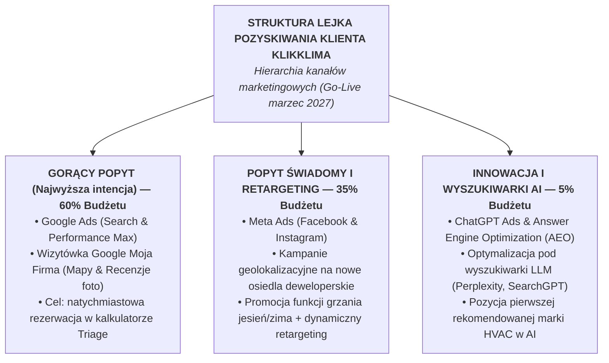
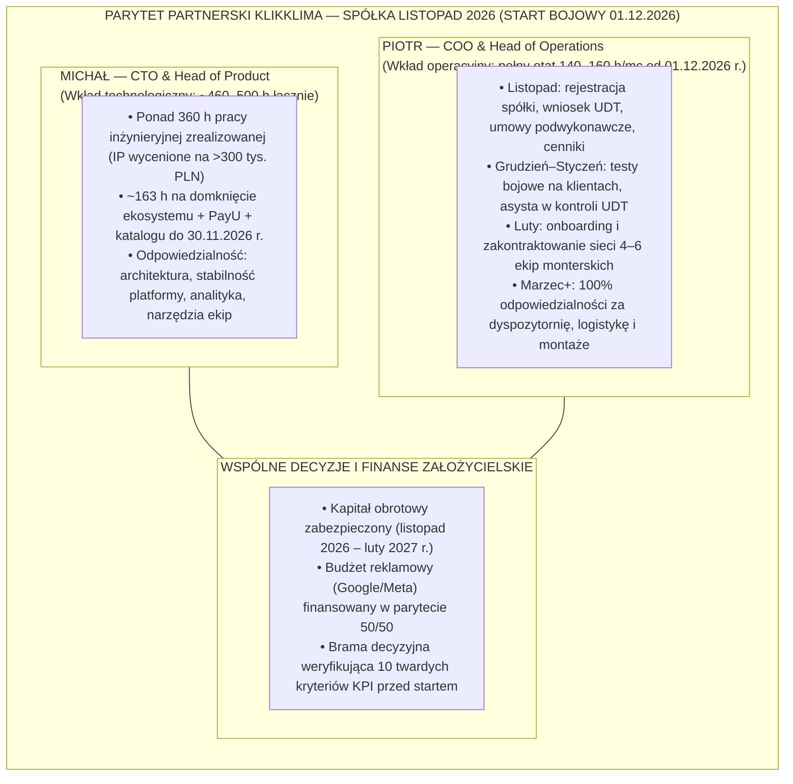

# Roadmapa GTM i Harmonogram Wdrożenia

## Strategia Wdrożenia Biznesowego KlikKlima (Listopad 2026 r. – Sierpień 2027 r.)

**Projekt:** KlikKlima  
**Autorzy:** Michał Sznurowski (CTO / Head of Product) & Piotr (COO / Head of Operations)  
**Data opracowania:** 17 września 2026 r. · **Wersja zaktualizowana:** 5 faz wdrożenia z dedykowanym miesiącem na onboarding ekip  
**Dokumenty powiązane:**

- Modele Współpracy Wspólników (`model_wspolpracy.md`)
- Polityka Dywidend i Dystrybucji Gotówki (`POLITYKA-DYWIDEND-I-DYSTRYBUCJI-GOTOWKI.md`)
- Raport Wartości IP i Technologii (`RAPORT-WARTOSCI-IP-I-TECHNOLOGII.md`)
- Zakres Odpowiedzialności i Wkład Operacyjny COO (`OCZEKIWANY-WKLAD-OPERACYJNY-COO.md`)
- System KPI i Bramki Decyzyjne (`SYSTEM-KPI-I-BRAMKI-DECYZYJNE.md`)
- Prognoza Finansowa i Budżet GTM (`PROGNOZA-FINANSOWA-I-KOSZTY-GTM.md`)
- Przewodnik Uzyskania Certyfikatu UDT (`PROCES-UZYSKANIA-CERTYFIKATU-UDT.md`)
- Koszyki Usług i Modele Rozliczeniowe (`KOSZYKI-USLUG-I-MODELE-ROZLICZENIOWE.md`)
- Główny Backlog Projektu (`docs/BACKLOG.md`)

---

## 0. Główne Założenia Harmonogramu

1. **Formalne powołanie spółki (Sp. z o.o.) w listopadzie 2026 r.:** Spółka jest bezwzględnie wymagana do podpisania umowy i uruchomienia produkcyjnego konta merchanta w bramce płatności **PayU** (weryfikacja KRS i rachunku bankowego). Operacyjny start współpracy i testów bojowych wyznaczono na **1 grudnia 2026 r.**
2. **Zakończenie prac technologicznych do 30 listopada 2026 r.:** Cały development systemu zostaje domknięty w listopadzie. Od 1 grudnia nie dopisujemy nowych funkcji — wchodzimy w fazę testów na żywym organizmie. W grudniu i styczniu realizowane są wyłącznie hotfiksy i stabilizacja.
3. **Komplet fundamentów operacyjnych do 30 listopada 2026 r.:** Do końca listopada gotowe są: wzory umów podwykonawczych, **wszystkie modele rozliczeniowe** (zaliczki 40–50%, siatka marż, taryfikator stawek montażowych) wdrożone w kodzie, oraz **odświeżony katalog produktów i cennik**.
4. **Faza Testów Bojowych (Dry Run) przez 2 miesiące (grudzień 2026 r. – styczeń/luty 2027 r.):** Realizacja zleceń na realnych klientach Piotra — **całkowicie BEZ publicznego landing page i BEZ zbierania leadów**. Klienci są wprowadzani do systemu ręcznie i przechodzą pełną ścieżkę operacyjną. Faza ta może ulec naturalnemu wydłużeniu. **Wszystkie zyski z montaży w trakcie Dry Runa zatrzymuje w 100% Piotrek (Kort Klima)** jako rekompensatę za udostępnienie zleceń. KlikKlima Sp. z o.o. rozpoczyna realizację zysków dopiero od **Marca 2027 r. (Public Go-Live)**.
5. **Brama Decyzyjna i Deklaracja Modelu Współpracy po testach (koniec stycznia / luty 2027 r.):** Szczegółowa weryfikacja 10 twardych kryteriów Gate 2 zdefiniowanych w [SYSTEM-KPI-I-BRAMKI-DECYZYJNE.md](SYSTEM-KPI-I-BRAMKI-DECYZYJNE.md). **Piotrek formalnie deklaruje wybór modelu:** Wariant A (podwykonawstwo B2B bez udziałów i bez zarządu) lub Wariant B (wspólnicy 51/49 z wejściem do zarządu jako COO). Przy Wariancie B zyski z klientów Kort Klima dzielone są 51/49, co **drastycznie redukuje ryzyko braku przychodów spółki**, gdyby startowa kampania marketingowa w marcu potrzebowała dłuższego czasu na rozbieg.
6. **Dedykowana Faza Onboardingu Ekip (luty 2027 r., 1 miesiąc):** Po pomyślnym zaliczeniu testów bojowych przeznaczamy **cały luty na profesjonalne przygotowanie sieci wykonawczej przed sezonem**. To czas na rekrutację, szkolenia stacjonarne i terenowe z aplikacji mobilnej (Field App), wdrożenie standardu 4 zdjęć i checklist oraz podpisanie umów z ekipami.
7. **Publiczne Uruchomienie Rynku i Start Zysków KlikKlima (Go-Live w marcu 2027 r.):** Start publicznego landing page, włączenie kampanii reklamowych (Google Ads, Meta Ads) oraz obsługa masowego napływu leadów przez wdrożoną w lutym sieć instalatorów. **Pierwszy miesiąc komercyjnej monetyzacji spółki.**
8. **Certyfikat UDT jako zależność krytyczna:** Złożenie wniosku następuje w listopadzie 2026 r., kontrola stacjonarna w grudniu, a wpis do rejestru UDT w styczniu 2027 r. — przed rozpoczęciem onboardingu ekip i startem komercyjnym.
9. **Polityka gotówkowa i kapitał obrotowy (runway):** Zasada samofinansowania dotyczy bezpośrednich kosztów zakupu urządzeń (COGS — w 100% z zaliczek klientów). Koszty stałe (OPEX: opłata UDT, polisy OC, hosting, rejestracja spółki, budżet reklamowy) wymagają zabezpieczenia **kapitału obrotowego na okres przedstartowy (listopad 2026 r. – luty 2027 r.)**.
10. **Niezależne tory odpowiedzialności:** Tor technologiczny Michała i tor operacyjno-rynkowy Piotra biegną równolegle według ustalonej macierzy odpowiedzialności.

> **Dlaczego ta sekwencja gwarantuje sukces rynkowy:**  
> Wchodzimy w testy z gotowym systemem, testujemy go po cichu na realnych zleceniach przez 2 miesiące (grudzień–styczeń), w lutym bez pośpiechu i bez ryzyka wpadki szkolimy instalatorów na stabilnym oprogramowaniu, a publiczny Go-Live odpalamy w **marcu** — **idealnie na progu wiosennego szczytu popytu (kwiecień–sierpień).** Wchodzimy w sezon z naoliwioną maszyną, sprawdzonym personelem i najwyższymi ocenami klientów.

---

## 1. Prognoza Czasowa Ukończenia Ekosystemu (Michał / CTO)

### Termin graniczny: 30 listopada 2026 r.

Development technologiczny musi zostać ukończony przed startem testów bojowych (01.12.2026 r.). Poniżej przedstawiono podział prac z uwzględnieniem bezpiecznego narzutu buforowego (+20%). Zakres obejmuje również produkcyjną integrację bramki **PayU** oraz **odświeżenie katalogu urządzeń i cenników**.

### Zestawienie Pakietów Prac Inżynieryjnych:

| Pakiet Prac Technologicznych                 | Zakres i Zadania z Backlogu                                                                                                           | Szacunek Bazowy | **Z Narzutem +20%** |
| :------------------------------------------- | :------------------------------------------------------------------------------------------------------------------------------------ | :-------------: | :-----------------: |
| **Pakiet 1: B2C Booking Flow**               | Atomowa rezerwacja slotów (`B2C-BOOKING-FLOW`), prezentacja cen „od" (`B2C-PRICE-FROM`), mechanizm triage oraz exit-intent modal.     |      20 h       |     **24,0 h**      |
| **Pakiet 2: Lejek + Zaliczki PayU**          | Przejścia T02–T05, akceptacja wyceny online z **bramką zaliczkową PayU**, generowanie protokołu montażowego T07–T08.                  |      26 h       |     **31,2 h**      |
| **Pakiet 3: Powiadomienia i Kalendarze**     | Bramka SMSAPI, transakcyjne szablony e-mail (`NTF-GATEWAY`), dwukierunkowa synchronizacja z Google Calendar floty.                    |      18 h       |     **21,6 h**      |
| **Pakiet 4: Aplikacja Terenowa (Field App)** | Wersja PWA dla montażystów: lista zleceń, nawigacja geolokalizacyjna, checklista montażowa, wymóg 4 zdjęć, podpis klienta na ekranie. |      28 h       |     **33,6 h**      |
| **Pakiet 5: Reklamacje, SLA i Karta 360**    | Obsługa usterek z twardym SLA 48h, globalna wyszukiwarka klientów 360°, automatyczny cron powiadomień o serwisach rocznych.           |      16 h       |     **19,2 h**      |
| **Pakiet 6: Hardening, E2E i Wdrożenie**     | Testy integracyjne Playwright E2E, logowanie Google SSO, monitoring Sentry, konfiguracja domen produkcyjnych i certyfikatów SSL.      |      12 h       |     **14,4 h**      |
| **Pakiet Dodatkowy A: Produkcyjne PayU**     | Podpięcie produkcyjnego konta merchanta spółki, obsługa webhooków płatności, automatyczne zwroty, zabezpieczenie idempotencji.        |      ~10 h      |     **~12,0 h**     |
| **Pakiet Dodatkowy B: Katalog Produktów**    | Aktualizacja bazy klimatyzatorów, import cenników hurtowych, konfiguracja kompatybilności jednostek Single i Multi-split.             |      ~6 h       |     **~7,0 h**      |
| **ŁĄCZNIE DO 30.11.2026 r.**                 | **Kompletny, przetestowany ekosystem gotowy do testów bojowych**                                                                      |    **136 h**    |     **~163 h**      |

### Realność Harmonogramu Technologicznego:

- Przy udokumentowanym tempie pracy Michała z września (~119 h w 16 dni roboczych, średnio 9,3 h/dzień) budżet **~163 godzin jest w pełni osiągalny do 30 listopada z bezpiecznym zapasem**.
- **Zależność formalna:** Pełne testy produkcyjne PayU wymagają zarejestrowanej spółki z numerem KRS i kontem bankowym (druga połowa listopada). Kod bramki powstaje na środowisku testowym (sandbox), dzięki czemu testy bojowe 1 grudnia mogą wystartować w 100% zgodnie z planem.

---

## 2. Strategia Marketingowa (Ads Strategy)

### Przygotowanie w okresie testów, uruchomienie w fazie Go-Live

Kanały pozyskiwania ruchu (Google Ads, Meta Ads, SearchGPT / AEO) wymagają precyzyjnej hierarchii budżetowej. **Wszystkie kampanie, kreacje graficzne, frazy i grupy docelowe konfigurujemy podczas testów bojowych i przygotowania ekip (grudzień–luty), a budżety odpalamy w dniu publicznego Go-Live (marzec 2027 r.).**

### 1. Google Ads (Search & Performance Max) — 60% Budżetu (Główny Filar Sprzedaży)

- **Mechanizm:** Przechwytywanie użytkowników wpisujących zapytania o natychmiastowej intencji zakupu (np. _„montaż klimatyzacji Warszawa”_, _„klimatyzator do mieszkania z montażem cennik”_).
- **Konwersja:** Ruch kierowany bezpośrednio do kalkulatora Triage z prezentacją ceny „od” oraz możliwością natychmiastowej rezerwacji terminu online.
- **Wizytówka Google Moja Firma:** Kluczowy bezpłatny kanał lokalny (30–40% zapytań z map). Zbieranie potwierdzonych recenzji ze zdjęciami po każdym montażu.

### 2. Meta Ads (Facebook & Instagram) — 35% Budżetu (Popyt Dedykowany & Retargeting)

- **Klienci deweloperscy i remontowi:** Targetowanie geolokalizacyjne na nowe osiedla mieszkaniowe. Przekaz edukacyjny: _„Zrób instalację podtynkową przed tynkami i wylewkami — uniknij kucia ścian w gotowym mieszkaniu”_.
- **Funkcja grzania jesienią i zimą:** Promocja klimatyzacji jako wysoce efektywnej pompy ciepła powietrze-powietrze (_„Ogrzewaj mieszkanie taniej niż prądem”_).
- **Dynamiczny retargeting:** Reklamy przypominające dla użytkowników, którzy porzucili konfigurator bez rezerwacji terminu.

### 3. ChatGPT Ads & AEO (Answer Engine Optimization) — 5% Budżetu (Innowacja)

- **Organiczne pozycjonowanie w modelach AI:** Wdrożenie mikrodanych Schema.org (JSON-LD), ustrukturyzowanych tabel cennikowych i baz wiedzy, dzięki którym asystenci AI (ChatGPT, Gemini, Perplexity) rekomendują KlikKlima jako zaufanego instalatora HVAC.
- **Płatne kampanie w botach AI:** Pilotażowe testy formatów reklamowych w wyszukiwarkach nowej generacji.

---

## 3. Szczegółowa Roadmapa Faza po Fazie (5 Faz Wdrożenia)

```mermaid
flowchart LR
    F1["<b>FAZA 1: FUNDAMENTY</b><br/><i>do 30.11.2026</i><br/>Spółka, UDT, 100% IT, PayU"]
    G1{{"Gate 1<br/>30.11"}}
    F2["<b>FAZA 2: DRY RUN</b><br/><i>01.12.26 – 31.01.27</i><br/>Testy bojowe na klientach Piotra"]
    G2{{"Gate 2<br/>31.01"}}
    F3["<b>FAZA 3: ONBOARDING</b><br/><i>01.02 – 28.02.2027</i><br/>Szkolenia 4–6 ekip, Field App"]
    G3{{"Gate 3<br/>28.02"}}
    F4["<b>FAZA 4: GO-LIVE</b><br/><i>01.03.2027</i><br/>Start publiczny i kampanie Ads"]
    G4{{"Gate 4<br/>31.03"}}
    F5["<b>FAZA 5: SKALOWANIE</b><br/><i>Kwiecień – Sierpień 2027+</i><br/><b>ULTIMATE GOAL: 100 montaży/mc</b>"]

    F1 --> G1 --> F2 --> G2 --> F3 --> G3 --> F4 --> G4 --> F5
```

---

### FAZA 1: PRZYGOTOWANIE I FUNDAMENTY (do 30 listopada 2026 r.)

_Cel strategiczny:_ Wejść w dzień 1 grudnia z gotowym systemem, zarejestrowaną spółką, zgłoszonym UDT, wzorami umów i podpisanymi rabatami hurtowymi.

| Obszar Działań        | Zadania Michała (CTO)                                                                                                                                                                 | Zadania Piotra (COO)                                                                                                                                                                                                                                                       |
| :-------------------- | :------------------------------------------------------------------------------------------------------------------------------------------------------------------------------------ | :------------------------------------------------------------------------------------------------------------------------------------------------------------------------------------------------------------------------------------------------------------------------- |
| **Spółka i Prawo**    | 1. Przygotowanie umowy spółki (51/49) oraz umowy wspólników. 2. Przygotowanie umowy licencyjnej IP i kodu na rzecz spółki.                                                         | 1. **Rejestracja spółki z o.o. w KRS w listopadzie** (wymóg formalny dla konta PayU). 2. Otwarcie rachunku bankowego spółki, wybór biura księgowego. 3. **Złożenie wniosku o certyfikat przedsiębiorstwa do UDT** (zgodnie z `PROCES-UZYSKANIA-CERTYFIKATU-UDT.md`). |
| **Technologia**       | 1. **Dopięcie 100% developmentu (Pakiety 1–6) do 30.11.** 2. Produkcyjna integracja bramki PayU po rejestracji spółki. 3. Odświeżenie i wdrożenie katalogu urządzeń i cenników. | 1. Testy akceptacyjne formularzy wyceny i kalkulatora mocy. 2. Przekazanie specyfikacji technicznych preferowanych marek (np. Gree, Daikin, Rotenso).                                                                                                                   |
| **Operacje i Rynek**  | —                                                                                                                                                                                     | 1. **Przygotowanie wzorów umów podwykonawczych** dla ekip montażowych. 2. Podpisanie umów handlowych z minimum 2 hurtowniami HVAC (rabaty B2B min. 35–45%). 3. Wstępna weryfikacja certyfikatów F-gaz, SEP i polis OC pierwszych ekip.                               |
| **Finanse i Cenniki** | 1. Wdrożenie algorytmicznych koszyków wycen i marż w systemie CRM.                                                                                                                    | 1. **Zatwierdzenie kompletnego modelu rozliczeniowego:** zaliczki 40–50%, siatka marżowa, taryfikator wynagrodzeń ekip. 2. Ostateczne zatwierdzenie cennika detalicznego na start.                                                                                      |
| **FINANSE**           | —                                                                                                                                                                                     | **Zabezpieczenie kapitału obrotowego na okres przedstartowy (pokrycie OPEX, opłaty UDT i narzędzi).**                                                                                                                                                                      |

---

### FAZA 2: TESTY BOJOWE / DRY RUN (1 grudnia 2026 r. – 31 stycznia 2027 r., 2 miesiące)

_Cel strategiczny:_ Przetestować pełną maszynę operacyjną **na realnych klientach Piotra, po cichu — bez publicznego landing page i bez zewnętrznego marketingu**.

> [!IMPORTANT]
> **Zasada Testów Bojowych:** W tej fazie nie prowadzimy publicznej reklamy ani otwartego zbierania leadów. Do systemu wprowadzani są **wyłącznie realni klienci z bieżącej działalności Piotra**, którzy przechodzą 100% cyfrowej ścieżki:  
> `Wprowadzenie leada` ➔ `Audyt z aplikacją` ➔ `Wycena z koszyka` ➔ `Zaliczka online` ➔ `Zamówienie w hurtowni JIT` ➔ `Montaż` ➔ `Checklista + 4 zdjęcia` ➔ `Protokół cyfrowy`.

| Obszar Działań        | Zadania Michała (CTO)                                                                                                                                            | Zadania Piotra (COO)                                                                                                                                                                                                                |
| :-------------------- | :--------------------------------------------------------------------------------------------------------------------------------------------------------------- | :---------------------------------------------------------------------------------------------------------------------------------------------------------------------------------------------------------------------------------- |
| **Testy Operacyjne**  | 1. Bieżący monitoring spójności danych (geolokalizacja, zdjęcia, statusy w bazie). 2. **Natychmiastowe usuwanie błędów (hotfiksy) i stabilizacja platformy.** | 1. **Realizacja montaży u realnych klientów** z wykorzystaniem pełnej ścieżki systemu. 2. Praktyczna weryfikacja dostaw urządzeń w modelu Just-in-Time (JIT).                                                                    |
| **Obsługa Klienta**   | 1. Wdrożenie i konfiguracja modułu zgłoszeń i linii wsparcia.                                                                                                    | 1. **Prowadzenie dyspozytorni i bieżący kontakt z klientami** (pomiar czasów reakcji).                                                                                                                                              |
| **Przygotowanie GTM** | 1. Konfiguracja narzędzi analitycznych: GA4, Meta Pixel, Google Tag Manager. 2. Techniczne wdrożenie znaczników AEO / Schema.org pod wyszukiwarki AI.         | 1. **Szczegółowe przygotowanie kampanii reklamowych:** dobór słów kluczowych, przygotowanie grafik, tekstów i budżetów.                                                                                                             |
| **Formalności UDT**   | —                                                                                                                                                                | 1. **Osobisty udział w kontroli inspektora UDT w grudniu.** 2. Uzyskanie protokołu pozytywnego i monitorowanie wpisu do rejestru UDT.                                                                                            |
| **FINANSE**           | —                                                                                                                                                                | **100% zysków z montaży w trakcie Dry Runa zatrzymuje Piotrek (Kort Klima); KlikKlima Sp. z o.o. nie generuje marży komercyjnej i pokrywa minimalny OPEX z kapitału założycielskiego; monetyzacja spółki startuje w marcu 2027 r.** |

---

### 🚦 BRAMA DECYZYJNA — WERYFIKACJA WYNIKÓW DRY RUN (koniec stycznia 2027 r.)

Przejście do etapu przygotowania sieci i publicznego startu następuje **wyłącznie po spełnieniu 10 twardych kryteriów akceptacyjnych Gate 2** (zgodnie ze źródłem prawdy w [`SYSTEM-KPI-I-BRAMKI-DECYZYJNE.md`](SYSTEM-KPI-I-BRAMKI-DECYZYJNE.md)):

|   #    | Wskaźnik Sukcesu (KPI / ID)                | Wymagany Próg Zaliczenia                                      | Weryfikacja (SSOT)               |
| :----: | :----------------------------------------- | :------------------------------------------------------------ | :------------------------------- |
| **1**  | Montaże testowe pełną ścieżką cyfrową      | **Minimum 3–5 zakończonych instalacji** na klientach Piotra   | Baza danych (`bookings`)         |
| **2**  | Otwarte błędy krytyczne (**TECH-02**)      | **Bezwzględne 0 błędów P1/Blocker** (system w 100% stabilny)  | Sentry / GitHub Issues           |
| **3**  | Model zaliczkowy w praktyce (**OPS-01**)   | **100% zakupu urządzeń sfinansowane z zaliczek klientów**     | Księgowość / Rachunek spółki     |
| **4**  | Realna marża brutto pilotażu (**OPS-02**)  | **Osiągnięty poziom marży brutto $\ge 25–35\%$**              | Moduł rozliczeń B2B CRM          |
| **5**  | Terminowość logistyki JIT (**OPS-04**)     | **Minimum 95% dostaw na czas** przed slotem montażowym        | Karty dostaw WZ                  |
| **6**  | Standard 4 zdjęć i protokołów (**OPS-06**) | **100% zleceń posiada kompletne protokoły i 4 zdjęcia**       | Repozytorium zdjęć S3 / CRM      |
| **7**  | Dyspozytornia i czas kontaktu (**OPS-03**) | **Średni czas kontaktu z klientem < 45 minut**                | Logi połączeń / AuditLog         |
| **8**  | Certyfikat Przedsiębiorstwa UDT (Gate-1.3) | **Kontrola stacjonarna UDT zakończona protokołem pozytywnym** | Protokół inspektora UDT          |
| **9**  | Baza produktów i koszyków (Gate-1.5)       | **Zablokowane i wdrożone bez rozbieżności w systemie**        | Słownik `visit_duration_baskets` |
| **10** | Gotowość materiałów reklamowych            | **Kampanie Google Ads i Meta Ads w 100% skonfigurowane**      | Ads Manager (wstrzymane)         |

---

### FAZA 3: PRZYGOTOWANIE DO STARTU I ONBOARDING EKIP (luty 2027 r., 1 miesiąc)

_Cel strategiczny:_ Wykorzystać w 100% ustabilizowany system do **zbudowania, przeszkolenia i zakontraktowania profesjonalnej sieci certyfikowanych instalatorów** przed otwarciem publicznego rynku.

> [!NOTE]
> **Dlaczego ta faza jest kluczowa:**  
> Sukces w branży HVAC zależy od jakości montażu. W lutym — mając w ręku działającą aplikację mobilną i certyfikat UDT — Piotr przeprowadza kompleksowy onboarding wykonawców. Nie wpuszczamy niesprawdzonych ekip na zlecenia z płatnych reklam. Każdy monter musi opanować aplikację terenową i standardy estetyczne KlikKlima.

| Obszar Działań                     | Zadania Michała (CTO)                                                                                                                                                                                                                                  | Zadania Piotra (COO)                                                                                                                                                                                                                                                                                                                                                  |
| :--------------------------------- | :----------------------------------------------------------------------------------------------------------------------------------------------------------------------------------------------------------------------------------------------------- | :-------------------------------------------------------------------------------------------------------------------------------------------------------------------------------------------------------------------------------------------------------------------------------------------------------------------------------------------------------------------- |
| **Narzędzia Terenowe (Field App)** | 1. Asysta techniczna i bezpośrednie wsparcie aplikacji mobilnej podczas szkoleń ekip. 2. Szlifowanie ergonomii interfejsu (UX) na podstawie uwag instalatorów. 3. Przygotowanie interaktywnych wideoporadników i instrukcji PDF dla montażystów. | 1. **Rekrutacja i selekcja min. 4–6 profesjonalnych ekip monterskich** w rejonach startowych. 2. Weryfikacja jakości narzędzi, busów i referencji wykonawców.                                                                                                                                                                                                      |
| **Szkolenia i Standardy Montażu**  | —                                                                                                                                                                                                                                                      | 1. **Przeprowadzenie warsztatów szkoleniowych dla instalatorów:**  • Obsługa aplikacji Field App (odbiór zlecenia, nawigacja, podpis klienta),  • Rygorystyczny standard 4 zdjęć z montażu (estetyka korytek, próba ciśnieniowa, jednostka zewnętrzna, porządek po montażu),  • Standardy kultury obsługi klienta KlikKlima (ochraniacze na buty, czystość). |
| **Umowy i Certyfikacja Floty**     | —                                                                                                                                                                                                                                                      | 1. **Podpisanie kompletnych umów podwykonawczych** z ekipami (kary umowne za spóźnienia, standardy SLA). 2. Weryfikacja i rejestracja w systemie certyfikatów F-gaz, SEP i polis OC wykonawców. 3. Konfiguracja promieni dojazdu ekip (`promien_dzialania_km`) w CRM.                                                                                           |
| **Logistyka i Magazyn**            | —                                                                                                                                                                                                                                                      | 1. Potwierdzenie z hurtowniami dedykowanych slotów odbioru urządzeń na marzec. 2. Zabezpieczenie stanów magazynowych najpopularniejszych modeli (Single/Multi-split).                                                                                                                                                                                              |
| **Ostatnie Szlify Przed Startem**  | 1. Końcowe testy obciążeniowe serwera i bazy danych przed masowym ruchem. 2. Sprawdzenie poprawności zdarzeń konwersji w Google Analytics 4 i Meta Pixel.                                                                                           | 1. Ostateczna akceptacja kreacji reklamowych i harmonogramu budżetowego na marzec.                                                                                                                                                                                                                                                                                    |
| **FINANSE**                        | —                                                                                                                                                                                                                                                      | **Przygotowanie funduszu marketingowego na start kampanii (model 50/50); zero dywidendy.**                                                                                                                                                                                                                                                                            |

---

### FAZA 4: PUBLICZNE URUCHOMIENIE RYNKU (GO-LIVE) (marzec 2027 r.)

_Cel strategiczny:_ Wejść publicznie na rynek z pełną mocą marketingową, przetestowaną platformą i wdrożoną siecią instalatorów tuż przed nadejściem szczytu sezonu.

| Obszar Działań          | Zadania Michała (CTO)                                                                                                                                                                                                                | Zadania Piotra (COO)                                                                                                                                                                 |
| :---------------------- | :----------------------------------------------------------------------------------------------------------------------------------------------------------------------------------------------------------------------------------- | :----------------------------------------------------------------------------------------------------------------------------------------------------------------------------------- |
| **Start Techniczny**    | 1. **Publiczne uruchomienie landing page i kalkulatora online.** 2. Ciągły monitoring wydajności (Core Web Vitals) i analiza zachowań (Hotjar/Clarity). 3. Zabezpieczenie bezawaryjności procesów rezerwacji i płatności PayU. | 1. **Dyspozytornia w pełnym reżimie operacyjnym:** kontakt telefoniczny z leadem w czasie <30 minut. 2. Codzienny nadzór nad płynnością przydziału zleceń do przeszkolonych ekip. |
| **Płatne Kampanie Ads** | 1. **Uruchomienie kampanii Google Ads i Meta Ads** na pełnych budżetach. 2. Codzienna analiza wskaźników efektywności: CAC (koszt pozyskania), CVR (konwersja).                                                                   | 1. Bieżąca ocena jakości napływających leadów i feedback dla optymalizacji marketingu. 2. Finansowanie budżetu reklamowego we wspólnym parytecie 50/50.                           |
| **Realizacja i Jakość** | —                                                                                                                                                                                                                                    | 1. Nadzór nad pierwszymi publicznymi montażami realizowanymi przez wdrożone ekipy. 2. Kontrola jakości 100% protokołów i fotodokumentacji spływającej do CRM.                     |
| **Budowa Reputacji**    | —                                                                                                                                                                                                                                    | 1. **Agresywne pozyskiwanie opinii w Google Moja Firma** po każdym udanym montażu (cel: minimum 15–20 nieskazitelnych opinii 5.0 w pierwszym miesiącu).                              |
| **FINANSE**             | —                                                                                                                                                                                                                                    | **100% wygenerowanej marży przeznaczane na reinwestycję i budowę poduszki płynnościowej.**                                                                                           |

---

### FAZA 5: SKALOWANIE SEZONOWE (kwiecień – sierpień 2027 r., szczyt popytu) + PUNKT DECYZYJNY

_Cel strategiczny:_ Maksymalizacja zysków i udziału w rynku w okresie najwyższego zapotrzebowania na klimatyzację, z wykorzystaniem sprawdzonych kampanii i zaufanej sieci montażystów.

| Obszar Działań           | Zadania Michała (CTO)                                                                                                                                                                              | Zadania Piotra (COO)                                                                                                                                            |
| :----------------------- | :------------------------------------------------------------------------------------------------------------------------------------------------------------------------------------------------- | :-------------------------------------------------------------------------------------------------------------------------------------------------------------- |
| **Rozwój Technologii**   | 1. Uruchomienie automatycznego modułu przypomnień o serwisach rocznych. 2. Ciągłe testy A/B stron docelowych podnoszące konwersję. 3. Integracje API z systemami magazynowymi hurtowni HVAC. | 1. Zgłaszanie zapotrzebowania na nowe funkcje automatyzujące pracę dyspozytorni. 2. Wdrożenie procedur obsługi zgłoszeń gwarancyjnych w standardzie SLA 48h. |
| **Zarządzanie Flotą**    | —                                                                                                                                                                                                  | 1. Rozbudowa bazy wykonawców do **6–10 stałych, certyfikowanych ekip**. 2. Renegocjacja progów rabatowych w hurtowniach przy rosnącym wolumenie zakupowym.   |
| **Skalowanie Sprzedaży** | 1. Zwiększanie budżetów na najlepiej konwertujące słowa kluczowe i grupy odbiorców. 2. Skalowanie ruchu z wyszukiwarek AI (AEO / SearchGPT).                                                    | 1. Utrzymanie płynności dostaw i montaży na poziomie **25–40 instalacji miesięcznie**. 2. Rygorystyczne egzekwowanie wskaźnika 100% terminowości wizyt.      |
| **PUNKT DECYZYJNY**      | —                                                                                                                                                                                                  | **GŁÓWNY GO/NO-GO NA DALSZĄ EKSPANSJĘ REGIONALNĄ. Po osiągnięciu progu aktywacji finansowej następuje uruchomienie wypłat dywidendy wspólników.**               |

#### 🎯 Ścieżka Dojścia do Celu Strategicznego (Ultimate Goal: 100 Montaży / Miesiąc)

Zarząd ustala **100 montaży miesięcznie** jako nadrzędny, docelowy cel skali operacyjnej platformy KlikKlima. Dojście do tej skali opiera się na 4 filarach wykonawczych:

1. **Flota Wykonawcza (Sieć Monterów):**
   - Do obsługi 100 zleceń/mc (średnio 4–5 montaży dziennie) wymagana jest aktywna sieć **10–14 sprawdzonych, certyfikowanych ekip podwykonawczych** (średnio 7–10 montaży na ekipę miesięcznie).
   - Standaryzacja pracy w Field App i automatyczna rezerwacja slotów eliminują wąskie gardła dyspozytorskie.
2. **Skalowanie Budżetu Marketingowego (GTM):**
   - Przy benchmarkowym koszcie pozyskania klienta $\text{CAC} \approx 350–450\ \text{PLN}$, obsługa 100 montaży wymaga comiesięcznego budżetu marketingowego na poziomie **35 000 – 45 000 PLN** (60% Google Ads, 35% Meta Ads, 5% AEO/AI).
   - Finansowanie marketingu w całości z bieżących zysków generowanych przez zlecenia (samofinansujący się lejek).
3. **Ekonomia Skali i Siła Zakupowa:**
   - Przy wolumenie 100 jednostek/mc KlikKlima staje się kluczowym partnerem hurtowni HVAC, uzyskując maksymalne progi rabatowe (do 45–50% od cen katalogowych).
   - Generowane przychody rzędu **~600 000 – 650 000 PLN brutto miesięcznie** przynoszą marżę brutto na poziomie **~180 000 – 205 000 PLN miesięcznie**.
4. **Kumulacyjny Strumień Serwisów Rocznych (MRR):**
   - Każde 100 montaży powiększa bazę klientów do corocznego serwisu. W połączeniu z bazą wniesioną przez Piotra, po 12 miesiącach spółka generuje powtarzalny przychód z przeglądów na poziomie kilkudziesięciu tysięcy złotych miesięcznie przy marży jednostkowej $\ge 50\%$.

---

## 4. Warstwa Finansowa: Kapitał Obrotowy i Polityka Gotówki

W strukturze spółki ściśle rozdzielamy **wynagrodzenie za bieżącą pracę operacyjną** (pensja / kontrakt menedżerski COO i CTO — stanowiący koszt uzyskania przychodu spółki) od **dywidendy ze zysku** (nagroda za wniesiony kapitał, wypłacana proporcjonalnie do posiadanych udziałów 51/49).

### Kapitał Obrotowy (Runway Przedstartowy)

Zaliczki od klientów finansują **w 100% zakup urządzeń i materiałów instalacyjnych (COGS)**, ale nie pokrywają kosztów stałych przed uruchomieniem sprzedaży.  
W okresie przedstartowym (**listopad 2026 r. – luty 2027 r.**) spółka musi sfinansować:

- Opłatę rejestracyjną i urzędową UDT (3 885,01 zł),
- Koszty rejestracji spółki z o.o., opłaty notarialne i sądowe,
- Polisy ubezpieczeniowe OC działalności instalatorskiej,
- Koszty infrastruktury serwerowej, domen i narzędzi programistycznych,
- Fundusz na start pierwszych kampanii marketingowych.

> **Wymóg finansowy:** Założyciele zabezpieczają uzgodniony kapitał obrotowy w listopadzie 2026 r. w celu zapewnienia płynności do momentu wejścia w fazę komercyjną.

### Polityka Dystrybucji Gotówki w Fazach Projektu:

> **Szczegółowy dokument wykonawczy:** Zasady akumulacji kapitału, poduszki finansowej i wypłat w proporcji 51/49 opisuje:  
> 👉 **[Polityka Dywidend i Dystrybucji Gotówki KlikKlima Sp. z o.o.](POLITYKA-DYWIDEND-I-DYSTRYBUCJI-GOTOWKI.md)**

| Faza Projektu                               | Ramy Czasowe                            | Zasady Zarządzania Gotówką i Zyskiem                                                                                                                                                                                          |
| :------------------------------------------ | :-------------------------------------- | :---------------------------------------------------------------------------------------------------------------------------------------------------------------------------------------------------------------------------- |
| **Faza 1: Przygotowanie i Fundamenty**      | Listopad 2026 r.                        | **0% dywidendy.** Finansowanie formalności, UDT i narzędzi z kapitału obrotowego założycieli.                                                                                                                                 |
| **Faza 2: Testy Bojowe (Dry Run)**          | Grudzień 2026 r. – Styczeń/Luty 2027 r. | **0% dywidendy.** **100% zysków z montaży testowych zatrzymuje Piotrek (Kort Klima).** KlikKlima nie generuje marży — testuje procesy i ponosi jedynie minimalny OPEX z kapitału założycielskiego. Faza może ulec wydłużeniu. |
| **Faza 3: Przygotowanie i Onboarding Ekip** | Luty 2027 r.                            | **0% dywidendy.** Przygotowanie funduszu reklamowego na start publiczny (parytet 50/50). Deklaracja modelu współpracy przez Piotra (Wariant A vs B).                                                                          |
| **Faza 4: Publiczny Start (Go-Live)**       | Marzec 2027 r.                          | **Rozpoczęcie realizacji zysków przez KlikKlima Sp. z o.o.** 0% dywidendy · 100% reinwestycji w budowę bezpiecznej poduszki płynnościowej (rezerwa na 2–3 miesiące kosztów stałych).                                          |
| **PRÓG AKTYWACJI DYWIDENDY**                | Kwiecień 2027 r. (start sezonu)         | Wypłaty zysku startują po spełnieniu dwóch warunków łącznie: 1. Zabezpieczona nienaruszalna poduszka finansowa na koncie, 2. Stabilny wolumen sprzedaży na poziomie min. 20–25 montaży miesięcznie.                     |
| **Faza 5: Skalowanie Sezonowe**             | Kwiecień – Sierpień 2027 r.             | **60–70% reinwestycji w kapitał obrotowy / 30–40% wypłaty dywidendy** w transzach kwartalnych (51% Michał / 49% Piotr).                                                                                                       |

---

## 5. Matryca Ryzyk i Mitygacji

| Zidentyfikowane Ryzyko                                                   | Potencjalny Wpływ                                                                         | Plan Mitygacji i Działania Zapobiegawcze                                                                                                                                                                                                                                     |
| :----------------------------------------------------------------------- | :---------------------------------------------------------------------------------------- | :--------------------------------------------------------------------------------------------------------------------------------------------------------------------------------------------------------------------------------------------------------------------------- |
| **Napięty harmonogram developmentu do 30.11**                            | Opóźnienie startu testów bojowych                                                         | Priorytet absolutny dla prac programistycznych; tempo z września daje bezpieczny margines; wdrożenie planu awaryjnego (zakres MVP do Dry Run).                                                                                                                               |
| **Wymóg spółki do rejestracji PayU**                                     | Późne testy produkcyjne bramki                                                            | Kod płatności powstaje wcześniej na środowisku sandbox; w razie opóźnienia weryfikacji bankowej testy bojowe ruszają z przelewem tradycyjnym, a PayU wdrażamy w trakcie grudnia.                                                                                             |
| **Czas trwania procedury UDT (3–6 tygodni)**                             | Blokada zakupu czynnika w hurtowniach                                                     | Złożenie wniosku w pierwszej połowie listopada; cotygodniowe monitorowanie w urzędzie; pełny bufor czasowy na kontrolę w grudniu i wpis w styczniu.                                                                                                                          |
| **Brak kapitału obrotowego na start**                                    | Paraliż formalności i marketingu                                                          | Precyzyjne zdefiniowanie i wniesienie wkładów założycielskich na pokrycie OPEX w listopadzie.                                                                                                                                                                                |
| **Zaangażowanie Piotra w pełnym wymiarze**                               | Zagrożenie realizacji testów i szkoleń                                                    | Formalna umowa wspólników; rozliczenie kamieni milowych 30/60/90; przejrzyste kryteria bramy decyzyjnej.                                                                                                                                                                     |
| **Ryzyko deadlocka decyzyjnego i blokada sprzedaży firmy (model 50/50)** | Paraliż decyzyjny spółki, odrzucenie przez fundusze inwestycyjne i zablokowanie exitu M&A | **Wdrożenie Rekomendowanej Opcji B (51/49 – „złoty 1%”):** Michał posiada bezpiecznik decyzyjny chroniący przed paraliżem, udziela spółce licencji wieczystej na IP, a w umowie wspólników gwarantuje Piotrowi proporcjonalny udział w zyskach z przyszłej akwizycji spółki. |
| **Onboarding ekip monterskich w lutym**                                  | Ryzyko błędów montażowych w sezonie                                                       | Dedykowany, 1-miesięczny bufor w lutym; praktyczne warsztaty ze standardu 4 zdjęć; dopuszczenie do zleceń tylko ekip ze zweryfikowanym F-gaz i polisą OC.                                                                                                                    |
| **Sezonowość branży klimatyzacji**                                       | Spadek popytu poza sezonem letnim                                                         | Harmonogram idealnie celuje w start publiczny w marcu, dzięki czemu spółka wchodzi w szczyt popytu (kwiecień–sierpień) z przeszkoloną siecią i dojrzałą technologią.                                                                                                         |

---

## 6. Podsumowanie Zobowiązań Wzajemnych

---

_Dokument stanowi wewnętrzny materiał strategiczny do ustaleń partnerskich założycieli spółki KlikKlima Sp. z o.o._
