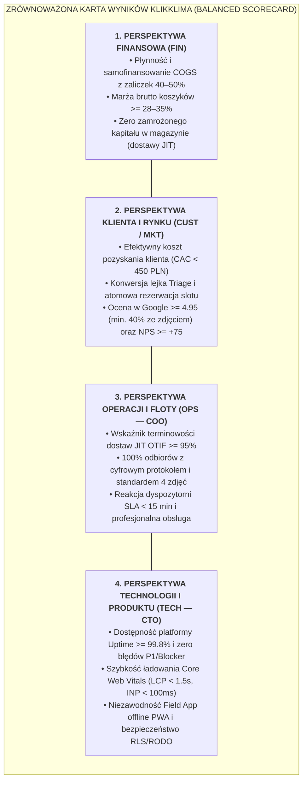

# System KPI i Bramki Decyzyjne
## Strategiczny Model Zarządzania Wynikami (Deloitte Advisory Framework)

> **Status:** Jedyne Źródło Prawdy (Single Source of Truth – SSOT) dla metryk biznesowych, operacyjnych i technologicznych  
> **Projekt:** System Cyfrowy KlikKlima Sp. z o.o.  
> **Właściciele:** Michał Sznurowski (CTO / Head of Product) & Piotr (COO / Head of Operations)  
> **Data wejścia w życie:** 17 września 2026 r.  
> **Wersja:** 2.0 (Pełna harmonizacja z 5-fazową roadmapą GTM, onboardingiem ekip i modelem koszyków rozliczeniowych)

---

## 1. Wprowadzenie i Ramy Metodologiczne (Balanced Scorecard)

Aby przekształcić KlikKlima w skalowalną organizację technologiczną (Asset-Light Platform), odchodzimy od intuicyjnego zarządzania na rzecz **reżimu decyzyjnego opartego na twardych danych (Data-Driven Enterprise)**.

Model KPI KlikKlima opiera się na adaptacji klasycznej **Zrównoważonej Karty Wyników (Balanced Scorecard)** do realiów dwustronnego marketplace'u usług instalacyjnych:

### Hierarchia Wskaźników:
1. **North Star Metric (NSM):** Jedna nadrzędna metryka integrująca tempo wzrostu, jakość i rentowność spółki.
2. **Tier 1 — Wskaźniki Zarządcze (Executive KPIs):** Podstawa decyzji o wypłacie dywidendy, skalowaniu budżetów reklamowych i alokacji kapitału obrotowego.
3. **Tier 2 — Wskaźniki Domenowe (CTO vs COO):** Ścisła, rozłączna odpowiedzialność wspólników za ich piony kompetencyjne.
4. **Bramki Decyzyjne (Stage-Gates):** Formalne punkty kontrolne Go/No-Go decydujące o przejściu do kolejnych faz inwestycyjnych.

---

## 2. North Star Metric (Główny Wskaźnik Sukcesu Spółki)

### **NFMI — Net Flawless Monthly Installs (Miesięczna Liczba Doskonałych Instalacji)**

$$\text{NFMI} = \text{Liczba montaży zrealizowanych w miesiącu spełniających 4 warunki łącznie:}$$
1. Montaż zakończony cyfrowym protokołem i **kompletem 4 poprawnych zdjęć** w Field App,
2. **Brak zgłoszenia reklamacyjnego / usterki** w ciągu pierwszych 30 dni od rozruchu,
3. Zrealizowana marża brutto na zleceniu $\ge 28\%$,
4. Sprzęt w 100% sfinansowany z zaliczki klienta (brak opóźnienia płatności wobec hurtowni).

* **Cel w fazie pilotażu (Dry Run – grudzień 2026 r. – styczeń 2027 r.):** $\ge 3$ instalacje testowe.
* **Cel w fazie startu publicznego (marzec 2027 r.):** $\ge 12–15$ instalacji/miesiąc.
* **Cel w szczycie pierwszego sezonu (kwiecień – sierpień 2027 r.):** $\ge 30–50$ instalacji/miesiąc.
* **ULTIMATE GOAL SPÓŁKI (Docelowa Skala Dojrzałości Biznesowej):**
  $$\mathbf{NFMI_{\text{target}} = 100\ \text{montaży w miesiącu}}$$
  * **100 bezbłędnych instalacji miesięcznie** przy utrzymaniu zablokowanej marży brutto $\ge 28–35\%$,
  * Obsługa przez zoptymalizowaną regionalną sieć **10–14 aktywnych, certyfikowanych ekip monterskich**,
  * Finansowanie COGS w 100% z zaliczek klientów (ujemny cykl konwersji gotówki, brak zamrożonego kapitału),
  * Równoległa obsługa bazy ponad **500+ cyklicznych serwisów rocznych (MRR)** z bazy własnej i pozyskanej.

---

## 3. Macierz KPI Pionu Technologicznego i Produktu (Domena CTO – Michał Sznurowski)

Pion technologiczny odpowiada za bezawaryjność infrastruktury, atomową rezerwację slotów, ergonomię narzędzi terenowych oraz maksymalizację konwersji użytkowników w cyfrowym lejku B2C/B2B.

| ID | Nazwa Wskaźnika | Wzór / Definicja | Próg Min. (Floor) | **Wartość Celowa (Target)** | Źródło Danych (SSOT) | Częstotliwość |
| :--- | :--- | :--- | :---: | :---: | :--- | :---: |
| **TECH-01** | **Dostępność Platformy (Uptime SLA)** | $\frac{\text{Czas bezawaryjnej pracy}}{\text{Całkowity czas okresu}} \times 100\%$ | $\ge 99.5\%$ | **$\ge 99.85\%$** | Sentry / Vercel Monitoring | Miesięcznie |
| **TECH-02** | **Zero Błędów Krytycznych (P1 Bug Rate)** | Liczba otwartych błędów uniemożliwiających rezerwację, płatność PayU lub zamknięcie protokołu. | **0 błędów** | **0 błędów** | Sentry / GitHub Issues | Ciągła (Real-time) |
| **TECH-03** | **Konwersja Formularza Triage (CVR-1)** | $\frac{\text{Ukończone formularze doboru}}{\text{Unikalne wejścia na kalkulator}} \times 100\%$ | $\ge 8.0\%$ | **$\ge 12.0–15.0\%$** | Google Analytics 4 | Tygodniowo |
| **TECH-04** | **Konwersja do Rezerwacji i Zaliczki (CVR-2)** | $\frac{\text{Rezerwacje ze skuteczną zaliczką PayU}}{\text{Przejścia do podsumowania wyceny}} \times 100\%$ | $\ge 20.0\%$ | **$\ge 28.0–35.0\%$** | Baza DB / Webhooki PayU | Tygodniowo |
| **TECH-05** | **Wydajność Core Web Vitals (LCP)** | Largest Contentful Paint dla stron docelowych (wersja mobilna). | $< 2.5$ s | **$< 1.8$ s** | Google Search Console / PageSpeed | Miesięcznie |
| **TECH-06** | **Niezawodność Notyfikacji (Delivery Rate)** | $\frac{\text{Skutecznie doręczone SMS + Email}}{\text{Wszystkie zdarzenia transakcyjne}} \times 100\%$ | $\ge 98.5\%$ | **$\ge 99.7\%$** | SMSAPI / Resend Logs | Tygodniowo |
| **TECH-07** | **Czas Wypełnienia Protokołu (Field App UX)** | Średni czas od otwarcia zlecenia do zebrania podpisu klienta i wysłania 4 zdjęć. | $< 6$ min | **$< 3.5$ min** | Telemetria Field App | Miesięcznie |

---

## 4. Macierz KPI Pionu Operacyjnego, Łańcucha Dostaw i Floty (Domena COO – Piotr)

Pion operacyjny odpowiada za fizyczną realizację usług, budowę i dyscyplinę certyfikowanej sieci podwykonawców, negocjacje zakupowe w hurtowniach, jakość montaży oraz pełnoetatowe prowadzenie dyspozytorni.

| ID | Nazwa Wskaźnika | Wzór / Definicja | Próg Min. (Floor) | **Wartość Celowa (Target)** | Źródło Danych (SSOT) | Częstotliwość |
| :--- | :--- | :--- | :---: | :---: | :--- | :---: |
| **OPS-01** | **Ujemny Cykl Gotówki (Cash Conversion)** | $\frac{\text{Zakupy urządzeń sfinansowane z zaliczek}}{\text{Wszystkie zakupy sprzętu w hurtowniach}} \times 100\%$ | $100\%$ | **$100\%$** | FK / Konto bankowe spółki | Przy każdym zleceniu |
| **OPS-02** | **Średnia Marża Brutto na Zleceniu** | $\frac{\text{Cena B2C} - \text{COGS sprzętu} - \text{Stawka Ekipy}}{\text{Cena B2C}} \times 100\%$ | $\ge 25.0\%$ | **$\ge 28.0–35.0\%$** | Moduł Rozliczeń B2B CRM | Miesięcznie |
| **OPS-03** | **SLA Pierwszego Kontaktu z Leadem** | Czas od pojawienia się nieprzypisanego leada do wykonania połączenia przez dyspozytora. | $< 60$ min | **$< 30$ min** (godz. 8–18) | CRM AuditLog / Telefonia | Codziennie |
| **OPS-04** | **Terminowość Dostaw Hurtowych (JIT OTIF)** | On-Time In-Full: dostawa sprzętu przed rozpoczęciem zarezerwowanego slotu montażowego. | $\ge 95.0\%$ | **$\ge 98.5\%$** | Potwierdzenia odbioru WZ | Tygodniowo |
| **OPS-05** | **Wskaźnik Jakości (Defect / Claim Rate)** | $\frac{\text{Liczba zgłoszonych usterek i poprawek}}{\text{Całkowita liczba zakończonych montaży}} \times 100\%$ | $< 2.5\%$ | **$< 1.0–1.5\%$** | Baza zgłoszeń `incidents` | Miesięcznie |
| **OPS-06** | **Dyscyplina Protokołów i 4 Zdjęć** | $\frac{\text{Zlecenia z kompletem 4 zatwierdzonych zdjęć}}{\text{Wszystkie zrealizowane zlecenia}} \times 100\%$ | $100\%$ | **$100\%$** (zero wypłat bez kompletu) | CRM Field Protocols | Przy każdym odbiorze |
| **OPS-07** | **Pojemność Certyfikowanej Sieci Ekip** | Liczba aktywnych ekip monterskich ze zweryfikowanym F-gaz, SEP i polisą OC $\ge 200$ tys. zł. | 4 ekipy (start) | **6–10 ekip** (w szczycie) | Rejestr wykonawców CRM | Miesięcznie |
| **OPS-08** | **Poziom Rabatu Hurtowego B2B** | Średni wynegocjowany opust od cen katalogowych na głównych markach (Gree, Daikin, Rotenso). | $\ge 35.0\%$ | **$\ge 40.0–45.0\%$** | Umowy ramowe z hurtowniami | Kwartalnie |
| **OPS-09** | **Wskaźnik Czasu Rozwiązania Reklamacji** | Czas od zgłoszenia usterki do fizycznej wizyty serwisowej i usunięcia problemu. | $< 48$ h | **$< 24–36$ h** | Moduł serwisowy SLA | Przy każdym zdarzeniu |

---

## 5. Macierz KPI Rynku, Marketingu i Zadowolenia Klienta (Wspólna)

Wskaźniki monitorowane wspólnie, stanowiące podstawę do optymalizacji budżetów marketingowych (finansowanych w parytecie 50/50).

| ID | Nazwa Wskaźnika | Wzór / Definicja | Próg Min. (Floor) | **Wartość Celowa (Target)** | Źródło Danych (SSOT) | Częstotliwość |
| :--- | :--- | :--- | :---: | :---: | :--- | :---: |
| **MKT-01** | **Efektywny Koszt Pozyskania Klienta (CAC)** | $\frac{\text{Wydatki na Google Ads + Meta Ads w miesiącu}}{\text{Liczba opłaconych montaży z tych kampanii}}$ | $< 550$ PLN | **$< 350–450$ PLN** | Ads Manager + CRM | Tygodniowo |
| **MKT-02** | **Reputacja i Ocena w Google Moja Firma** | Średnia ważona ocen wizytówki Google oraz odsetek recenzji ze zdjęciami wykonanej instalacji. | $\ge 4.8 / 5.0$ | **$\ge 4.95 / 5.0$** (min. 40% ze zdjęciem) | Profil Biznesowy Google | Ciągła |
| **MKT-03** | **Współczynnik NPS (Net Promoter Score)** | Badanie satysfakcji wysyłane SMS-em po 7 dniach od zakończenia montażu (skala 0–10). | $\ge +60$ | **$\ge +75–85$** | System ankiet posprzedażowych | Miesięcznie |
| **MKT-04** | **Konwersja Serwisów Rocznych (MRR Retention)**| $\frac{\text{Klienci rezerwujący płatny przegląd po 12 mies.}}{\text{Wszyscy klienci z montażem sprzed roku}} \times 100\%$ | $\ge 35.0\%$ | **$\ge 50.0–60.0\%$** | Moduł cykliczny `cron` | Kwartalnie |

---

## 6. Architektura Bramek Decyzyjnych (Stage-Gate Framework: Go / No-Go)

Przejście między etapami rozwoju biznesu nie odbywa się automatycznie na podstawie upływu czasu, lecz **wymaga 100% zaliczenia kryteriów twardej bramki decyzyjnej**.

```mermaid
flowchart LR
    F1["<b>FAZA 1: FUNDAMENTY</b><br/><i>XI 2026</i><br/>Spółka, UDT, 100% IT, PayU"]
    G1{{"Gate 1<br/>30.11.2026"}}
    F2["<b>FAZA 2: DRY RUN</b><br/><i>XII 2026 – I 2027</i><br/>Pilotaż na klientach Piotra"]
    G2{{"Gate 2<br/>31.01.2027"}}
    F3["<b>FAZA 3: ONBOARDING</b><br/><i>II 2027</i><br/>Kontraktowanie 4–6 ekip"]
    G3{{"Gate 3<br/>28.02.2027"}}
    F4["<b>FAZA 4: GO-LIVE</b><br/><i>III 2027</i><br/>Publiczny start i kampanie"]
    G4{{"Gate 4<br/>31.03.2027"}}
    F5["<b>FAZA 5: SKALOWANIE</b><br/><i>IV – VIII 2027+</i><br/><b>ULTIMATE GOAL: 100 montaży/mc</b>"]

    F1 --> G1 --> F2 --> G2 --> F3 --> G3 --> F4 --> G4 --> F5
```

---

### 🚦 BRAMA 1: Gotowość do Testów Bojowych (Termin: 30 listopada 2026 r.)
**Cel decyzyjny:** Zgoda na uruchomienie testów na realnych klientach Piotra od 1 grudnia 2026 r.

* [ ] **GATE-1.1:** Domknięte 100% developmentu technologicznego (Pakiety 1–6 z Backlogu, ~163 h).
* [ ] **GATE-1.2:** Spółka z o.o. wpisana do KRS, otwarty rachunek bankowy, konto sandbox PayU wdrożone.
* [ ] **GATE-1.3:** Kompletny wniosek o Certyfikat Przedsiębiorstwa złożony w urzędzie UDT (zgodnie z `PROCES-UZYSKANIA-CERTYFIKATU-UDT.md`).
* [ ] **GATE-1.4:** Podpisane umowy ramowe z minimum 2 hurtowniami HVAC (rabaty B2B $\ge 35\%$).
* [ ] **GATE-1.5:** Wdrożony i zatwierdzony słownik 7 koszyków technologicznych oraz wzory umów podwykonawczych.
* [ ] **GATE-1.6:** Zabezpieczony wkład założycielski na kapitał obrotowy (pokrycie OPEX, opłaty UDT 3 885 zł i narzędzi).

---

### 🚦 BRAMA 2: Ewaluacja Wyników Dry Run (Termin: 31 stycznia 2027 r.)
**Cel decyzyjny:** Zgoda na rozpoczęcie kontraktowania i szkoleń zewnętrznych ekip w lutym 2027 r.

| # | Kryterium Akceptacji Bramki Dry Run | Wymagany Próg Zaliczenia | Status / Weryfikacja |
| :---: | :--- | :--- | :--- |
| **1** | Wolumen montaży pilotażowych | **Minimum 3–5 pełnych instalacji** na klientach Piotra | Baza DB (`bookings`) |
| **2** | Otwarte błędy krytyczne (TECH-02) | **Bezwzględne 0 błędów P1/Blocker** w systemie | Sentry / GitHub |
| **3** | Model zaliczkowy w praktyce (OPS-01) | **100% zakupu urządzeń sfinansowane z zaliczek** | Księgowość spółki |
| **4** | Realna marża brutto pilotażu (OPS-02)| **Średnia marża brutto $\ge 25–35\%$** na zleceniu | Raport rozliczeń CRM |
| **5** | Terminowość logistyki JIT (OPS-04) | **Minimum 95% dostaw na czas** przed slotem | Karty dostaw WZ |
| **6** | Standard fotodokumentacji (OPS-06) | **100% zleceń posiada kompletne 4 zdjęcia i protokół** | Repozytorium plików S3 |
| **7** | Dyspozytornia i kontakt (OPS-03) | **Średni czas kontaktu z leadem $< 45$ minut** | Logi połączeń |
| **8** | Status formalny w UDT | **Kontrola stacjonarna UDT zakończona protokołem pozytywnym** | Protokół inspektora |
| **9** | Stabilność bazy danych i koszyków | **Wszystkie cenniki i matryce uprawnień zablokowane w kodzie** | Audyt integracji |
| **10**| Kreacje reklamowe i landing page | **Kampanie Google Ads i Meta Ads w 100% skonfigurowane** | Ads Manager (wstrzymane) |

---

### 🚦 BRAMA 3: Gotowość do Publicznego Startu Rynkowego (Termin: 28 lutego 2027 r.)
**Cel decyzyjny:** Zgoda na otwarcie publicznego landing page i włączenie pełnych budżetów reklamowych od 1 marca 2027 r.

* [ ] **GATE-3.1:** **Certyfikat Przedsiębiorstwa UDT wpisany do oficjalnego rejestru online** (bezwzględny wymóg prawny).
* [ ] **GATE-3.2:** **Minimum 4–6 profesjonalnych ekip monterskich zakontraktowanych i przeszkolonych:**
  * Każda ekipa posiada zweryfikowany certyfikat F-gaz personelu, uprawnienia elektryczne SEP G1 i polisę OC min. 200 tys. zł,
  * Każda ekipa przeszła praktyczne warsztaty z obsługi aplikacji terenowej (Field App) oraz standardu 4 zdjęć.
* [ ] **GATE-3.3:** **Integracja produkcyjna PayU:** weryfikacja konta produkcyjnego spółki ukończona, pomyślna transakcja testowa live.
* [ ] **GATE-3.4:** Zabezpieczone sloty odbioru urządzeń i deklaracje dostępności najpopularniejszych modeli w hurtowniach partnerskich na marzec.
* [ ] **GATE-3.5:** Wdrożony i zasilony fundusz reklamowy na start kampanii marketingowych (finansowany w parytecie 50/50).
* [ ] **GATE-3.6:** Poprawność śledzenia analitycznego: zdarzenia konwersji w GA4, Meta Pixel i Google Tag Manager zweryfikowane bez rozbieżności.

---

### 🚦 BRAMA 4: Próg Aktywacji Wypłaty Dywidendy (Od kwietnia 2027 r. w szczycie sezonu)
**Cel decyzyjny:** Zgoda na uruchomienie kwartalnych wypłat zysku dla założycieli (51/49) bez ryzyka utraty płynności spółki.

Wypłata dywidendy jest prawnie i operacyjnie zablokowana do momentu **jednoczesnego spełnienia dwóch twardych warunków finansowych**:
1. **Nienaruszalna Poduszka Płynnościowa:** Na rachunku bieżącym spółki zabezpieczona jest rezerwa gotówkowa pokrywająca **minimum 3 miesiące pełnych kosztów stałych (OPEX)** spółki (w tym pensje bazowe zarządu, hosting, księgowość, polisy, minimalny budżet reklamowy).
2. **Trwała Skala Operacyjna:** Spółka osiągnęła i utrzymała przez minimum 30 kolejnych dni wolumen sprzedaży na poziomie **$\ge 25$ zrealizowanych montaży miesięcznie** przy zachowaniu wskaźnika $\text{NFMI} \ge 90\%$.

* **Podział zysku po spełnieniu progu:**  
  * **60–70% wygenerowanego zysku netto** pozostaje w spółce jako reinwestycja w kapitał obrotowy i rozwój regionalny,  
  * **30–40% zysku netto** podlega wypłacie w formie dywidendy dla wspólników (Michał 51%, Piotr 49%).

---

## 7. Procedura Eskalacji i Przeglądów Wskaźników

1. **Codzienny Stand-up Operacyjny (10 minut):** Przegląd napływu leadów, SLA pierwszego kontaktu (OPS-03) oraz statusu bieżących montaży w CRM.
2. **Cotygodniowy Przegląd Efektywności (Weekly Business Review):** Analiza CAC, CVR, błędów w Sentry, terminowości JIT oraz dyscypliny 4 zdjęć.
3. **Procedura Żółtej Flagi (Yellow Alert):** Gdy wskaźnik marży brutto (OPS-02) spadnie poniżej 25% lub CAC (MKT-01) przekroczy 550 PLN w ujęciu 7-dniowym — natychmiastowe wstrzymanie skalowania budżetów i rewizja cenników.
4. **Procedura Czerwonej Flagi (Red Alert / Stop-the-Line):** Wystąpienie błędu P1 (TECH-02), usterki krytycznej z winy montażysty (OPS-05 > 2.5%) lub naruszenie prawa F-gazowego — natychmiastowe wstrzymanie przydziału zleceń do danej ekipy i audyt bezpośredni COO/CTO.

---

*Dokument stanowi integralną część umowy wspólników spółki KlikKlima Sp. z o.o. i jedyne wiążące źródło prawdy dla oceny wkładu operacyjnego i technologicznego założycieli.*
