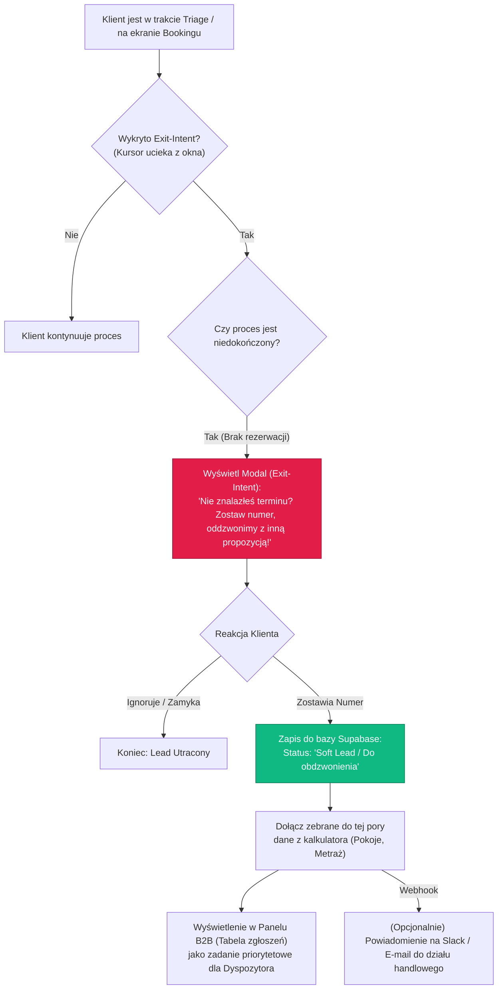
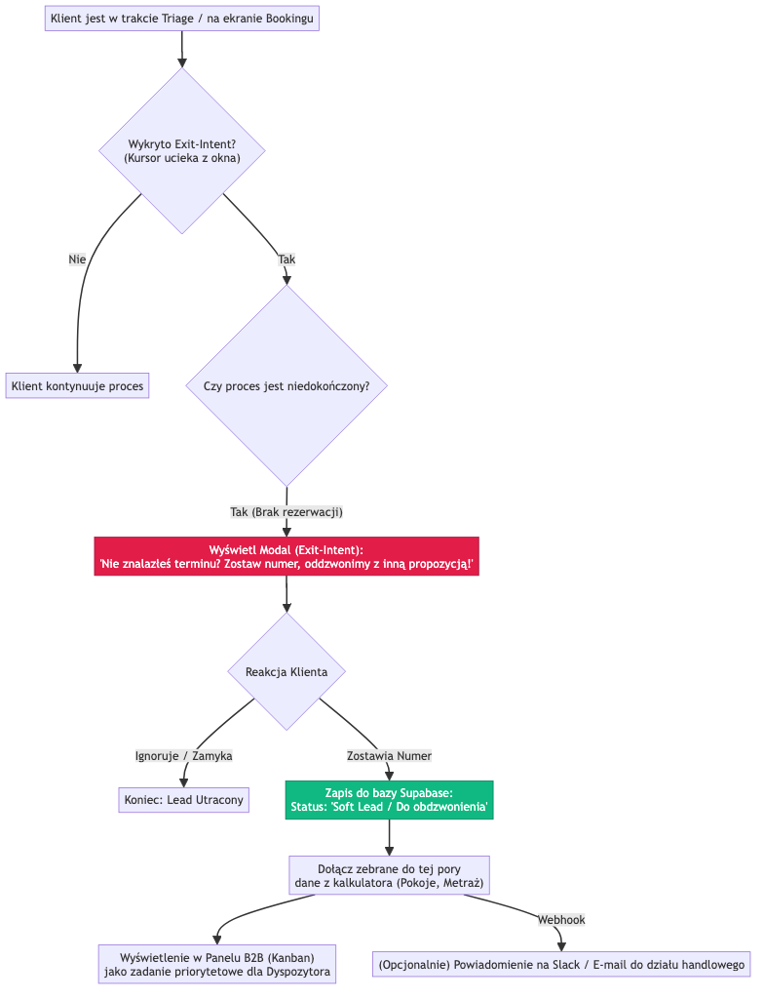

# Workflow: Soft Lead Recovery (Exit-Intent)

Ten proces odpowiada za przechwytywanie tzw. "miękkich leadów" (użytkowników, którzy zawahali się przed ostateczną rezerwacją terminu). Mechanizm opiera się na technologii **Exit-Intent**, która wykrywa ruch kursora w stronę paska adresu lub przycisku zamknięcia karty w przeglądarce.

## Diagram Przepływu (Mermaid)



## Implikacje dla Bazy Danych

Zamiast tworzyć nową tabelę, najlepiej wykorzystać istniejącą tabelę `leady`. Będziemy zapisywać do niej częściowo wypełniony obiekt `odpowiedzi_triage`, ale z odpowiednim statusem.

Wymaga to rozszerzenia pola `status_leada` o nową wartość (np. `Soft Lead` lub `Porzucony`).

**Przykładowy zrzut danych przy Exit-Intent:**
```json
// Tabela: leady
{
  "status_leada": "Soft Lead",
  "dane_kontaktowe": {
    "telefon": "+48 987 654 321"
  },
  "odpowiedzi_triage": {
    "etap_porzucenia": "Krok 3 - Metraż",
    "pokoje": [
      { "id": 1, "metraz": "Do 25m2" }
    ]
  }
}
```
Dzięki temu Dyspozytor dzwoniąc do klienta wie, że klient szukał klimatyzacji do 1 pokoju, co drastycznie zwiększa szanse na sprzedaż.

## Wizualizacja Diagramu

