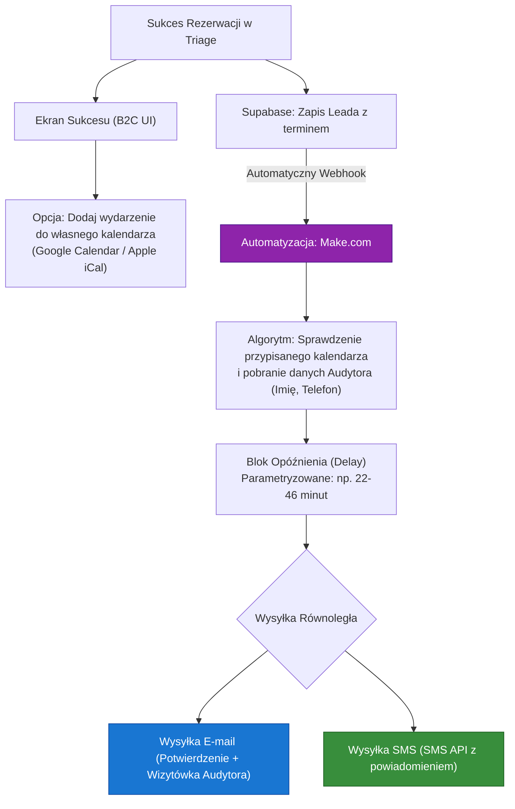
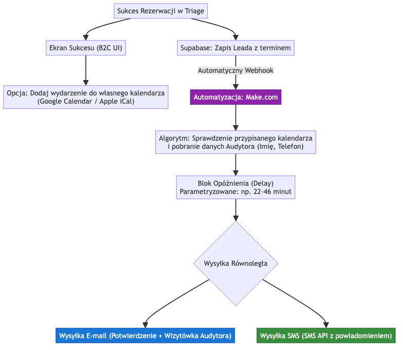

# Workflow Komunikacji Po-Rezerwacyjnej (Post-Booking)

Ten dokument opisuje proces, który dzieje się natychmiast po udanym zakończeniu formularza Triage i zarezerwowaniu terminu przez klienta. Oddzielamy ten proces od logiki samego kalkulatora, ponieważ wykorzystuje on zewnętrzne systemy do automatyzacji (Make.com, SMS API) oraz asynchroniczne kolejkowanie (opóźnienia czasowe).



## Implikacje dla Bazy Danych

Aby system mógł być w pełni konfigurowalny przez administratora (np. z poziomu panelu B2B), musimy dodać tabelę lub konfigurację opóźnień:

```json
// Tabela: communication_config
{
  "delay_min_minutes": 22,
  "delay_max_minutes": 46,
  "sms_provider_active": true,
  "email_template_id": "audyt_confirmation_v1"
}
```

Dodatkowo rekord w tabeli `leady` po przypisaniu musi zostać zaktualizowany o identyfikator audytora:
```sql
ALTER TABLE leady ADD COLUMN auditor_id UUID REFERENCES auth.users(id);
```

## Scenariusze Testowe (Playwright)

Poniższe scenariusze BDD definiują weryfikację tego procesu od strony końcowej.

**Scenariusz 1: Ekran Sukcesu i integracja z kalendarzem klienta**
- **Given** użytkownik prawidłowo wypełnił formularz Triage i kliknął "Zarezerwuj"
- **When** system wyświetla widok podziękowania ("Sukces")
- **Then** na ekranie widoczne są dwa przyciski: "Dodaj do Google Calendar" oraz "Dodaj do Apple Calendar"
- **And** kliknięcie w przycisk generuje poprawny plik `.ics` lub link do kalendarza z danymi spotkania

**Scenariusz 2: Parametryzacja asynchronicznych powiadomień**
- **Given** aplikacja wysłała Webhook do Make.com o nowym Leadzie
- **When** skrypt Make.com dochodzi do węzła "Sleep/Delay"
- **Then** odczytuje wartości `delay_min_minutes` i `delay_max_minutes` z bazy danych
- **And** wznawia działanie dopiero po losowym czasie z tego przedziału, po czym triggeruje e-mail i SMS API

## Wizualizacja Diagramu


## Faza Po-Audytowa (Ofertowanie)

Proces ten ma swoją kontynuację po tym, jak inżynier / doradca fizycznie zjawi się na obiekcie u klienta. W trakcie audytu konsultant weryfikuje warunki techniczne.

1. **Wycena Finalna w Panelu B2B**: Doradca loguje się do panelu instalatora, odnajduje konkretnego Leada i zatwierdza ostateczną konfigurację. W tym kroku musi zaktualizować dwa kluczowe pola:
   - `finalna_wycena_pln`: Kwota ostateczna (może różnić się od estymacji B2C).
   - `przewidywany_czas_montazu`: Oszacowanie czasu trwania prac (np. "1 dzień roboczy", "około 6 godzin").

2. **Wysyłka Finalnej Oferty**: Po zapisaniu tych danych w bazie, następuje trigger wysyłający do klienta zaktualizowaną ofertę (np. via e-mail lub SMS).
3. **Kluczowy Wymóg Informacyjny**: Komunikat (e-mail) kierowany do klienta **MUSI** bezwzględnie zawierać informację o przewidywanym czasie montażu, aby klient mógł odpowiednio zaplanować swój czas (np. wziąć urlop w pracy).

*W modelu danych (tabela `leady`), wartości te są przechowywane jako kolumny `finalna_wycena_pln` (NUMERIC) oraz `przewidywany_czas_montazu` (TEXT).*
