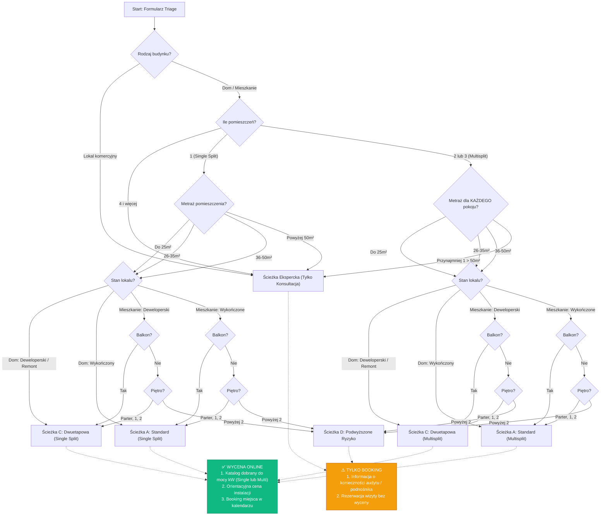
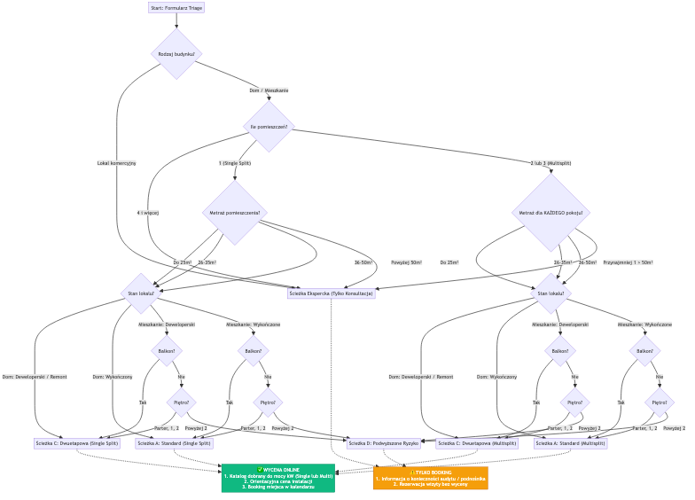

# Workflow Formularza Triage (Kalkulator B2C)

Ten diagram definiuje dokładną logikę działania inteligentnego formularza wyceny dla klientów B2C. Odseparowaliśmy drzewa decyzyjne dla instalacji Single Split i Multisplit, aby wyraźnie widzieć ostateczne ścieżki i powiązane z nimi warianty urządzeń na końcu.



## Implikacje dla Bazy Danych
Struktura JSON dla `odpowiedzi_triage` w tabeli `leady` powinna obsłużyć dynamiczną listę pomieszczeń i jasną ścieżkę końcową.

Przykładowy rekord Leada z wyceną:
```json
{
  "rodzaj_budynku": "Mieszkanie",
  "stan_lokalu": "Wykończone",
  "sciezka_koncowa": "Path_A_Multi",
  "pokoje": [
    { "id": 1, "metraz": "Do 25m2" },
    { "id": 2, "metraz": "26-35m2" }
  ],
  "balkon": false,
  "pietro": "1",
  "estymowana_wycena": "4500 PLN",
  "dane_kontaktowe": {
    "imie_i_nazwisko": "Jan Kowalski",
    "email": "jan.kowalski@example.com",
    "telefon": "+48 123 456 789"
  },
  "adres": "Złota 44, Warszawa",
  "wspolrzedne": {
    "lat": 52.231123,
    "lng": 21.006234
  }
}
```
*Uwaga: Adres w formularzu Triage jest walidowany i geokodowany "w locie" przy użyciu Google Maps Places API (Autocomplete). Po wyborze adresu z listy, natychmiast zapisujemy zwalidowany tekst oraz jego współrzędne (lat/lng).*

## Scenariusze Testowe (Playwright)

Poniższe scenariusze BDD mogą zostać bezpośrednio wykorzystane przy budowie testów E2E dla kalkulatora.

**Scenariusz 1: Ścieżka A - Standardowy Montaż (Happy Path, Single Split)**
- **Given** użytkownik wchodzi na formularz Triage
- **When** wpisuje adres korzystając z podpowiedzi (Google Places Autocomplete)
- **And** wybiera "Mieszkanie" -> "1 pokój" -> "Do 25m²" -> "Wykończone" -> "Masz balkon: Tak"
- **Then** użytkownik dociera do końca formularza na Ścieżkę A (Wycena Online + Booking)

**Scenariusz 2: Ścieżka C - Instalacja Dwuetapowa (Multisplit)**
- **Given** użytkownik wchodzi na formularz Triage
- **When** wybiera "Dom" -> "2 lub 3 pokoje" -> oba pokoje "Do 25m²" -> "Deweloperski / Remont"
- **Then** użytkownik dociera do końca formularza na Ścieżkę C (Wycena Dwuetapowa + Booking)

**Scenariusz 3: Ścieżka D - Podwyższone Ryzyko (Wysokościowe)**
- **Given** użytkownik wchodzi na formularz Triage
- **When** wybiera "Mieszkanie" -> "1 pokój" -> "26-35m²" -> "Wykończone" -> "Masz balkon: Nie" -> "Piętro: Powyżej 2"
- **Then** użytkownik dociera do końca formularza na Ścieżkę D (Tylko Booking, komunikat o audycie i podnośniku)

**Scenariusz 4: Ścieżka Ekspercka (Za dużo pokoi)**
- **Given** użytkownik wchodzi na formularz Triage
- **When** wybiera "Dom" -> "4 i więcej pomieszczeń"
- **Then** system natychmiast wyrzuca użytkownika na Ścieżkę Ekspercką (Tylko Booking bez wyceny)

**Scenariusz 5: Ścieżka Ekspercka (Duży metraż pojedynczego pokoju w Multisplicie)**
- **Given** użytkownik wchodzi na formularz Triage
- **When** wybiera "Mieszkanie" -> "2 lub 3 pokoje" -> Pokój 1: "Do 25m²", Pokój 2: "Przynajmniej 1 > 50m²"
- **Then** system wyrzuca użytkownika na Ścieżkę Ekspercką z powodu nietypowego metrażu

**Scenariusz 6: Moduł Rezerwacji (Dostępność i Sloty)**
- **Given** użytkownik dociera do ekranu końcowego (dowolna ścieżka) i widzi kalendarz
- **When** system pobiera dostępne terminy ze zintegrowanego kalendarza doradców (np. Google Calendar)
- **Then** użytkownik widzi wyłącznie sloty trwające dokładnie 1h (z uwzględnieniem 45 minut bufora między spotkaniami)
- **And** sloty mieszczą się w zdefiniowanym oknie godzinowym (np. 08:00 - 15:00)

## Moduł Kalkulatora Wyceny (Netto / Brutto)

Kluczowym elementem formularza jest kalkulator, który po przejściu ścieżki B2C i wybraniu "Mieszkanie" lub "Dom", musi zaprezentować klientowi ostateczną wycenę Brutto.

1. **Baza Danych (Wartości Netto)**: Wszystkie ceny katalogowe urządzeń (`cena_katalogowa_netto`) oraz koszty usług montażu (`koszt_b2c_netto`) przechowywane są w bazie danych jako wartości **NETTO**. 
2. **Stawka VAT w Triage B2C**: Ponieważ formularz B2C obsługuje klientów indywidualnych w domach i mieszkaniach (ścieżka "Lokal Komercyjny" jest odrzucana do ręcznej wyceny eksperckiej), do obliczeń zautomatyzowanych aplikowany jest zawsze **podatek VAT 8%**.
   - (Uwaga: Usługa montażu połączona z dostawą sprzętu dla celów mieszkaniowych w Polsce podlega preferencyjnej stawce VAT 8%).
3. **Wzorcowy Montaż**: Do bazowej ceny instalacji doliczane są standardowe wartości z cennika (np. montaż jednostki, 3 mb instalacji chłodniczej, 3 mb odpływu itp.). Suma tych usług netto tworzy `łączny_koszt_montażu_netto`.
4. **Prezentacja UI**: Klient na końcu formularza widzi wartość **Brutto** obliczoną jako `(Cena_Urządzeń_Netto + Koszt_Montażu_Netto) * 1.08`.

## Moduł Rezerwacji Terminu (Booking Module)

Na samym końcu procesu, niezależnie od wybranej ścieżki (Wycena vs Tylko Konsultacja), użytkownik przechodzi do kalendarza rezerwacji. Główne wymagania i reguły biznesowe dla tego modułu to:

1. **Integracja z Kalendarzem (Custom Next.js API)**: System musi czytać bieżącą dostępność inżyniera ze współdzielonego kalendarza (Google Calendar API). Autoryzacja przez Service Account. Zapytania o `freebusy` będą realizowane po stronie serwera (SSR) w celu zapewnienia maksymalnej szybkości i płynności UI bez ładowania zewnętrznych widgetów (iframe).
2. **Parametryzacja**: Główne wartości są pobierane z bazy danych (np. tabela `booking_config`), by administrator mógł je łatwo zmienić:
   - `duration_minutes`: Czas trwania jednego spotkania (Domyślnie: **60 minut** / 1h).
   - `buffer_minutes`: Minimalny odstęp czasowy między jednym a drugim spotkaniem na dojazd/odpoczynek (Domyślnie: **45 minut**).
   - `hours_start`: Godzina otwarcia okna rezerwacyjnego (Domyślnie: **08:00**).
   - `hours_end`: Godzina zamknięcia okna rezerwacyjnego (Domyślnie: **15:00**).
3. **Dane Klienta**: Tuż obok wyboru slotu czasowego, system musi wymusić od klienta podanie kluczowych danych kontaktowych niezbędnych do obsługi Leada: **Imię i Nazwisko, E-mail, Numer Telefonu** oraz **Zwalidowany Adres (geokodowany)**.

System przy generowaniu wolnych slotów w UI dla klienta, najpierw filtruje dostępne ramy czasowe z konfiguracji bazy danych, potem sprawdza Google Calendar API dla danego dnia odrzucając blokady, a następnie na wolny czas nakłada sloty uwzględniające czas trwania (`duration_minutes`) oraz przerwę na dojazd (`buffer_minutes`).
Wszystko dzieje się natychmiastowo na zapleczu aplikacji Next.js, aby zapewnić płynne przejście.


## Wizualizacja Diagramu

